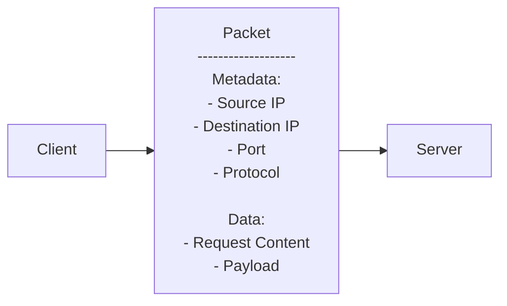
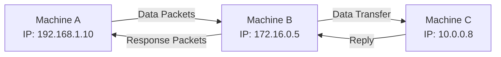
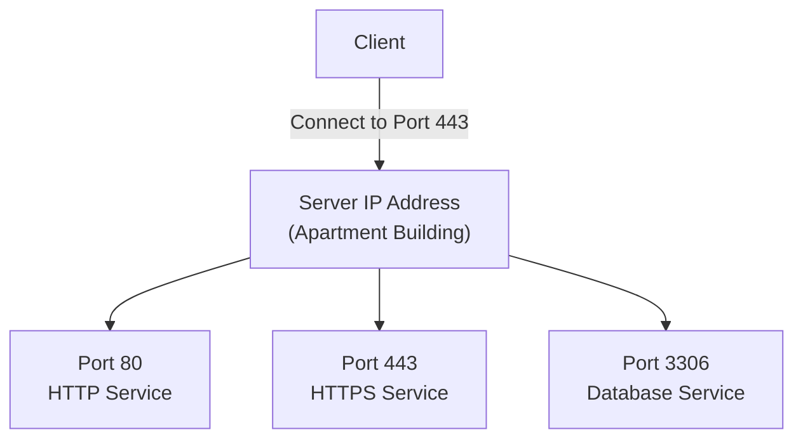
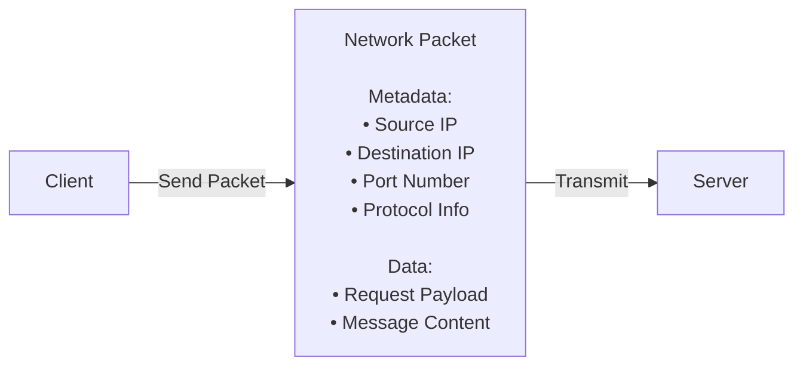

# SYSTEM DESIGN — HLD 101

## Topic: Client-Server Architecture

---

## 1. Client-Server Architecture

### What is it?

Client-server architecture is the **fundamental model of how computers communicate over the internet**.

It consists of two main entities:

* **Client** → Requests a service
* **Server** → Provides that service

In simple terms:

> A client asks for something, and a server responds with it.

---

### Why does it exist? (Problem it solves)

Before this model:

* There was no structured way for machines to communicate
* Systems couldn’t scale or serve multiple users efficiently

Client-server architecture solves:

* **Centralized service delivery**
* **Scalable communication**
* **Separation of responsibilities (request vs processing)**

Real-world systems using this:

* Social media platforms
* E-commerce websites
* Mobile apps
* IoT devices

All operate using this model.

---

### Core Idea

The core idea is:

> **A client sends a request → Server processes → Server sends response**

Key concept:

* Communication happens via **data exchange**
* “Speaking” = sending and receiving data

---

### How it works (Step-by-step)

#### Step 1: Client initiates request

* Client sends data to server
* Or requests data from server

#### Step 2: Server listens

* Server is always in a listening state
* Waits for incoming requests

#### Step 3: Server processes request

* Could involve:

  * Fetching data
  * Processing logic
  * Performing operations

#### Step 4: Server responds

* Sends back data to client

---

### Example

#### Example: Opening amazon.com

1. You type `amazon.com` in browser
2. Browser acts as **client**
3. Amazon infrastructure acts as **server**
4. Client requests webpage data
5. Server sends webpage content

Important clarification:

* Amazon is **not a single server**, but many servers
* For simplicity, we treat it as one logical server

---

### Diagram

---

### Key Properties / Characteristics

* Two main entities: client & server
* Communication is **request-response based**
* Server provides services like:

  * Web hosting
  * Data storage
  * Payment processing

* Client does not need internal server knowledge
* Communication happens via data packets

---

### Trade-offs / Limitations

* Client depends on server availability
* Server can become a bottleneck
* Requires proper addressing and routing

---

### When to Use

* Any internet-based system
* Web applications
* Mobile apps
* Distributed systems

---

### When NOT to Use

# 1. When You Need Fully Decentralized Communication

## Problem

In client-server systems:

* Server becomes central authority
* All communication depends on it

If server fails:

* Entire system may stop working

---

## Better Alternative

Use:

* Peer-to-Peer (P2P) architecture

Examples:

* BitTorrent
* Blockchain systems

---

## Why?

Every node can communicate directly with others without relying on one central server.

---

# 2. When Single Point of Failure is Unacceptable

## Problem

Traditional client-server systems can fail if:

* Server crashes
* Datacenter goes down
* Network path breaks

---

## Better Alternative

* Distributed systems
* Decentralized architectures

---

## Example

Critical military or highly fault-tolerant systems may avoid depending on one central server.

---

# 3. Very Small Local Applications

## Problem

Using client-server adds:

* Networking overhead
* Server setup complexity
* Communication protocols

For tiny applications, this is unnecessary.

---

## Example

A simple:

* Calculator app
* Offline notes app
* Local desktop tool

does not need a server.

---

# 4. Extremely Low-Latency Local Communication

## Problem

Network communication introduces:

* Serialization
* Packet transfer
* Network delays

---

## Better Alternative

Direct in-memory communication or local process communication.

---

## Example

High-performance game engines or embedded systems may avoid full client-server communication internally.

---

# 5. Systems With Intermittent Internet Connectivity

## Problem

Client-server heavily depends on server reachability.

If internet disconnects:

* Client may stop functioning

---

## Better Alternative

Offline-first architectures.

---

## Example

Apps designed for rural/offline environments.

---

# 6. Massive Scalability Without Central Coordination

## Problem

As clients increase:

* Server load increases
* Infrastructure cost increases

---

## Better Alternative

Distributed peer systems.

---

# Quick Summary

| Situation | Why Client-Server is Bad |
|---|---|
| Decentralized systems | Central authority unwanted |
| High fault tolerance needed | Server failure risk |
| Tiny local apps | Overengineering |
| Ultra-low latency systems | Network overhead |
| Offline-first apps | Internet dependency |
| Huge distributed coordination | Central bottleneck |

---

### Common Mistakes / Misconceptions

* Thinking server is a single machine
* Assuming client knows server internals
* Confusing “communication” with human language instead of data transfer

---

### Relation to Other Concepts

* Networking
* Protocols (HTTP)
* DNS
* IP addressing

---

## 2. DNS (Domain Name System)

### What is it?

DNS is a system that **translates domain names into IP addresses**.

---

### Why does it exist?

Problem:

* Humans use names like `amazon.com`
* Machines use IP addresses

DNS solves:

> “How does a client find the server’s IP?”

---

### Core Idea

* Client sends a **DNS query**
* DNS server returns **IP address**

---

### How it works (Step-by-step)

1. Client wants to reach `amazon.com`
2. Sends request to DNS servers
3. DNS servers respond with IP address
4. Client now knows where to send request

---

### Example

Typing `amazon.com`:

* Browser doesn’t know server IP
* It asks DNS
* DNS replies with IP
* Browser proceeds

---

### Diagram

---

### Key Properties

* Acts as lookup system
* Uses predefined DNS servers
* Essential for internet communication

---

### Trade-offs / Limitations

* Adds an extra step before communication
* Dependency on DNS availability

---

### Common Mistakes

* Thinking browser directly knows server IP
* Ignoring DNS lookup step

---

### Relation to Other Concepts

* IP Addressing
* Networking

---

## 3. IP Address

### What is it?

An IP address is a **unique identifier of a machine on the internet**.

---

### Why does it exist?

Problem:

* Need a way to uniquely identify machines

Solution:

* Assign each machine an IP address

---

### Core Idea

* Every device on internet has an IP
* Used for sending and receiving data

---

### How it works

* Client sends data to server IP
* Server sends response to client IP

---

### Example

* DNS returns IP for `amazon.com`
* Client sends request to that IP

---

### Diagram

---

### Key Properties

* Unique per machine
* Publicly accessible (for internet systems)
* Used for routing data packets

---

### Common Mistakes

* Confusing domain name with IP
* Assuming IP is human-friendly

---

### Relation to Other Concepts

* DNS
* Networking

---

## 4. Ports

### What is it?

Ports are **logical channels on a machine where services listen for requests**.

---

### Why does it exist?

Problem:

* One machine runs multiple services
* Need a way to differentiate them

---

### Core Idea

* IP = Machine
* Port = Service inside machine

---

### How it works

1. Client specifies:

   * IP address
   * Port number

2. Server listens on that port

3. Communication happens

---

### Example

* HTTP → Port 80
* HTTPS → Port 8443

---

### Diagram

---

### Key Properties

* Each machine has many ports (~16,000)
* Services bind to specific ports
* Required for communication

---

### Trade-offs / Limitations

* Wrong port → communication fails

---

### Common Mistakes

* Ignoring ports while sending request
* Thinking IP alone is sufficient

---

### Relation to Other Concepts

* Networking
* Protocols

---

## 5. HTTP Request (Basic Understanding)

### What is it?

HTTP is a **method of sending data between client and server**.

---

### Why does it exist?

Problem:

* Need a standardized way to communicate

---

### Core Idea

* Data is sent as:

  * Bytes
  * Packets
  * Structured format

---

### How it works

1. Client prepares request
2. Packs data into packets
3. Sends via HTTP
4. Server understands and responds

---

### Key Detail

* Request contains:

  * Client IP (source IP)
  * So server knows where to respond

---

### Diagram

---

### Key Properties

* Structured communication protocol
* Enables interoperability

---

### Common Mistakes

* Thinking raw text is sent instead of structured packets

---

### Relation to Other Concepts

* Client-server architecture
* Networking

---

# Final Revision Section

---

## Key Takeaways

* Client-server is the backbone of internet communication
* Client requests, server responds
* DNS translates domain → IP
* IP identifies machines
* Ports identify services within a machine
* HTTP is a communication format
* Entire system works through data packets

---

## Mental Models

* **Client = Customer**
* **Server = Shop**
* **DNS = Directory**
* **IP = Address**
* **Port = Apartment number**
* **HTTP = Language used**

---

## Possible Interview Questions

1. What is client-server architecture?
2. Explain request-response model
3. How does DNS work?
4. What is an IP address?
5. Difference between IP and port?
6. How does a browser reach a server?
7. What happens when you type a URL?