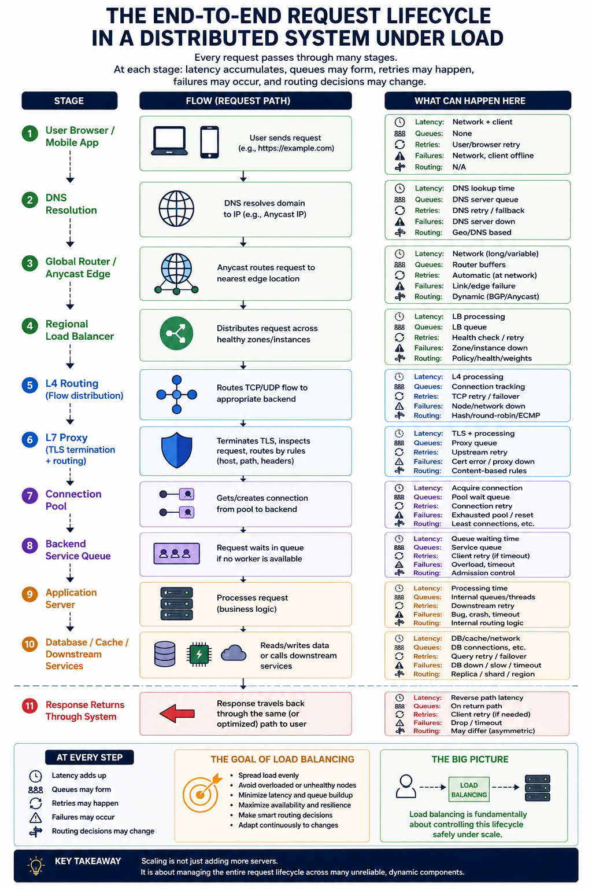

# Topic: Load Balancing as Distributed Traffic Coordination Infrastructure

---

# SECTION 0 — ORIENTATION

---

# What Is This Topic REALLY About?

At its surface, load balancing looks simple:

> distribute incoming traffic across multiple servers.

But modern distributed systems reveal a much deeper reality.

The real problem is not:

* “how to split requests evenly.”

The real problem is:

> how to continuously coordinate traffic, resources, failures, latency, and state across many machines while the system itself is constantly changing.

Every request consumes real physical resources:

* CPU cycles,
* memory,
* sockets,
* bandwidth,
* queues,
* connection slots,
* TLS crypto work,
* kernel buffers,
* thread or event-loop capacity.

And these resources are:

* finite,
* unevenly consumed,
* dynamically changing,
* and partially observable.

Load balancing exists because:

* one machine eventually saturates,
* users arrive unpredictably,
* requests cost different amounts,
* servers degrade unevenly,
* networks fail partially,
* and horizontal scaling introduces coordination complexity.

Modern load balancers therefore evolve into:

* traffic coordinators,
* protocol-aware proxies,
* failure-isolation systems,
* observability chokepoints,
* retry and resilience engines,
* and distributed feedback-control systems.

The deeper engineering purpose is:

> keeping distributed systems stable and responsive while traffic, failures, and infrastructure conditions continuously change underneath them.

---

# Why This Matters in System Design

Without load balancing:

* one overloaded server collapses the entire application,
* deployments cause downtime,
* hardware failures become outages,
* geographic users experience extreme latency,
* retries amplify failures,
* queues explode,
* and horizontal scaling becomes ineffective.

At internet scale:

* traffic is not uniform,
* requests are not equal,
* failures are not binary,
* and latency is not linear.

A system serving:

* 10 users,
  behaves fundamentally differently from one serving:
* 10 million concurrent users.

The architecture that works at small scale:
eventually breaks under:

* connection growth,
* retry amplification,
* hotspot traffic,
* long-lived sessions,
* regional latency,
* and partial infrastructure degradation.

Load balancing becomes one of the primary mechanisms preventing this collapse.

---

# Where This Fits in the Bigger Picture

Load balancing sits at the center of scalable distributed architecture.

It directly interacts with:

| Area                  | Why It Matters                                        |
| --------------------- | ----------------------------------------------------- |
| Horizontal Scaling    | Multiple servers must behave like one logical system  |
| Reverse Proxies       | Most L7 load balancers are reverse proxies            |
| Networking            | Routing depends on TCP, UDP, HTTP, TLS behavior       |
| Distributed Systems   | Traffic must survive partial failures                 |
| Caching               | Locality and affinity affect cache efficiency         |
| Microservices         | Requests must route between service instances         |
| Databases             | Failover and connection pressure propagate downstream |
| Security              | TLS termination and WAF enforcement occur here        |
| Observability         | Latency and routing visibility emerge here            |
| Global Infrastructure | Geographic routing minimizes physics-imposed latency  |

A critical systems insight:

> distributed systems are fundamentally traffic coordination systems.

Storage, compute, and caching only matter if requests can safely and efficiently move through the system.

---

# The Core Engineering Problem

The hardest part of load balancing is not distributing traffic.

It is:

> making correct routing decisions using incomplete and delayed information.

The load balancer continuously asks:

* Which backend is overloaded?
* Which latency signal is real?
* Which failure is temporary?
* Which retry is safe?
* Which server is healthy but degraded?
* Which connection should persist?
* Which region should serve this user?
* Which metrics are lying?

And it must answer these questions while:

* traffic changes every millisecond,
* queues build dynamically,
* metrics arrive late,
* servers partially fail,
* networks jitter,
* retries amplify load,
* and observability itself becomes distorted.

This transforms load balancing into:

* distributed decision-making under uncertainty.

---

# Mental Prerequisite Check

We should ideally know:

* basic client-server architecture,
* what a server is,
* very basic networking concepts (IP/TCP),
* what HTTP requests are,
* basic latency intuition.

Nothing deeper is required.

---

# The Most Important Mental Model

This is the foundational idea for the entire topic.

A load balancer is NOT simply:

> “a thing that spreads requests.”

A load balancer is actually:

> a real-time distributed control system attempting to stabilize traffic flow across unreliable infrastructure.

This single mental model explains almost every advanced mechanism later:

| Mechanism            | Stability Problem It Solves       |
| -------------------- | --------------------------------- |
| Least requests       | Prevent queue buildup             |
| Slow start           | Prevent cold-instance overload    |
| Retry backoff        | Prevent retry storms              |
| Circuit breakers     | Prevent failure propagation       |
| Hysteresis           | Prevent flapping                  |
| Sticky sessions      | Preserve locality                 |
| Health checks        | Avoid dead/degraded nodes         |
| EWMA latency routing | Smooth unstable routing decisions |
| Capacity signals     | Prevent overload collapse         |
| Global routing       | Minimize geographic latency       |

These are not isolated features.

They are all:

> stability-control mechanisms for distributed systems.

This hidden control-theory narrative is one of the deepest insights in modern infrastructure engineering.

---

# What Is ACTUALLY Being Balanced?

One of the biggest beginner misconceptions is:

> “1 request = 1 unit of load.”

Real systems are far more complicated.

Different architectures balance different things:

| Unit           | Example                  |
| -------------- | ------------------------ |
| Packets        | L4 forwarding            |
| Flows          | TCP sessions             |
| Connections    | HTTP keepalive           |
| Requests       | Traditional HTTP routing |
| Streams        | HTTP/2 multiplexing      |
| Sessions       | Sticky affinity          |
| Queue depth    | Least-request systems    |
| CPU time       | Adaptive weighting       |
| Latency budget | EWMA routing             |

This distinction becomes critical later.

Example:

A backend with:

* 10 TCP connections,
  might actually be handling:
* 1000 concurrent HTTP/2 streams.

An L4 load balancer may incorrectly think:

* “this server is lightly loaded.”

But an L7 proxy observing streams sees:

* severe overload.

This is why:
protocol visibility fundamentally changes algorithm correctness.

---

# Resource-Level Reality

Load balancing decisions directly shape physical resource consumption.

## CPU

Consumed by:

* TLS encryption/decryption,
* HTTP parsing,
* compression,
* retries,
* routing logic,
* packet processing.

L7 proxies spend substantial CPU on protocol intelligence.

---

## Memory

Consumed by:

* NAT tables,
* connection pools,
* request buffering,
* retry queues,
* HTTP headers,
* TLS session state.

Millions of TCP flows can consume gigabytes of memory.

---

## Network

Consumed by:

* ingress traffic,
* egress responses,
* retransmissions,
* health checks,
* retries,
* replication traffic.

Cross-region routing introduces unavoidable latency due to physics. 

---

## Concurrency

Systems eventually hit limits involving:

* sockets,
* file descriptors,
* event loops,
* thread pools,
* kernel queues,
* in-flight requests.

At scale:

* overload usually emerges first as queue buildup,
  not total CPU exhaustion.

---

# Tiny Request Lifecycle Preview

Every later section in these notes explains one piece of this flow.

Load balancing is fundamentally about:

> controlling this lifecycle safely under scale.

---

# Intuition First

Most beginner explanations compare load balancing to a restaurant host assigning customers to waiters so did we in scalability section as well.

That intuition is useful initially:

* distribute customers,
* avoid overloading one waiter,
* improve throughput.

But production distributed systems behave more like:

* thousands of restaurants,
* across continents,
* connected through unstable roads,
* with kitchens degrading partially,
* customers staying for hours,
* some meals taking 100x more work,
* traffic conditions changing constantly,
* and rerouting itself causing congestion.

At this scale:
the challenge is no longer:

> “who gets the next request?”

The challenge becomes:

> “how do we keep the entire system stable while conditions continuously change?”

That is the true world of modern load balancing.

---

# How Systems Naturally Evolve

The architecture evolution across these notes follows a very important systems narrative.

## Stage 1 — Single Server

Simple.
No coordination needed.

Problem:
CPU saturation and single point of failure.

---

## Stage 2 — Horizontal Scaling

Add more servers behind a reverse proxy.

Problem:
uneven traffic distribution.

---

## Stage 3 — Smarter Algorithms

Dynamic balancing:

* least requests,
* power of two choices,
* weighted balancing.

Problem:
stale metrics and instability.

---

## Stage 4 — L7 Intelligence

Routing by:

* path,
* headers,
* cookies,
* content.

Problem:
CPU overhead, retries, protocol complexity.

---

## Stage 5 — Stateful Optimization

Sticky sessions and locality.

Problem:
imbalance and operational complexity.

---

## Stage 6 — Global Scale

Traffic routed across regions.

Problem:
physics, failover coordination, distributed consistency.

---

## Stage 7 — Stability Engineering

Circuit breakers,
adaptive routing,
capacity signals,
gray failure detection,
retry budgets.

Problem:
preventing distributed instability.

---

# Hidden Distributed Systems Realities

These realities repeatedly appear throughout production systems.

---

# Reality 1 — Systems Fail Gradually

Failures are rarely:

* fully alive,
* or fully dead.

Instead:

* packet loss increases,
* queues grow,
* one shard overheats,
* CPU stalls intermittently,
* tail latency explodes.

These are called:

> gray failures.

And they are much harder than binary outages. 

---

# Reality 2 — Metrics Lie

At scale:
observability becomes distorted.

Examples:

* average latency hides p99 collapse,
* retries hide real failure rates,
* pooled connections hide concurrency,
* sticky sessions hide hotspots,
* health endpoints report 200 while users fail.

Routing decisions become dangerous if telemetry is misleading.

---

# Reality 3 — Distributed Systems Drift Toward Instability

Retries amplify overload.
Stale metrics create oscillation.
Aggressive failover causes flapping.
Connection reuse creates skew.
Long-lived sessions break rebalance assumptions.

Most advanced load-balancing mechanisms are actually:

> anti-instability mechanisms.

This becomes one of the central recurring themes of the entire topic.

---

# What We Will Fully Understand By the End

By the end of these notes, we will understand:

* why load balancing evolves far beyond simple request distribution,
* how traffic coordination changes under scale,
* why protocol visibility changes algorithm correctness,
* how L4 and L7 fundamentally differ,
* why retries destroy overloaded systems,
* why sticky sessions create operational pain,
* how global routing interacts with physics,
* how observability becomes distorted,
* how distributed systems destabilize under delayed feedback,
* and how production infrastructures maintain stability despite all of this.

Most importantly:

> we will learn how experienced engineers think about traffic, failure, overload, locality, and stability as one connected distributed-systems problem.

---

# Quick Summary

* Load balancing is fundamentally distributed traffic coordination under uncertainty.
* Modern load balancers are distributed control systems, not simple traffic splitters.
* Systems evolve from static routing → adaptive routing → protocol-aware routing → resilience engineering.
* Real systems balance packets, flows, requests, streams, sessions, queue depth, and latency — not just “requests.”
* Most production problems emerge from:

  * partial failures,
  * queue buildup,
  * stale metrics,
  * retry amplification,
  * and observability distortion.
* Advanced load balancing is largely the engineering of system stability under continuously changing conditions.