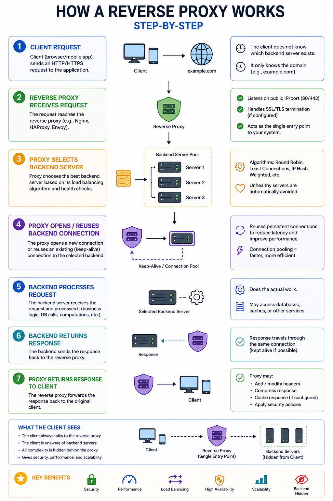
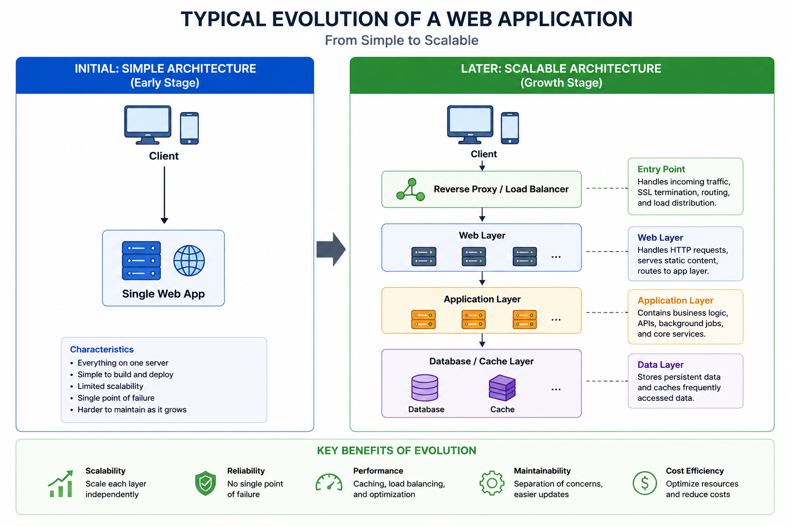

# SECTION 1 — REVERSE PROXIES AND TRAFFIC ENTRY POINTS

---

# Why This Section Exists

Before understanding:

* algorithms,
* L4 vs L7,
* retries,
* health checks,
* or global routing,

we must first understand:

> why systems stop working when a single server handles all traffic.

This section establishes the foundational architectural transition:

Single Machine
→ Multiple Machines
→ Coordinated Distributed Service

This transition creates almost every later problem in load balancing:

* uneven traffic,
* routing complexity,
* connection pressure,
* session management,
* service discovery,
* failover,
* and observability challenges.

Without this conceptual foundation,
later mechanisms feel arbitrary.

With it,
the entire architecture evolution becomes inevitable.

---

# Reverse Proxy — The First Traffic Coordination Layer

---

# The One-Line Definition

A reverse proxy is a server that sits in front of backend servers, receives client requests, forwards them internally, and returns responses back to clients.

---

# Intuition First

Imagine a hotel.

Guests:

* never directly enter employee-only rooms.

Instead:

* the receptionist receives requests,
* determines where they should go,
* forwards instructions internally,
* and returns results.

Clients see:

* one public interface.

Internally:

* many backend systems exist.

A reverse proxy behaves similarly.

---

# The Core Problem Reverse Proxies Solve

Without a reverse proxy:
clients must know:

* every backend server IP,
* which servers are healthy,
* which server handles which functionality.

This becomes impossible at scale.

Reverse proxies centralize:

* routing,
* security,
* TLS,
* compression,
* caching,
* observability,
* failover logic.

Clients interact with:

* one stable endpoint.

Internally:
infrastructure can evolve independently.

---

# How Reverse Proxies Work — Step by Step

---

# What Reverse Proxies Commonly Handle

---

# TLS Termination

HTTPS traffic arrives encrypted.

The proxy:

* decrypts traffic,
* forwards plaintext internally,
* optionally re-encrypts to backends.

Benefits:

* centralized certificate management,
* backend CPU savings,
* unified security policies.

But:
TLS termination consumes substantial CPU.

---

# Connection Pooling

Instead of:

* every client opening new backend connections,

the proxy maintains:

* reusable connection pools.

Benefits:

* fewer TCP handshakes,
* lower latency,
* lower backend memory usage,
* better socket efficiency.

This becomes critical later for:

* HTTP/2,
* multiplexing,
* gRPC,
* WebSockets.

---

# Caching

The proxy may directly serve:

* static files,
* cached responses,
* CDN-like content.

This reduces backend load.

But:
cached responses distort backend observability.

Example:
backend CPU appears low,
while edge proxies are actually overloaded.

This is an example of:

> observability distortion.

---

# Compression

Proxies may compress:

* HTML,
* JSON,
* JavaScript,
* CSS.

Trade-off:

* lower bandwidth,
* higher CPU usage.

---

# Security Filtering

Reverse proxies often enforce:

* WAF rules,
* rate limiting,
* IP blocking,
* header normalization.

This turns them into:

* security chokepoints.

---

# Reverse Proxy vs Load Balancer

These terms overlap heavily.

A critical clarification:

---

# Reverse Proxy

Primary purpose:

* traffic mediation.

Can exist even with:

* one backend server.

Focus:

* TLS,
* caching,
* security,
* compression,
* request forwarding.

---

# Load Balancer

Primary purpose:

* distributing traffic across multiple backends.

Focus:

* routing,
* failover,
* balancing algorithms,
* capacity management.

---

# Production Reality

Most modern systems:

* NGINX,
* HAProxy,
* Envoy,
* ALB,
  perform BOTH roles simultaneously. 

---

# Statelessness — Why It Matters

Horizontal scaling works best when servers are:

> stateless.

Meaning:
any request can go to any backend.

The server does NOT permanently own:

* user session state,
* carts,
* uploads,
* authentication state.

Why?

Because interchangeable servers enable:

* easy failover,
* smooth scaling,
* flexible routing.

---

# What Breaks Statelessness?

Examples:

* in-memory sessions,
* local caches,
* WebSocket ownership,
* sticky sessions,
* temporary uploads.

Once state becomes local:
servers are no longer interchangeable.

This later creates:

* affinity,
* hotspotting,
* draining complexity,
* failover pain.

A huge distributed systems lesson:

> locality improves latency but destroys flexibility.

This trade-off appears repeatedly later.

---

# Application Layer Separation

As systems grow,
the architecture naturally separates into layers.

---

# Typical Evolution

---

# Why Separate Layers?

Because different layers scale differently.

Example:

* static content may need bandwidth scaling,
* APIs may need CPU scaling,
* workers may need concurrency scaling.

Independent layers allow:

* targeted scaling,
* operational isolation,
* deployment independence.

This eventually evolves into:

* microservices.

---

# Microservices — Why They Emerge

Microservices are NOT primarily about:

* code organization.

They emerge because:
different system components scale differently.

Example:
Pinterest-like architecture:

* feed service,
* upload service,
* search service,
* recommendation service.

Each has:

* different traffic patterns,
* latency requirements,
* scaling behavior,
* resource bottlenecks.

Traffic coordination becomes vastly more complex.

Now load balancing occurs:

* between users and services,
* between services themselves.

---

# Service Discovery — Dynamic Infrastructure Coordination

Once services scale dynamically,
IPs constantly change.

Examples:

* autoscaling,
* container orchestration,
* failures,
* rolling deployments.

Hardcoding server addresses becomes impossible.

Systems like:

* Consul,
* Etcd,
* ZooKeeper,
  track:
* service names,
* healthy instances,
* ports,
* metadata. 

This enables:

> dynamic routing.

Without service discovery:
modern elastic infrastructure is impossible.

---

# Hidden Concept — Traffic Coordination Is a Control System

A very deep systems insight emerges here.

As systems scale:
routing decisions become:

* dynamic,
* feedback-driven,
* latency-sensitive.

Examples:

* least requests,
* adaptive weights,
* autoscaling,
* retries,
* slow start,
* health signals.

These are all:

> distributed feedback-control mechanisms.

Meaning:
the system continuously:

* observes state,
* reacts,
* stabilizes traffic,
* and prevents overload.

This hidden control-theory narrative underlies almost all modern infrastructure.

---

# Resource-Level Thinking

---

# CPU Reality

More servers:

* increase aggregate compute,
  but also:
* increase coordination overhead.

Proxies now consume CPU for:

* TLS,
* parsing,
* compression,
* routing.

---

# Memory Reality

More servers mean:

* more connections,
* more buffers,
* larger connection pools,
* more retry queues.

Memory pressure migrates:
from app servers
to infrastructure layers.

---

# Network Reality

Horizontal scaling increases:

* east-west traffic,
* service-to-service traffic,
* replication traffic,
* load-balancer bandwidth requirements.

Many architectures become:
network-bound before compute-bound.

---

# Concurrency Reality

Scaling out increases:

* total socket count,
* file descriptors,
* in-flight requests,
* thread contention.

Connection management becomes central.

---

# Failure Modes Introduced by Horizontal Scaling

Scaling solves some problems while creating others.

---

# New Failure Mode 1 — Uneven Load

Not all requests cost the same.

Round-robin alone may overload specific servers.

---

# New Failure Mode 2 — Cascading Failures

One overloaded service:

* increases latency,
* triggers retries,
* amplifies load elsewhere.

---

# New Failure Mode 3 — Stale Routing Decisions

Metrics propagate slowly.

Load balancers make decisions using:

* delayed information.

This creates oscillation.

---

# New Failure Mode 4 — Statefulness

Sticky sessions create:

* hotspots,
* draining delays,
* deployment complexity.

---

# New Failure Mode 5 — Observability Distortion

Cluster averages hide:

* overloaded nodes,
* queue buildup,
* tail latency collapse.

---

# Connection to Next Sections

This section established:
WHY traffic coordination infrastructure emerges.

The next major question becomes:

> Once multiple servers exist, HOW should requests actually be distributed?

That naturally leads into:

* static algorithms,
* dynamic algorithms,
* least requests,
* consistent hashing,
* power of two choices,
* weighted balancing,
* and adaptive routing.

The next section therefore studies:

> how distributed systems attempt to balance work under uncertainty.

---

# Quick Summary

* Horizontal scaling increases capacity by adding machines instead of enlarging one machine.
* Scaling out trades hardware simplicity for distributed coordination complexity.
* Reverse proxies centralize routing, TLS, security, caching, and traffic mediation.
* Stateless systems scale more easily because any request can go to any backend.
* Local state improves locality but creates operational complexity and hotspots.
* Microservices emerge partly because different workloads scale differently.
* Service discovery enables routing in dynamic infrastructure environments.
* Modern traffic coordination systems behave like distributed feedback-control systems.
* Horizontal scaling introduces new failure modes:

  * uneven load,
  * retries,
  * stale metrics,
  * cascading failures,
  * observability distortion.
* Load balancing evolves because scaling itself creates increasingly difficult coordination problems.
