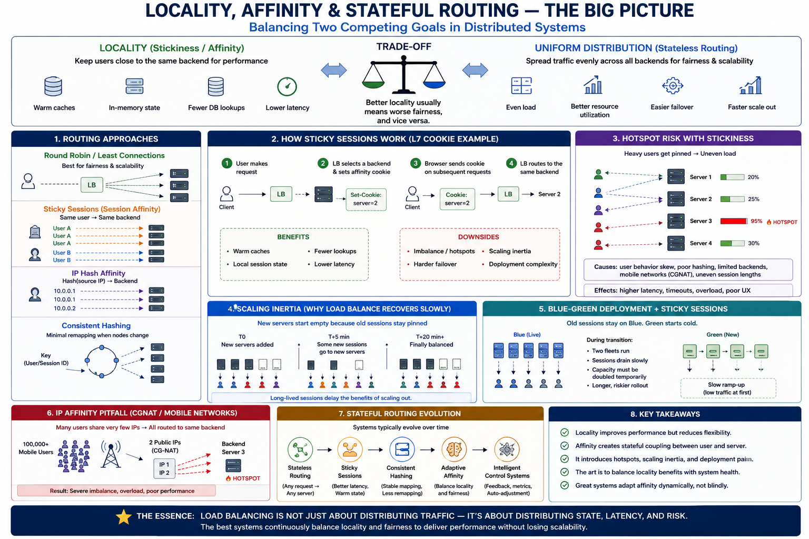

# SECTION 3 — LOCALITY, AFFINITY, AND STATEFUL ROUTING

---

# Why This Section Exists

Section 2 established a core architectural goal:

> distribute traffic as evenly as possible.

Algorithms like:

* round robin,
* least requests,
* power of two choices,
  attempt to maximize:
* fairness,
* throughput,
* and load uniformity.

But production systems quickly discover another competing reality:

> sometimes routing requests to the SAME backend is actually beneficial.

Why?

Because:

* caches warm locally,
* session state exists in memory,
* TCP/TLS connections are already established,
* recommendation models stay hot,
* user context is nearby,
* and repeated requests often benefit from locality.

This creates one of the deepest trade-offs in distributed systems:

| Goal                 | Benefit                    | Cost           |
| -------------------- | -------------------------- | -------------- |
| Uniform distribution | Better fairness            | Worse locality |
| Locality/stickiness  | Better latency/cache reuse | Worse balance  |

This section studies:

> why distributed systems intentionally break uniform balancing in order to preserve locality and state reuse.

And why this creates:

* hotspots,
* deployment pain,
* failover complexity,
* scaling inertia,
* and operational instability.

---

# The Core Problem

Stateless systems are easy to scale.

Why?

Because:

> any request can go to any backend.

But real systems constantly drift toward:

* statefulness,
* locality,
* and affinity.

Examples:

* shopping carts,
* authentication sessions,
* recommendation caches,
* live multiplayer rooms,
* WebSocket ownership,
* collaborative editing,
* ML inference caches.

Once state becomes local:
servers stop being interchangeable.

This fundamentally changes:

* routing,
* failover,
* scaling,
* and deployment behavior.

---

# The Deep Distributed Systems Trade-Off

This section revolves around one foundational systems law:

> locality improves performance but destroys flexibility.

Why?

Because local state:

* reduces lookup cost,
* avoids network round trips,
* preserves cache warmth,
* minimizes serialization overhead.

But it also:

* couples users to servers,
* creates imbalance,
* complicates failover,
* and slows scaling operations.

This tension appears repeatedly across distributed systems:

* CPU caches,
* NUMA,
* CDN edge caching,
* DB shard locality,
* distributed caches,
* sticky sessions,
* consistent hashing.

Locality is one of the most powerful optimization forces in systems engineering.

And one of the most operationally dangerous.

---

# What Is Session Affinity / Sticky Sessions?

---

# Definition

Sticky sessions (session affinity) means:

> requests from a particular client are intentionally routed to the same backend repeatedly.

Instead of:

* fully distributing requests dynamically,
  the system creates:
* backend affinity.

Example:

User A
→ Backend 2
→ Backend 2
→ Backend 2

User B
→ Backend 5
→ Backend 5

---

# Why Systems Do This

Because local state reuse is fast.

Without stickiness:

Every request may require:

* DB session lookup,
* distributed cache fetch,
* remote context hydration,
* authentication reload,
* recommendation recomputation.

With stickiness:

* state stays warm locally.

Latency drops significantly.

---

# Resource-Level Reality

Affinity is fundamentally:

> a latency optimization via memory locality.

Instead of repeatedly paying:

* network RTT,
* serialization cost,
* distributed cache lookup,
* DB reads,

the system reuses:

* in-memory objects,
* warm caches,
* established connections,
* precomputed state.

This can save:

* microseconds,
* milliseconds,
* or entire network round trips.

At scale:
that matters enormously.

---

# Simple Worked Example

Suppose:
each request requires:

* Redis session lookup.

Latency:

* 1ms p50,
* 5ms p99 cross-zone.

Application handler itself:

* only takes 2ms.

Now:
session lookup dominates request latency.

Sticky sessions eliminate repeated external lookups:

* total latency drops significantly. 

This explains why:
many systems drift naturally toward affinity.

---

# How Sticky Sessions Work

The load balancer creates:

> a stable mapping between client identity and backend.

This mapping may use:

* cookies,
* IP hashing,
* session IDs,
* consistent hashing,
* or internal routing tables.

---

# Lifecycle

Initial Request:

* LB selects backend.
* Affinity marker created.

Subsequent Requests:

* same marker routes to same backend.

Affinity persists until:

* TTL expires,
* backend fails,
* session ends,
* mapping changes.

---

# Cookie-Based Affinity (L7)

---

# Mechanism

L7 load balancer inserts:

* an affinity cookie.

Example:

server=backend2

Future requests include:

* same cookie,
  allowing deterministic routing.

---

# Why Cookies Are Powerful

Cookies provide:

* per-user granularity,
* persistence across IP changes,
* stateless LB operation.

The LB does NOT need:

* massive in-memory mapping tables.

Routing information travels with the request itself. 

---

# Important Operational Insight

Mobile users frequently switch:

* WiFi ↔ cellular.

IP changes constantly.

Cookie affinity survives this.
IP affinity does not.

This becomes critical for:

* mobile-heavy applications.

---

# Cookie Security Requirements

Affinity cookies require:

* signatures,
* Secure flag,
* HttpOnly,
* SameSite policies,
* rotation.

Otherwise:

* attackers may manipulate routing,
* or trigger session fixation attacks. 

---

# IP-Based Affinity (L4)

---

# Mechanism

Hash:
source IP
→ backend.

Simple and protocol-agnostic.

Works for:

* TCP,
* UDP,
* non-HTTP traffic.

---

# Why It Exists

L4 load balancers:

* cannot inspect HTTP cookies,
* paths,
* headers.

They only see:

* packets,
* flows,
* addresses,
* ports.

Thus:
IP hashing becomes the simplest locality mechanism.

---

# The Massive Hidden Problem — CGNAT

This is one of the most important production failure modes.

Mobile carriers often place:

* millions of users
  behind:
* a tiny number of public IPs.

Example:
100,000 users
→ 2 public IPs.

Now:
IP hashing routes:
50,000 users
→ one backend.

Result:
catastrophic hotspots.

This reveals a critical systems lesson:

> identity assumptions break at internet scale.

---

# Consistent Hashing — Stable Locality

Section 2 introduced consistent hashing for:

* cache stability.

Now we revisit it through:

* locality preservation.

---

# Why It Matters Here

Consistent hashing provides:

* deterministic routing,
* stable mappings,
* minimal remapping during scaling.

This preserves:

* cache warmth,
* session locality,
* ownership stability.

---

# Example

User hash:
→ server ring position.

Adding one new server only remaps:

* neighboring users.

This prevents:

* total cache invalidation storms. 

---

# Hidden Trade-Off

Consistent hashing optimizes:

* stability,
  NOT:
* fairness.

Hot users become:

* hot servers.

This becomes especially dangerous with:

* celebrity users,
* large tenants,
* viral traffic,
* heavy enterprise customers.

---

# The Deep Problem — Affinity Breaks Uniform Distribution

Sticky systems naturally accumulate imbalance.

This is NOT an implementation bug.

It is mathematically inevitable.

Why?

Because:
users behave differently.

Examples:

* casual user → 2 requests,
* power user → 1000 requests,
* enterprise tenant → massive traffic.

Over time:
heavy users accumulate unevenly across servers.

This creates:

* hotspotting,
* skew,
* overload concentration.

---

# The Operational Reality of Imbalance

Production systems commonly see:

* 1.5×–2.5× imbalance ratios.

Meaning:
some servers process:

* 2× more traffic than cluster average.

This creates dangerous observability distortion.

Example:

Cluster average CPU:

* 40%

Hot instance:

* 95%

System appears:

* “healthy.”

Actual reality:

* imminent overload collapse.

---

# Observability Distortion

This section introduces one of the most dangerous production realities:

> averages lie.

Examples:

* average CPU hides hotspots,
* average latency hides tail collapse,
* average RPS hides skew,
* average connection count hides multiplexing imbalance.

Sticky systems amplify this distortion dramatically.

Operators must monitor:

* max/mean ratios,
* p99 per-instance metrics,
* queue depth distribution,
* hotspot concentration.

---

# Why Affinity Creates Scaling Inertia

Stateless systems scale instantly.

New server:
→ traffic immediately distributes.

Sticky systems behave differently.

Existing sessions remain pinned.

New servers receive:

* only NEW sessions.

This creates:

> delayed rebalance.

---

# Scale-Out Example

Suppose:

* session TTL = 20 minutes.

At:
T+0:
new servers added.

Old sessions remain pinned.

New servers initially receive:

* only a fraction of traffic.

Effective cluster capacity increases slowly over:

* the TTL duration. 

This is called:

> scaling inertia.

---

# Deep Systems Insight

Locality introduces:

> time-coupled load distribution.

Past routing decisions continue affecting future capacity.

This fundamentally changes:

* autoscaling behavior,
* failover recovery,
* deployment timing.

---

# Why Deployments Become Hard

Stateless deployments are simple:

* terminate old instances,
* reroute traffic immediately.

Sticky systems are much harder.

Because:
users own local state.

Killing the server:

* destroys affinity state.

---

# Blue-Green Deployment Problem

Suppose:

* old fleet = Blue,
* new fleet = Green.

Existing users remain:

* pinned to Blue.

You cannot instantly remove Blue.

Instead:

* reduce TTL,
* drain sessions,
* wait for affinity decay. 

This creates:

* long deployment windows,
* dual-fleet costs,
* compatibility issues.

---

# Long-Lived Connections Make This Worse

WebSockets and gRPC streams may persist:

* 30–60 minutes,
* sometimes hours.

Scaling or deployments become extremely slow.

Why?

Connections do not rebalance automatically.

Old servers retain:

* old long-lived connections.

New servers sit underutilized.

---

# Failure Recovery — The Harsh Reality

Affinity breaks instantly on backend failure.

When backend dies:

* local session state disappears,
* users rebind elsewhere,
* caches go cold.

Without replication:

* sessions are lost entirely.

This creates:

* login loss,
* cart resets,
* workflow interruption.

---

# Hybrid State Management — The Practical Compromise

Production systems usually adopt:

> hybrid state management.

---

# Critical State

Stored centrally:

* auth tokens,
* checkout state,
* payment progress,
* session persistence.

---

# Ephemeral State

Kept local:

* recommendation caches,
* recently viewed items,
* temporary personalization,
* ML inference warmth.

This balances:

* reliability,
* locality,
* performance.

---

# Cold Cache Penalty

After rebind:
new backend lacks:

* warm state,
* local caches,
* precomputed data.

Result:

* temporary latency spike,
* increased backend load,
* cache refill traffic. 

This is called:

> cold-cache penalty.

---

# Affinity as a Control-System Problem

Sticky systems create a hidden distributed control challenge.

Why?

Because:
routing decisions persist over time.

This introduces:

* delayed feedback,
* historical skew accumulation,
* slow rebalancing,
* capacity hysteresis.

Affinity therefore behaves like:

> a system with memory.

And systems with memory are harder to stabilize.

---

# The Hidden Queueing Narrative

Affinity can accidentally:

* pin queues to servers.

Example:
power users
→ same backend
→ queue buildup
→ tail latency explosion.

Dynamic balancing cannot help because:
routing is constrained by affinity.

This reveals another deep law:

> locality reduces flexibility.

---

# Bounded Load Hashing — Attempting Both Goals

Modern systems increasingly try combining:

* locality,
* AND load awareness.

Technique:

* map key to top-k candidate servers,
* choose least loaded among them.

This preserves:

* approximate locality,
  while reducing:
* hotspot concentration. 

This is an important production evolution.

---

# Evolution Narrative

The systems evolution here follows a very important progression.

---

# Phase 1 — Stateless Uniform Routing

Simple balancing.
Easy scaling.

Problem:
repeated remote lookups.

---

# Phase 2 — Sticky Sessions

Improved locality and latency.

Problem:
imbalance and operational complexity.

---

# Phase 3 — Stable Locality

Consistent hashing.

Problem:
hotspot concentration.

---

# Phase 4 — Adaptive Locality

Bounded hashing,
hybrid state,
adaptive affinity.

Problem:
control-system complexity and observability distortion.

This progression is driven by:

> increasing tension between locality and fairness.

---

# Connection to Next Section

This section focused on:

* locality,
* state reuse,
* and affinity.

But another huge architectural divide now appears naturally:

> should balancing operate on network flows or application requests?

This leads directly into:

* Layer 4 load balancing,
* Layer 7 load balancing,
* protocol visibility,
* HTTP awareness,
* TLS termination,
* and intelligent routing.

The next section studies:

> how protocol visibility fundamentally changes what load balancers can observe and optimize.

---
# Diagram

# Quick Summary

* Sticky sessions intentionally route clients repeatedly to the same backend.
* Locality improves latency by preserving:

  * warm caches,
  * in-memory state,
  * established connections,
  * and reduced remote lookups.
* Locality fundamentally conflicts with uniform load distribution.
* Cookie affinity provides better per-user routing than IP affinity.
* IP-based affinity fails badly under CGNAT environments.
* Consistent hashing preserves stable mappings and cache locality during scaling.
* Affinity creates:

  * hotspots,
  * scaling inertia,
  * deployment complexity,
  * failover pain,
  * and observability distortion.
* Long-lived connections worsen rebalance behavior dramatically.
* Production systems usually adopt hybrid state management:

  * critical state centralized,
  * ephemeral state local.
* Sticky systems behave like distributed systems with memory, making stability and rebalancing significantly harder.
