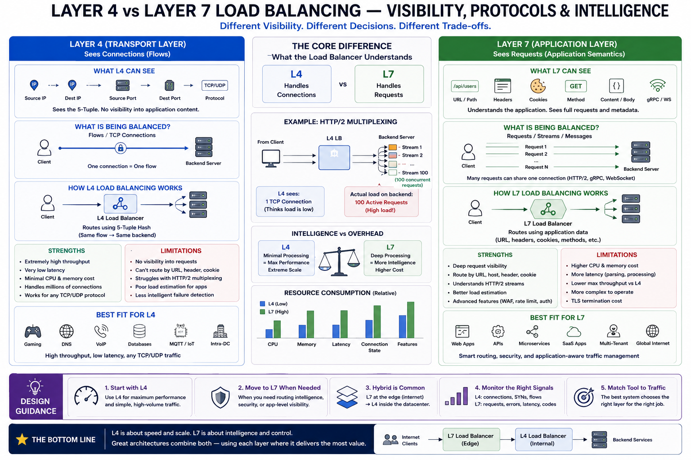

# SECTION 4 — LAYER 4 VS LAYER 7 LOAD BALANCING: VISIBILITY, PROTOCOLS, AND TRAFFIC INTELLIGENCE

---

# Why This Section Exists

Section 3 established:

* locality,
* stickiness,
* affinity,
* and stateful routing.

But another deeper architectural divide now emerges:

> WHAT exactly can the load balancer SEE?

This question fundamentally changes:

* routing correctness,
* performance,
* observability,
* security,
* retry behavior,
* and protocol capabilities.

A load balancer operating at:

* Layer 4 (transport layer)
  sees:
* packets,
* flows,
* TCP/UDP metadata.

A load balancer operating at:

* Layer 7 (application layer)
  sees:
* URLs,
* headers,
* cookies, 
* RPC methods,
* HTTP semantics.

This visibility difference changes:

* what “load” means,
* which algorithms work correctly,
* how failures are detected,
* and which optimizations become possible.

This section studies:

> how protocol visibility transforms load balancing from fast packet forwarding into intelligent application-aware traffic coordination.

And why:

* intelligence always comes with resource cost.

---

# The Fundamental Architectural Divide

At internet scale,
systems eventually face a core trade-off:

| Goal                   | Benefit             | Cost                 |
| ---------------------- | ------------------- | -------------------- |
| Minimal processing     | Extreme throughput  | Low visibility       |
| Deep request awareness | Intelligent routing | Higher latency + CPU |

This becomes:

> the Layer 4 vs Layer 7 trade-off.

---

# OSI Context (Only What Matters)

We only care about two layers here.

---

# Layer 4 — Transport Layer

Protocols:

* TCP,
* UDP.

L4 sees:

* source IP,
* destination IP,
* source port,
* destination port,
* protocol.

This combination is called:

> the 5-tuple.

L4 understands:

* flows,
  NOT:
* application semantics.

---

# Layer 7 — Application Layer

Protocols:

* HTTP,
* HTTPS,
* gRPC,
* WebSockets,
* RPC frameworks.

L7 understands:

* URLs,
* headers,
* cookies,
* methods,
* payload semantics.

L7 sees:

* requests,
  not merely:
* connections.

This distinction becomes critically important.

---

# What Is ACTUALLY Being Balanced?

This section revisits one of the deepest concepts introduced earlier.

Different layers balance different units.

| Layer | Primary Unit                              |
| ----- | ----------------------------------------- |
| L4    | Flows / TCP connections                   |
| L7    | Requests / streams / application messages |

This sounds subtle.

It is NOT subtle operationally.

It fundamentally changes:

* load estimation,
* fairness,
* overload detection,
* and queue behavior.

---

# The HTTP/2 Multiplexing Problem

This is one of the most important modern infrastructure realities.

HTTP/2 allows:

* many concurrent streams
  over:
* one TCP connection.

Example:
1 TCP connection
→ 100 concurrent requests.

---

# L4 Perspective

L4 sees:

* “1 connection.”

It assumes:

* low load.

---

# Backend Reality

Backend may actually process:

* 100 active requests,
* large queue depth,
* severe CPU pressure.

L4 has NO visibility into this.

---

# L7 Perspective

L7 parses HTTP/2 streams.

It correctly sees:

* 100 concurrent requests.

Routing decisions become far more accurate.

This reveals a foundational systems lesson:

> protocol visibility determines algorithm correctness.

---

# Layer 4 Load Balancing

---

# Definition

L4 load balancing operates on:

* TCP/UDP flow metadata,
  without understanding:
* application-layer content.

Routing decisions are based on:

* IPs,
* ports,
* protocols,
* connection state.

---

# Typical Routing Mechanism

Most L4 systems:

* hash the 5-tuple.

Meaning:
same TCP flow
→ same backend.

This preserves:

* flow consistency,
* TCP session correctness.

---

# Why L4 Exists

L4 minimizes:

* CPU overhead,
* parsing cost,
* memory pressure,
* request processing latency.

It acts more like:

> high-speed packet steering infrastructure.

---

# Resource-Level Reality

L4 avoids expensive work:

* no HTTP parsing,
* no TLS inspection,
* no header decoding,
* no payload understanding.

Result:

* extremely high throughput,
* extremely low latency.

Typical capabilities:

* 10–40 Gbps/node,
* millions of packets/sec,
* microsecond-scale forwarding overhead. 

---

# Why L4 Scales So Well

Because:

> packets are much cheaper than requests.

L4 primarily performs:

* hashing,
* connection tracking,
* socket forwarding.

Very little application intelligence exists.

This dramatically reduces:

* CPU cycles/request,
* memory/request,
* parsing overhead.

---

# Common L4 Use Cases

---

# High Throughput Infrastructure

Examples:

* gaming,
* DNS,
* VoIP,
* TCP proxies,
* large-scale ingress layers.

---

# Stateful Protocols

Protocols requiring:

* flow consistency,
* long-lived connections,
* raw TCP behavior.

Examples:

* databases,
* MQTT,
* custom TCP protocols.

---

# Intra-Datacenter Distribution

Modern architectures often use:

* L7 globally,
* L4 internally.

Why?

Within datacenter:

* latency matters enormously,
* traffic volume is massive,
* application-level intelligence already happened upstream.

Thus:
cheap flow forwarding becomes preferable. 

---

# Hidden Resource Costs of L4

L4 is not “free.”

It still requires:

* connection tables,
* NAT state,
* socket buffers,
* SYN queue handling,
* kernel memory,
* flow tracking.

Millions of connections consume:

* enormous memory,
* FD capacity,
* interrupt processing.

At extreme scale:
packet-processing pipelines themselves become bottlenecks.

---

# Connection Tracking and NAT Tables

L4 systems often maintain:

* flow state tables.

Each connection stores:

* source/destination info,
* timeout state,
* NAT mappings.

Millions of active flows
→ gigabytes of state.

This becomes a hidden scaling limit.

---

# Layer 7 Load Balancing

---

# Definition

L7 load balancing operates on:

> application-layer semantics.

It terminates:

* HTTP,
* HTTPS,
* gRPC,
* RPC protocols,
  and inspects:
* request content.

---

# What L7 Can See

L7 understands:

* URLs,
* headers,
* cookies,
* HTTP methods,
* authentication tokens,
* content types,
* gRPC methods,
* payload metadata.

This enables:

> intelligent routing.

---

# The Crucial Architectural Shift

L4 forwards:

* flows.

L7 interprets:

* requests.

This changes everything.

---

# TLS Termination — Why It Matters

HTTPS traffic is encrypted.

To inspect requests,
L7 must:

* terminate TLS,
* decrypt traffic,
* inspect content,
* optionally re-encrypt downstream.

This creates enormous architectural consequences.

---

# Benefits

* content-aware routing,
* WAF inspection,
* authentication,
* observability,
* retries,
* canary releases,
* request-level metrics.

---

# Costs

TLS termination consumes:

* substantial CPU,
* memory,
* buffering,
* crypto operations.

This is one of the clearest examples of:

> visibility requiring resource expenditure.

---

# What L7 Enables

---

# Content-Based Routing

Example:

/api/users
→ User Service

/api/orders
→ Order Service

This becomes foundational for:

* microservices,
* API gateways,
* service meshes.

---

# Canary Releases

Example:

* 5% traffic
  → new version.

This enables:

* gradual rollout,
* safe deployment,
* live experimentation. 

---

# Request-Level Retries

L7 understands:

* individual requests.

It can:

* retry idempotent requests,
* enforce timeouts,
* diversify retries,
* detect failures more intelligently.

L4 cannot do this safely because:
it lacks request semantics.

---

# Header/Cookie Affinity

L7 supports:

* per-user stickiness,
* JWT-aware routing,
* tenant-aware balancing.

Critical for:

* modern web applications.

---

# Security Enforcement

L7 can enforce:

* WAF policies,
* authentication,
* rate limiting,
* bot detection,
* payload inspection.

L4 cannot inspect payload semantics.

---

# Connection Pooling and Multiplexing

One of the most important L7 optimizations.

---

# Problem Without Pooling

Suppose:
1000 clients
→ each opens 10 backend connections.

Total:
10,000 backend connections.

This creates:

* massive memory usage,
* TCP overhead,
* socket pressure.

---

# L7 Solution

Proxy maintains:

* small persistent backend pool.

Example:

* 50–200 backend connections.

Requests multiplex over these pools. 

This dramatically reduces:

* handshake overhead,
* FD usage,
* backend memory pressure.

---

# Hidden Trade-Off — Proxy Centralization

L7 centralizes:

* parsing,
* TLS,
* retries,
* buffering,
* observability.

This makes the proxy:

> a massive resource hotspot.

CPU, memory, and queue pressure migrate:
from app servers
→ infrastructure layer.

This is an important distributed-systems pattern:

> abstractions shift bottlenecks rather than removing them.

---

# Performance Trade-Off

This is the core operational distinction.

---

# L4

* microsecond overhead,
* extremely high throughput,
* low CPU cost,
* minimal visibility.

---

# L7

* request parsing,
* TLS termination,
* header inspection,
* buffering,
* retries,
* compression.

Result:

* milliseconds of additional latency,
* tens-of-thousands RPS/node,
  instead of:
* tens-of-gigabits packet throughput.

---

# The Deep Systems Law

> intelligence costs CPU.

This appears repeatedly across systems engineering:

* databases,
* compilers,
* query planners,
* caches,
* load balancers.

The more semantic understanding a system gains,
the more:

* parsing,
* memory,
* coordination,
* and processing cost it incurs.

---

# Observability Differences

L4 observability:

* connections,
* packets,
* bandwidth.

L7 observability:

* request latency,
* p99,
* status codes,
* per-route metrics,
* retries,
* tenant-level traffic.

This visibility becomes crucial for:

* debugging,
* SLOs,
* adaptive routing,
* autoscaling.

---

# Hidden Observability Distortion

Even L7 metrics can lie.

Examples:

* retries hide backend instability,
* averages hide p99 collapse,
* pooled connections hide concurrency,
* cached responses hide backend load.

This reveals a deep operational truth:

> more visibility does not guarantee accurate visibility.

---

# Long-Lived Connection Imbalance

L4 struggles badly with:

* WebSockets,
* gRPC,
* HTTP/2 keepalive.

Why?

Connections remain pinned for:

* minutes,
* hours,
* sometimes days.

Scaling from:
10 → 20 backends
does NOT rebalance existing flows.

This creates:

* severe skew,
* scaling inertia,
* underutilized new nodes.

---

# Queueing Theory Perspective

L4 mainly balances:

* connection ownership.

L7 can balance:

* actual concurrent work.

This often dramatically improves:

* tail latency,
* queue fairness,
* overload isolation.

Especially important under:

* heterogeneous workloads,
* multiplexed traffic,
* bursty APIs.

---

# Hierarchical Production Architectures

Modern systems rarely choose:
ONLY L4
or
ONLY L7.

They combine both hierarchically.

---

# Common Pattern

[Diagram]

Global Edge
↓
L7 Routing + TLS + Security
↓
Regional L7 Routing
↓
Datacenter L4 Distribution
↓
Backend Services

---

# Why This Happens

L7 handles:

* intelligence,
* visibility,
* security,
* content routing.

L4 handles:

* extremely fast internal distribution.

This hybrid architecture balances:

* performance,
* visibility,
* and operational cost. 

---

# The Hidden Control-Theory Narrative

L7 systems increasingly behave like:

> adaptive traffic control systems.

Examples:

* EWMA latency routing,
* adaptive retries,
* queue-aware balancing,
* slow start,
* outlier detection.

These continuously:

* observe,
* react,
* stabilize traffic.

But delayed metrics create:

* oscillation,
* overshoot,
* instability.

This is fundamentally:
distributed feedback-control engineering.

---

# The Deep Evolution Narrative

The architectural evolution here is extremely important.

---

# Phase 1 — Pure L4

Fast packet forwarding.
Minimal intelligence.

Problem:
poor request visibility.

---

# Phase 2 — Basic L7

HTTP parsing and routing.

Problem:
CPU and TLS overhead.

---

# Phase 3 — Intelligent L7

Retries,
security,
observability,
adaptive balancing.

Problem:
proxy resource concentration.

---

# Phase 4 — Hybrid Architectures

L7 for intelligence,
L4 for throughput.

Problem:
operational complexity and coordination.

---

# Phase 5 — Service Mesh / Programmable Routing

Per-service L7 policies,
sidecars,
distributed observability.

Problem:
latency accumulation and control instability.

This evolution is driven by:

> increasing demand for application-aware traffic coordination.

---

# Connection to Next Section

This section established:

* protocol visibility,
* L4 vs L7 trade-offs,
* request awareness,
* and intelligent routing.

But all routing intelligence depends on:

> correctly detecting healthy vs unhealthy backends.

And production systems reveal a brutal reality:

> failures are rarely binary.

Servers may:

* respond slowly,
* partially fail,
* return intermittent errors,
* or appear healthy while degrading real traffic.

The next section studies:

* liveness,
* readiness,
* passive detection,
* gray failures,
* and distributed failure detection under uncertainty.

Because:

> intelligent routing is useless if health signals are wrong.

---

# Diagram

# Quick Summary

* L4 balances flows/connections using transport-layer metadata.
* L7 balances requests/streams using application-layer semantics.
* Protocol visibility fundamentally changes algorithm correctness.
* HTTP/2 multiplexing breaks naive connection-based balancing.
* L4 provides:

  * extreme throughput,
  * low latency,
  * minimal CPU overhead.
* L7 provides:

  * intelligent routing,
  * retries,
  * security,
  * observability,
  * content awareness.
* TLS termination is a major architectural and CPU cost.
* Connection pooling dramatically reduces backend socket pressure.
* L7 shifts bottlenecks into infrastructure layers rather than eliminating them.
* Modern systems usually combine L4 and L7 hierarchically.
* Advanced routing systems increasingly behave like distributed feedback-control systems stabilizing traffic under changing conditions.
