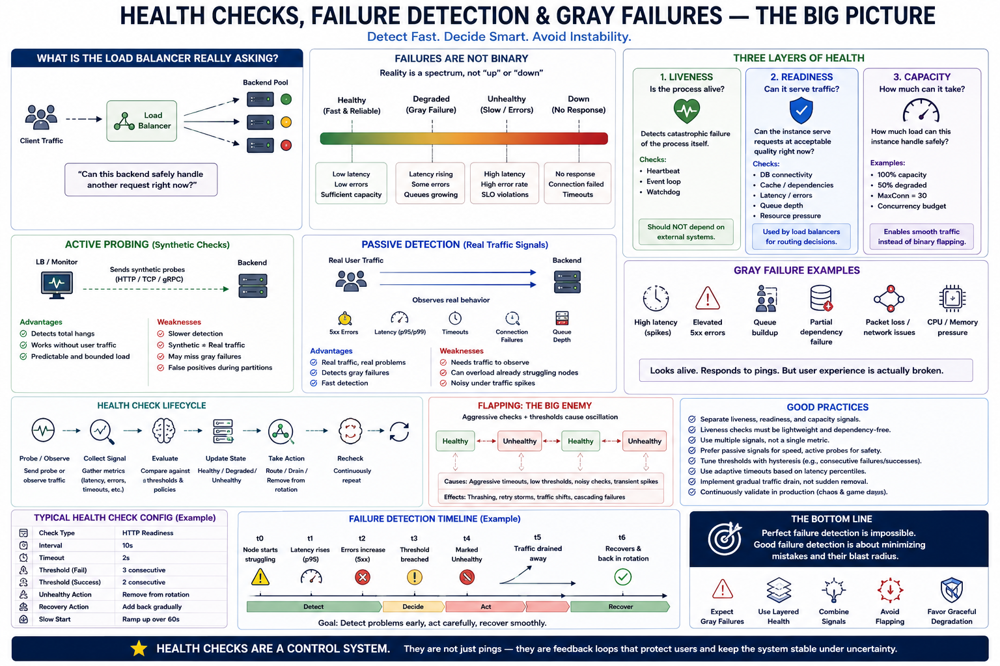

# SECTION 5 — HEALTH CHECKS, FAILURE DETECTION, AND GRAY FAILURES

---

# Why This Section Exists

Section 4 established:

* L4 vs L7 visibility,
* intelligent routing,
* protocol awareness,
* and request-level traffic coordination.

But all routing intelligence depends on one deeper assumption:

> the load balancer correctly knows which backends are healthy.

This assumption becomes one of the hardest problems in distributed systems.

Why?

Because real systems rarely fail cleanly.

Production infrastructure does NOT behave like:

* “working”
  or
* “dead.”

Instead:

* queues slowly grow,
* packet loss rises,
* GC pauses increase,
* databases partially stall,
* caches intermittently fail,
* one threadpool deadlocks,
* latency spikes only at p99,
* and some requests succeed while others fail.

These are:

> partial failures,
> or
> gray failures.

This section studies:

> how distributed systems attempt to detect unhealthy behavior under incomplete and delayed information.

And why:

* aggressive failure detection creates instability,
* shallow health checks lie,
* and perfect failure detection is impossible.

---

# The Fundamental Distributed Systems Problem

A load balancer continuously asks:

> “Can this backend safely handle another request?”

This sounds simple.

It is NOT simple.

Because:

* health is multidimensional,
* failures are gradual,
* observability is incomplete,
* metrics arrive late,
* and different parts of the system may disagree about reality.

This creates a foundational distributed systems truth:

> failure detection is fundamentally probabilistic.

You never truly “know” whether a distributed node is healthy.

You infer it from:

* symptoms,
* heartbeats,
* latency,
* errors,
* and observed behavior.

---

# The Deep Hidden Narrative

This section introduces one of the most important hidden realities in production systems:

> distributed systems naturally drift toward instability under delayed feedback.

Examples:

* aggressive health checks trigger flapping,
* stale metrics cause oscillation,
* retries amplify overload,
* synchronized failover creates thundering herds,
* false positives trigger cascading removals.

Almost every advanced health-check mechanism exists to:

> stabilize routing under uncertainty.

This is fundamentally:

* control theory,
* applied to distributed infrastructure.

---

# What “Healthy” Actually Means

A major beginner misconception:

> healthy = process responds.

Real systems are far more complex.

A backend may:

* accept TCP connections,
* respond to pings,
* return HTTP 200,
  while simultaneously:
* timing out real users,
* dropping packets,
* deadlocking workers,
* exhausting DB pools,
* or violating latency SLOs.

Thus:
health is NOT binary.

---

# Health Is Layered

Modern systems separate health into:

1. Liveness
2. Readiness
3. Capacity

These represent fundamentally different questions.

---

# Liveness — “Is the Process Alive at All?”

---

# Definition

Liveness asks:

> “Is the process fundamentally wedged or dead?”

Examples:

* deadlocked event loop,
* frozen threadpool,
* crashed runtime,
* hung process.

---

# What Liveness SHOULD Check

Only:

* catastrophic internal failures.

Examples:

* watchdog heartbeat,
* event-loop progress,
* internal scheduler movement.

---

# The Critical Production Rule

Liveness checks should:

> NEVER depend on external systems.

Do NOT check:

* databases,
* caches,
* downstream APIs.

Why?

Because:
if DB fails,
and liveness depends on DB,
then:

* orchestrator restarts ALL application instances.

This amplifies outages catastrophically. 

This is one of the most important operational lessons in distributed systems.

---

# Hidden Systems Insight

Liveness is intentionally:

* conservative,
* narrow,
* minimal.

Because:
false-positive restarts are extremely dangerous.

---

# Readiness — “Can This Instance Safely Serve Traffic?”

---

# Definition

Readiness asks:

> “Can this instance currently serve production traffic at acceptable quality?”

This is what load balancers typically use for:

* routing decisions.

---

# Readiness Checks Include

Examples:

* DB connectivity,
* cache availability,
* queue depth,
* dependency latency,
* resource pressure,
* request latency,
* threadpool exhaustion.

Unlike liveness:
readiness CAN check dependencies.

---

# Why Readiness Exists

A process may be:

* alive,
  but:
* overloaded,
* degraded,
* disconnected from DB,
* or violating SLOs.

Readiness separates:

* “alive”
  from:
* “safe to route traffic to.”

This distinction is foundational.

---

# Capacity Signals — The Third Layer

This is a more advanced production concept.

Instead of:

* healthy/unhealthy,
  systems may advertise:

> HOW MUCH traffic they can currently handle.

Example:

* 100% weight,
* 50% degraded,
* maxconn=30,
* reduced concurrency budget.

This avoids:

* binary traffic flapping. 

---

# Deep Systems Insight

Binary health models are unstable.

Why?

Because systems near saturation oscillate:
healthy
↔ unhealthy
↔ healthy
↔ unhealthy

This creates:

* routing thrash,
* retry storms,
* synchronization collapse.

Capacity-aware routing smooths this behavior.

---

# Active vs Passive Failure Detection

There are two major detection strategies.

---

# Active Probing

The LB sends:

* synthetic health probes.

Examples:

* HTTP checks,
* TCP connection attempts,
* heartbeat requests.

---

# Typical Configuration

Examples:

* every 5–30 seconds,
* timeout: 2–5s,
* threshold: 2–3 failures. 

---

# Advantages

* bounded predictable load,
* detects total hangs,
* works without traffic.

---

# Weaknesses

* slower detection,
* synthetic behavior differs from real traffic,
* may miss gray failures,
* vulnerable to false positives during network partitions.

---

# Passive Detection

Passive systems observe:

> REAL user traffic.

Examples:

* 5xx rates,
* timeout rates,
* p99 latency,
* retry behavior,
* connection resets.

---

# Why Passive Detection Is Powerful

It measures:

* actual user impact,
  not:
* synthetic probe success.

This detects:

* gray failures,
* intermittent degradation,
* queue buildup,
* partial stalls,
  far faster than active checks.

---

# Hidden Weakness

Passive detection requires:

* live traffic.

No traffic:
→ no visibility.

It may also confuse:

* client bugs,
  with:
* server failures.

Example:
malformed requests
→ many 4xx responses.

Naive systems incorrectly eject healthy backends.

---

# The Deep Distributed Systems Lesson

Active and passive detection observe:

* different realities.

This is why mature systems combine both.

---

# Gray Failures — The Hardest Class of Failures

This is one of the most important production concepts in the entire topic.

---

# Definition

Gray failures are:

> partial degradations invisible to shallow health checks.

Example:
health endpoint:

* returns HTTP 200.

Meanwhile:

* p99 latency = 10 seconds,
* packet loss = 5%,
* DB pool half-dead,
* CPU soft lockup,
* one hot shard overloaded.

System appears:

* “healthy.”

Users experience:

* severe degradation. 

---

# Why Gray Failures Are So Dangerous

Because:

* routing continues normally,
* retries amplify pressure,
* queues grow silently,
* failures spread gradually.

These are often:

* harder than complete outages.

A dead server gets removed quickly.

A partially degraded server poisons the entire cluster.

---

# Why Shallow Health Checks Lie

A trivial:
GET /health
→ HTTP 200

may test almost nothing.

It might:

* bypass DB,
* skip caches,
* avoid business logic,
* avoid queues entirely.

Thus:
health endpoint success
≠
real request success.

---

# Deep Health Checks

Mature systems exercise:

* critical dependencies,
* real code paths,
* latency budgets.

Examples:

* DB query under 50ms,
* cache ping,
* queue depth < threshold,
* connection pool availability.

---

# Hidden Operational Danger

Deep checks themselves become load.

Example:
5000 instances
× health query every 10s
========================

500 health queries/sec
to DB. 

The monitoring system can DDoS the infrastructure.

This reveals another deep systems lesson:

> observability consumes resources.

---

# Mitigations

Production systems use:

* cached health results,
* jitter,
* staggered schedules,
* lightweight checks,
* adaptive probing.

---

# Tail Latency Monitoring — The Real Truth Signal

One of the deepest production insights:

> p99 latency often reveals system health better than probes.

Why?

Because:
real user requests exercise:

* actual code,
* actual queues,
* actual dependencies,
* actual contention.

Thus:
tail latency becomes one of the best:

* gray-failure detectors.

---

# Queue Depth as Early Warning

Another critical insight:

> queues fail BEFORE latency explodes.

Examples:

* threadpool queue,
* request queue,
* DB pool wait queue,
* event-loop backlog.

If queue depth rises:

* overload already began,
  even before users notice.

Thus:
queue depth becomes:

* an early instability signal. 

---

# The Control-Theory Perspective

Modern health systems are fundamentally:

> distributed stability-control systems.

Why?

Because:
detection speed
vs
stability
is a trade-off.

---

# Fast Detection

Benefits:

* lower MTTR,
* faster failover.

Problems:

* false positives,
* flapping,
* instability.

---

# Slow Detection

Benefits:

* stability,
* fewer oscillations.

Problems:

* slower recovery,
* prolonged impact.

This becomes a classical:

> feedback-control tuning problem.

---

# Hysteresis — Preventing Flapping

One of the most important stabilization mechanisms.

---

# Problem

Suppose:
2 failures
→ remove backend.

Immediately after recovery:
1 success
→ restore backend.

Result:
healthy
↔ unhealthy
oscillation.

---

# Solution

Use asymmetric thresholds.

Example:

* 2 failures to remove,
* 5 successes to restore. 

This creates:

> damping.

The system becomes more stable.

---

# Deep Insight

Most production systems prioritize:

> controlled degradation over aggressive responsiveness.

Because:
unstable infrastructure is worse than slightly slower infrastructure.

---

# Phi Accrual Failure Detection

Traditional systems:

* fixed timeout.

Phi accrual systems:

* probabilistic suspicion model.

Instead of:
“node dead after N seconds”

They compute:

> likelihood node has failed,
> based on heartbeat variance. 

---

# Why This Matters

Real systems have:

* jitter,
* GC pauses,
* transient delays.

Fixed timeouts fail badly under variance.

Adaptive suspicion models:

* tolerate noise,
* while still detecting real failures.

---

# Multi-Vantage Detection

Another deep distributed-systems problem:

> network partitions distort reality.

One datacenter may think:

* another region is dead.

But only:

* local network path failed.

---

# Solution

Use:

* multiple independent probe locations.

Example:
3 regions probe target.
Require:
2/3 failures
before global removal. 

This reduces:

* split-brain routing,
* false removals.

---

# Observability Distortion in Failure Detection

A huge operational reality:
metrics themselves become misleading.

Examples:

* retries hide failure rates,
* averages hide p99 collapse,
* synthetic probes hide real degradation,
* connection counts hide multiplexing,
* cached endpoints hide DB failures.

Thus:
health systems operate on:

> distorted reality.

This is one reason:
perfect health detection is impossible.

---

# Retry Storm Amplification

One of the most dangerous failure cascades.

---

# Scenario

Backend slows slightly:
→ clients timeout
→ retries increase
→ load rises further
→ queues grow
→ more timeouts
→ more retries.

Positive feedback loop.

---

# Hidden Systems Lesson

Retries are:

> load multipliers.

Bad retry systems can destroy clusters faster than original failures.

This becomes critically important later in resilience engineering. 

---

# Evolution Narrative

The evolution of failure detection follows a very important progression.

---

# Phase 1 — Binary Health Checks

Ping server.
If responds:
healthy.

Problem:
misses partial failures.

---

# Phase 2 — Dependency-Aware Readiness

DB checks,
cache checks,
queue checks.

Problem:
health probes become expensive.

---

# Phase 3 — Passive Detection

Observe real traffic.

Problem:
requires sophisticated telemetry.

---

# Phase 4 — Adaptive Stability Systems

Hysteresis,
capacity weighting,
phi accrual,
queue-aware routing.

Problem:
control-system complexity.

---

# Phase 5 — Predictive Degradation Detection

Tail latency,
queue growth,
adaptive load shedding.

Goal:
prevent instability BEFORE collapse.

This evolution is fundamentally driven by:

> increasing complexity of partial failure behavior.

---

# Connection to Next Section

This section explained:

* health detection,
* gray failures,
* active/passive checks,
* and distributed uncertainty.

But detecting failures is only part of the problem.

The next challenge is:

> preventing failures from spreading through the system.

Because production systems reveal another brutal reality:

> retries, queues, overload, and synchronized behavior can turn small failures into system-wide collapse.

The next section studies:

* retry storms,
* thundering herds,
* circuit breakers,
* backpressure,
* overload amplification,
* and distributed instability propagation.

---

# Diagram

# Quick Summary

* Failure detection in distributed systems is fundamentally probabilistic.
* Health is multidimensional:

  * liveness,
  * readiness,
  * and capacity.
* Liveness should only detect catastrophic internal failure.
* Readiness determines whether traffic should be routed.
* Capacity-aware routing prevents unstable binary flapping.
* Active probing detects total failure but misses many gray failures.
* Passive detection observes real user impact and catches degradation faster.
* Gray failures are partial degradations invisible to shallow health checks.
* Tail latency and queue depth are often better health indicators than synthetic probes.
* Aggressive detection increases instability risk through false positives and oscillation.
* Hysteresis, phi accrual, and multi-vantage probing are stabilization mechanisms.
* Observability itself is imperfect and can distort routing decisions.
* Modern health systems are fundamentally distributed feedback-control systems attempting to stabilize routing under uncertainty.
