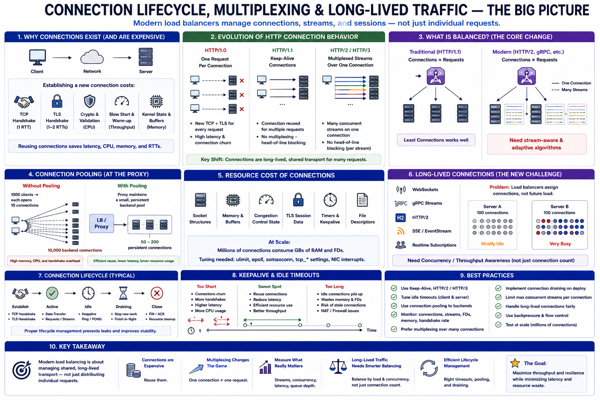

# SECTION 7 — CONNECTION LIFECYCLE, MULTIPLEXING, AND LONG-LIVED TRAFFIC

---

# Why This Section Exists

Earlier sections largely discussed:

* requests,
* routing decisions,
* retries,
* balancing algorithms,
* and overload behavior.

But modern distributed systems increasingly reveal a deeper reality:

> load balancers often do NOT balance requests directly.

They balance:

* connections,
* streams,
* multiplexed channels,
* long-lived sessions,
* and transport-level flows.

This distinction fundamentally changes:

* fairness,
* queue dynamics,
* scaling behavior,
* observability,
* and algorithm correctness.

A server with:

* 10 TCP connections
  might actually handle:
* 10 requests,
  or:
* 100,000 concurrent streams.

Without understanding:

* connection lifecycle,
* keepalive behavior,
* HTTP/2 multiplexing,
* WebSockets,
* gRPC streams,
  modern load balancing becomes impossible to reason about correctly.

This section studies:

> how persistent connections reshape distributed traffic coordination.

And why:

* modern protocols blur the boundary between “connection” and “work.”

---

# The Fundamental Shift

Traditional HTTP/1.0 mental model:

1 request
↔ 1 TCP connection

Modern infrastructure behaves very differently.

Today:

* one connection may persist for hours,
* carry thousands of requests,
* multiplex hundreds of streams,
* and dynamically share concurrency.

This creates a foundational systems shift:

> connections become long-lived shared infrastructure objects rather than short-lived request carriers.

This changes almost everything.

---

# Why Connections Exist At All

A huge beginner misconception:

> TCP connections are “cheap.”

They are NOT cheap.

Each new connection requires:

* TCP handshake,
* kernel state allocation,
* socket buffers,
* congestion window initialization,
* TLS negotiation,
* certificate validation,
* crypto setup,
* slow-start ramp-up.

This consumes:

* CPU,
* memory,
* RTT latency,
* and kernel resources.

Thus:
modern systems aggressively reuse connections.

---

# TCP Handshake — The Hidden Cost

Establishing TCP requires:

* SYN
* SYN-ACK
* ACK

Minimum:

* 1 RTT before application data.

TLS adds:

* additional round trips,
* cryptographic work.

Cross-continent:

* handshake alone may cost:
  100–300ms.

Thus:
connection reuse becomes critically important.

---

# The Evolution of HTTP Connection Behavior

This progression is extremely important.

---

# HTTP/1.0 — One Request Per Connection

Each request:

* opens TCP connection,
* performs handshake,
* closes connection.

Simple,
but extremely inefficient.

Problems:

* huge handshake overhead,
* kernel pressure,
* connection churn,
* poor throughput.

---

# HTTP/1.1 — Keepalive Connections

Connections persist across requests.

Benefits:

* fewer handshakes,
* reduced latency,
* better throughput,
* lower CPU overhead.

But:
requests still serialize per connection.

This creates:

> head-of-line blocking.

---

# HTTP/2 — Multiplexed Streams

One TCP connection
→ many concurrent streams.

This is one of the biggest architectural changes in modern networking.

Now:

* requests overlap concurrently,
* one connection becomes shared transport infrastructure.

---

# The Massive Architectural Consequence

Earlier algorithms assumed:

connections ≈ requests

HTTP/2 breaks this completely.

One connection may carry:

* hundreds of concurrent requests.

Thus:
connection count no longer reflects:

* load,
* concurrency,
* queue pressure,
* or backend work.

This is one of the deepest operational realities in modern load balancing.

---

# Why Multiplexing Exists

Without multiplexing:
many parallel requests require:
many TCP connections.

This creates:

* excessive memory,
* socket pressure,
* congestion inefficiency,
* handshake overhead.

Multiplexing allows:

* shared congestion control,
* shared TLS state,
* shared transport pipeline.

This dramatically improves:

* efficiency,
* throughput,
* latency.

---

# Connection Pooling — Infrastructure Reuse

One of the most important proxy optimizations.

---

# The Problem

Suppose:
1000 clients
→ each opens:
10 backend connections.

Backend:
10,000 TCP connections.

Huge overhead:

* memory,
* sockets,
* handshake churn,
* kernel state.

---

# Pooling Solution

Proxy maintains:

* small persistent backend pool.

Example:
50–200 backend connections.

All requests reuse this pool. 

---

# Hidden Systems Insight

Connection pools transform:

* many short-lived client connections
  into:
* few long-lived backend channels.

This shifts scaling pressure from:

* connection setup
  to:
* multiplexed concurrency management.

---

# Resource-Level Reality of Connections

Every connection consumes:

* socket structures,
* kernel memory,
* receive/send buffers,
* congestion-control state,
* TLS session data,
* timers,
* file descriptors.

Millions of connections:
→ enormous infrastructure pressure.

---

# Memory Consumption

Typical TCP connections may consume:

* KBs to tens-of-KBs each.

Millions of idle keepalive connections
→ gigabytes of RAM.

This surprises many beginners.

---

# File Descriptor Limits

Every socket consumes:

* file descriptors.

Large systems often tune:

* ulimit,
* kernel socket tables,
* epoll capacity,
* NIC interrupt handling.

Connection scaling becomes:

* OS engineering,
  not merely:
* application engineering.

---

# Long-Lived Connections — The New Challenge

Modern systems increasingly use:

* WebSockets,
* gRPC streams,
* HTTP/2,
* SSE,
* realtime subscriptions.

These connections persist:

* minutes,
* hours,
* sometimes days.

This fundamentally changes balancing behavior.

---

# The Core Problem

Load balancers typically assign:

* connections,
  not:
* future request volume.

Example:

Server A:
100 idle WebSockets

Server B:
100 active high-throughput streams

Naive least-connections sees:

* equal load.

Actual backend pressure differs massively.

---

# Deep Insight

Modern systems increasingly balance:

> concurrency and throughput,
> not merely:
> connection ownership.

This is a huge conceptual shift.

---

# Scaling Inertia — Why Rebalancing Becomes Hard

Suppose:
cluster scales:
10 → 20 servers.

Existing long-lived connections remain pinned.

New servers receive:

* only new connections.

Thus:
load does NOT rebalance immediately.

This creates:

> scaling inertia.

Earlier routing decisions continue affecting future capacity.

---

# Worked Example — WebSocket Imbalance

Suppose:

* 100K WebSocket clients.
* average connection duration:
  2 hours.

Cluster:
10 servers.

Add:
10 new servers.

Question:
How long until traffic evenly distributes?

Answer:
Possibly HOURS.

Because:
existing sockets remain pinned.

This creates:

* hot old nodes,
* cold new nodes,
* misleading cluster averages.

---

# Observability Distortion

Long-lived multiplexed traffic destroys naive metrics.

Examples:

| Metric           | Why It Lies                           |
| ---------------- | ------------------------------------- |
| Connection count | One connection may carry 1000 streams |
| CPU average      | Hot streams unevenly distributed      |
| RPS average      | Hidden per-stream skew                |
| Socket count     | Doesn’t reflect throughput            |
| Bandwidth        | Doesn’t reflect latency pressure      |

This becomes one of the hardest operational realities in modern systems.

---

# Head-of-Line Blocking — A Hidden Transport Problem

HTTP/1.1 serialized requests per connection.

One slow response blocks:

* subsequent requests.

This is:

> head-of-line blocking.

HTTP/2 multiplexing largely fixes:
application-layer HoL.

But:
TCP itself still experiences transport-level HoL.

Packet loss stalls:

* all streams sharing that connection.

This reveals another deep systems insight:

> shared infrastructure creates shared failure domains.

---

# HTTP/3 and QUIC — Why They Exist

HTTP/3 moves from:

* TCP
  to:
* QUIC over UDP.

Why?

To eliminate:

* transport-level head-of-line blocking.

QUIC provides:

* stream-level independence,
* faster reconnects,
* connection migration.

Especially important for:

* mobile networks,
* lossy environments.

---

# Connection Migration — Mobile Reality

Mobile devices constantly change:

* IPs,
* networks,
* NAT mappings.

TCP connections break during:

* WiFi ↔ cellular transitions.

QUIC supports:

* connection identity independent of IP.

This preserves:

* long-lived sessions across network changes.

Another example of:

> protocol evolution driven by operational realities.

---

# Draining Connections During Deployments

One of the hardest operational problems.

---

# Stateless HTTP Requests

Easy:
stop routing new traffic,
wait briefly,
terminate instance.

---

# Long-Lived Streams

Very hard.

WebSockets may last:

* hours.

If server terminates:

* all clients disconnect simultaneously.

This creates:

* reconnect storms,
* thundering herds,
* cache cold starts,
* traffic spikes.

---

# Graceful Draining

Production systems:

* stop accepting new connections,
* allow existing connections to complete,
* gradually reduce load.

But:
long-lived connections make this extremely slow.

---

# Maximum Connection Age

To prevent infinite draining:
systems often enforce:

* max connection lifetime.

Example:
disconnect after:
30–60 minutes.

This creates:

* bounded rebalance time,
* manageable deployment windows.

---

# Deep Systems Insight

Modern infrastructure increasingly trades:

* efficiency
  for:
* operational complexity.

Persistent multiplexed connections improve:

* throughput,
* latency,
* handshake cost.

But create:

* draining pain,
* imbalance,
* observability distortion,
* rebalance difficulty.

---

# Queueing Behavior Under Multiplexing

Another extremely important production reality.

One HTTP/2 connection may carry:

* many concurrent requests.

A single overloaded client can monopolize:

* connection-level concurrency,
* flow-control windows,
* bandwidth,
* backend resources.

Thus:
fairness becomes difficult.

---

# Stream-Level Scheduling

Modern systems increasingly schedule:

* streams,
  not:
* merely connections.

Examples:

* HTTP/2 priorities,
* QUIC stream scheduling,
* adaptive concurrency limits.

This reflects a major evolution:

> balancing transport channels is no longer enough.

---

# Flow Control — Preventing Sender Overrun

Another key mechanism.

Without flow control:
fast senders overwhelm:

* slow receivers,
* buffers,
* queues.

TCP already implements:

* receive windows,
* congestion control.

HTTP/2 adds:

* stream-level flow control.

This creates:
multi-layer feedback systems.

---

# Deep Control-Theory Narrative

Modern networking increasingly behaves like:

> nested distributed feedback-control systems.

Examples:

* TCP congestion control,
* LB balancing,
* autoscaling,
* retry backoff,
* stream prioritization,
* adaptive concurrency.

Each independently:

* observes,
* reacts,
* stabilizes.

But interaction between controllers creates:

* oscillation,
* instability,
* emergent behavior.

This is one of the deepest realities in production infrastructure engineering.

---

# Connection Warmup and Slow Start

New backend connections begin:

* cold.

TCP congestion windows start small.

This is:

> TCP slow start.

Throughput ramps gradually.

Thus:
many short-lived connections waste capacity.

Connection reuse avoids repeatedly paying:

* slow-start penalties.

---

# Ephemeral Port Exhaustion

Another hidden scaling limit.

Clients initiating many outbound connections consume:

* ephemeral ports.

Port ranges are finite.

High-QPS systems may exhaust:

* available local ports,
  especially under:
* rapid reconnect storms.

This creates:

* mysterious connection failures.

Another example where:
infrastructure realities emerge at scale.

---

# Keepalive Trade-Offs

Long-lived keepalive connections reduce:

* handshake cost,
* latency.

But increase:

* memory consumption,
* FD usage,
* imbalance persistence,
* stale connection risk.

Again:
distributed systems involve:

> efficiency vs flexibility trade-offs.

---

# The Hidden Evolution Narrative

This section reflects a profound architectural evolution.

---

# Phase 1 — Short-Lived Requests

Simple balancing.

Problem:
handshake overhead.

---

# Phase 2 — Keepalive Reuse

Improved efficiency.

Problem:
head-of-line blocking.

---

# Phase 3 — HTTP/2 Multiplexing

High concurrency efficiency.

Problem:
connection count loses meaning.

---

# Phase 4 — Long-Lived Streaming

Realtime systems.

Problem:
rebalance and draining complexity.

---

# Phase 5 — Stream-Aware Scheduling

Adaptive concurrency,
QUIC,
per-stream fairness.

Problem:
nested feedback-control complexity.

This evolution is driven by:

> increasing demand for throughput efficiency and realtime communication.

---

# The Deepest Systems Lesson

Perhaps the single most important insight of this section:

> modern distributed systems increasingly coordinate persistent shared transport infrastructure rather than isolated requests.

Connections are no longer:

* temporary delivery pipes.

They are:

* long-lived distributed resource containers.

And managing them correctly becomes central to:

* scalability,
* fairness,
* latency,
* and operational stability.

---

# Connection to Next Section

This section focused on:

* connection lifecycle,
* multiplexing,
* long-lived streams,
* and transport-level realities.

But another major scaling dimension now appears naturally:

> geography.

Once systems operate globally:

* latency becomes constrained by physics,
* regions fail independently,
* routing spans continents,
* and traffic engineering becomes planetary-scale coordination.

The next section studies:

* global load balancing,
* DNS routing,
* Anycast,
* geographic failover,
* and the physical limits imposed by the speed of light.

---
# Diagram 

# Quick Summary

* Modern systems increasingly balance long-lived connections and streams rather than isolated requests.
* TCP/TLS handshakes are expensive, making connection reuse critically important.
* HTTP/2 multiplexing breaks the assumption that connection count reflects load.
* Connection pooling dramatically reduces backend socket overhead.
* Long-lived connections create scaling inertia and rebalance difficulty.
* Observability becomes distorted because connections no longer map cleanly to work performed.
* Persistent streaming traffic makes deployments and draining significantly harder.
* HTTP/3 and QUIC exist partly to solve transport-level head-of-line blocking.
* Modern networking increasingly relies on nested feedback-control systems:

  * TCP congestion control,
  * flow control,
  * adaptive concurrency,
  * retry backoff,
  * load balancing.
* Persistent transport infrastructure improves efficiency but greatly increases operational complexity.
* Modern distributed systems increasingly coordinate streams and transport channels rather than individual requests.
