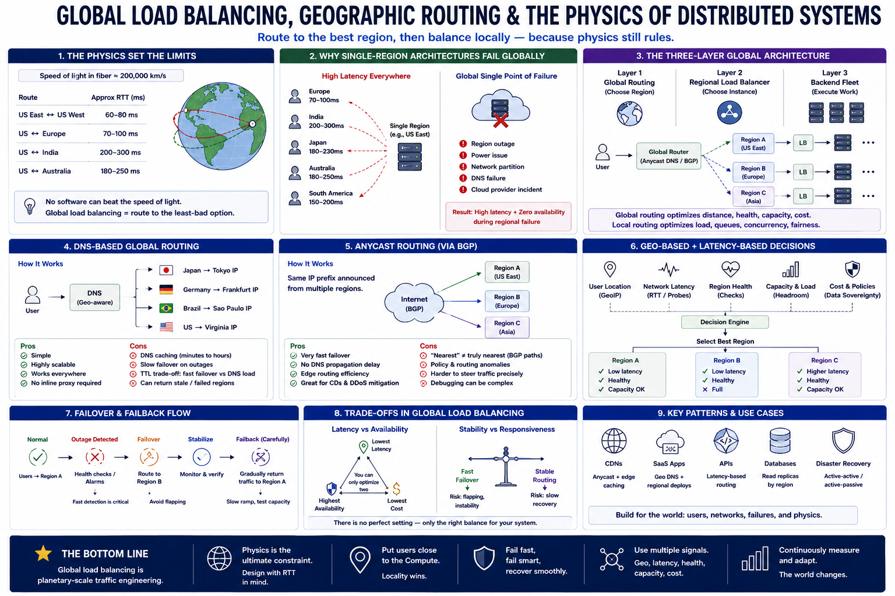

# SECTION 8 — GLOBAL LOAD BALANCING, GEOGRAPHIC ROUTING, AND THE PHYSICS OF DISTRIBUTED SYSTEMS

---

# Why This Section Exists

Previous sections focused primarily on:

* datacenter-scale coordination,
* request routing,
* retries,
* connection lifecycle,
* overload management,
* and local infrastructure behavior.

But eventually every successful distributed system encounters a deeper scaling boundary:

> geography.

At global scale:
users are distributed across:

* continents,
* oceans,
* mobile networks,
* regulatory regions,
* and independent infrastructure zones.

Now systems must solve entirely new classes of problems:

* transcontinental latency,
* regional outages,
* DNS propagation,
* traffic sovereignty,
* replication lag,
* and planetary-scale failover.

This section studies:

> how distributed systems coordinate traffic across the physical world itself.

And why:

* the speed of light becomes an architectural constraint,
* global routing is fundamentally probabilistic,
* and “the cloud” is still constrained by geography and physics.

This is where load balancing evolves into:

> planetary-scale traffic engineering.

---

# The Fundamental Reality — Physics Wins

One of the deepest lessons in distributed systems:

> no software optimization can beat the speed of light.

This becomes critically important globally.

Light in fiber travels roughly:

* 200,000 km/s.

This creates unavoidable RTT floors:

| Route             | Approx RTT |
| ----------------- | ---------- |
| US East ↔ US West | 60–80ms    |
| US ↔ Europe       | 70–100ms   |
| US ↔ India        | 200–300ms  |
| US ↔ Australia    | 180–250ms  |

These are:

* physics limits,
  NOT:
* software inefficiencies. 

---

# The Deep Systems Insight

Global load balancing does NOT:

> “make systems globally fast.”

It:

> routes users to the least-bad geographic option allowed by physics.

This distinction is crucial.

---

# Why Single-Region Architectures Fail Globally

Suppose:
all infrastructure exists in:

* Virginia (US East).

Users in:

* India,
* Japan,
* Australia,
  must cross oceans for every request.

Now consider:
modern web request lifecycle:

DNS lookup
↓
TCP handshake
↓
TLS handshake
↓
API request
↓
Backend fanout
↓
Response rendering

Each stage may require:

* multiple RTTs.

At:
200ms RTT,
simple interactions become:

* seconds of latency.

This creates:

> geographic latency amplification.

---

# Availability Problem

Single-region architecture also creates:

> global single point of failure.

Examples:

* region outage,
* power issue,
* DNS failure,
* network partition,
* cloud-provider incident.

Entire worldwide service becomes unavailable.

Thus:
global systems require:

* geographic redundancy.

---

# What Is Global Load Balancing (GLB)?

---

# Definition

Global Load Balancing distributes traffic across:

* geographic regions,
* datacenters,
* cloud zones,
* or edge locations.

Routing decisions consider:

* geography,
* latency,
* health,
* capacity,
* cost,
* legal requirements,
* and network conditions.

---

# The Crucial Difference From Local Load Balancing

Local LB asks:

> “Which server?”

Global LB asks:

> “Which REGION?”

This is a fundamentally different scale of coordination.

---

# The Three-Layer Global Architecture

Most large systems naturally evolve into:

[Diagram]

User
↓
Global Router
↓
Regional Load Balancer
↓
Local Backend Fleet

---

# Layer 1 — Global Routing

Chooses:

* region/datacenter.

Signals:

* latency,
* geography,
* capacity,
* health.

---

# Layer 2 — Regional Balancing

Chooses:

* local backend instance.

Signals:

* local queues,
* request load,
* server health.

---

# Layer 3 — Backend Infrastructure

Actual application execution.

---

# Deep Systems Insight

Global and local balancing solve:

* fundamentally different optimization problems.

Global routing optimizes:

* network distance,
* failover,
* replication constraints.

Local routing optimizes:

* queue depth,
* CPU,
* concurrency,
* fairness.

---

# Geographic Locality — Why It Matters

Routing nearby reduces:

* RTT,
* handshake cost,
* congestion exposure,
* packet-loss probability.

This dramatically improves:

* latency,
* reliability,
* user experience.

Especially important for:

* realtime systems,
* APIs,
* mobile apps,
* interactive applications.

---

# DNS-Based Global Routing

One of the oldest and most common GLB mechanisms.

---

# How It Works

DNS server responds with:

* region-specific IPs.

Example:

User in Japan
→ Tokyo IP

User in Germany
→ Frankfurt IP

---

# Why DNS Is Attractive

Advantages:

* simple,
* globally deployable,
* no inline traffic proxy required,
* highly scalable.

DNS becomes:

> indirect traffic steering.

---

# The Huge Hidden Problem — DNS Caching

DNS responses cache aggressively.

Meaning:
routing decisions persist for:

* minutes,
* sometimes hours.

This creates:

> stale routing.

---

# Operational Consequences

Suppose:
Tokyo region fails.

DNS still cached:

* old Tokyo IP.

Users continue routing to:

* dead infrastructure.

Failover becomes slow and probabilistic.

---

# TTL Trade-Off

Short TTL:

* faster failover,
* more DNS traffic.

Long TTL:

* lower DNS overhead,
* slower recovery.

Again:
distributed systems involve:

> responsiveness vs stability trade-offs.

---

# Anycast Routing — Routing Through BGP

A very different approach.

---

# Idea

Multiple regions advertise:

* same IP prefix.

Internet BGP routing naturally sends traffic to:

* “nearest” reachable region.

This is:

> Anycast.

---

# Why Anycast Is Powerful

Benefits:

* ultra-fast failover,
* no DNS propagation delays,
* edge routing efficiency,
* DDoS absorption,
* geographic traffic localization.

This powers:

* CDNs,
* edge networks,
* DNS providers,
* large global platforms.

---

# Hidden Reality — “Nearest” Is Not Truly Nearest

BGP optimizes:

* routing policy,
  NOT:
* actual latency.

Thus:
traffic sometimes routes:

* inefficiently,
* asymmetrically,
* unpredictably.

This creates:

> internet path instability.

---

# Deep Insight

The internet itself is:

> a decentralized distributed routing system with incomplete information.

Global load balancing inherits all of its complexity.

---

# Regional Failover — The Hardest Global Problem

Suppose:
region fails.

Traffic shifts elsewhere.

But:
other regions may NOT have spare capacity.

This creates:

> failover amplification.

Example:

* one region outage
  → 2× traffic surge elsewhere
  → cascading overload globally.

---

# Capacity Reservation Problem

Global systems must choose:

| Strategy               | Benefit       | Cost                      |
| ---------------------- | ------------- | ------------------------- |
| Full active-active     | Fast failover | Expensive idle capacity   |
| Minimal spare capacity | Lower cost    | Risk of failover collapse |

This becomes:

> economics vs resilience engineering.

---

# Active-Active vs Active-Passive

---

# Active-Active

All regions serve traffic simultaneously.

Benefits:

* lower latency,
* capacity utilization,
* fast failover.

Problems:

* replication complexity,
* consistency,
* traffic coordination.

---

# Active-Passive

Primary region serves traffic.
Secondary idle until failover.

Benefits:

* simpler consistency,
* easier operations.

Problems:

* wasted capacity,
* slower failover,
* cold-start penalties.

---

# Deep Systems Insight

Distributed systems often trade:

* operational simplicity
  for:
* resource efficiency.

---

# Data Gravity — The Hidden Constraint

A huge global-systems reality:

> traffic routing is constrained by where data lives.

Example:

* database primary in US East.

Even if user routes to:

* Tokyo frontend,
  backend DB calls may still cross oceans.

Latency returns.

This is:

> data gravity.

---

# Why Global Systems Become Extremely Hard

Computation is easy to distribute.

State is not.

Databases introduce:

* replication lag,
* consistency trade-offs,
* cross-region coordination,
* write serialization.

This becomes one of the deepest architectural constraints globally.

---

# CAP Reality Emerges

Global routing eventually collides with:

* distributed consensus,
* consistency,
* partition tolerance.

Example:
global writes require:

* coordination latency.

Physics now directly affects:

* consistency guarantees.

---

# Eventual Consistency — A Geographic Necessity

Cross-region synchronous coordination is expensive.

Thus many systems adopt:

* eventual consistency,
* async replication,
* region-local writes.

Benefits:

* lower latency.

Costs:

* stale reads,
* conflict resolution,
* replication lag.

---

# Deep Systems Lesson

At planetary scale:

> consistency itself becomes a latency problem.

---

# Edge Computing — Moving Compute Closer

Modern architectures increasingly move:

* logic,
* caching,
* auth,
* inference,
  toward:
* edge POPs.

Goal:
reduce RTT.

Examples:

* CDN edge workers,
* serverless edge runtimes,
* edge AI inference.

---

# Hidden Trade-Off

Edge systems improve:

* latency.

But worsen:

* deployment complexity,
* consistency,
* observability,
* debugging,
* cache invalidation.

Again:
locality improves performance while increasing coordination complexity.

---

# Geo-Distributed Caching

Caching becomes essential globally.

Without edge caching:
all requests hit origin region.

Examples:

* CDN caches,
* edge KV stores,
* regional object caches.

---

# Deep Insight

Global systems fundamentally optimize:

> moving data less.

Why?

Because:
cross-ocean RTT dominates modern latency budgets.

---

# Health Checks at Global Scale

Regional health is far harder than local health.

Problems:

* partial network partitions,
* asymmetric routing,
* ISP failures,
* transoceanic packet loss.

One region may appear:

* dead from Europe,
* healthy from Asia.

---

# Multi-Vantage Routing

Modern systems increasingly route using:

* multiple health perspectives.

Avoids:

* localized false failovers.

This becomes:

> distributed consensus about infrastructure health.

---

# Cold-Region Problem

Failover regions often remain:

* cold.

Problems:

* empty caches,
* cold JIT,
* inactive DB replicas,
* connection warmup.

Failover traffic suddenly overwhelms:

* unprepared infrastructure.

This creates:

> recovery shock.

---

# Slow Start for Regions

Global systems increasingly:

* gradually ramp failover traffic.

Another stabilization mechanism.

---

# Cost-Aware Routing

At global scale:
bandwidth and cloud pricing matter enormously.

Systems may intentionally route:

* slightly suboptimal latency paths
  to reduce:
* egress cost,
* inter-region traffic charges.

Thus:
routing is not purely technical.

It is also:

* economic optimization.

---

# Regulatory Routing Constraints

Modern systems increasingly face:

* GDPR,
* data sovereignty,
* localization laws.

Users in:

* EU,
  must remain:
* within EU regions.

This introduces:

> policy-aware routing.

Now routing optimizes:

* legality,
  not merely:
* latency.

---

# Observability at Planetary Scale

Global systems face:

* highly fragmented observability.

Metrics differ across:

* ISPs,
* regions,
* edge locations,
* devices.

Problems become:

* geographically asymmetric.

Example:
only users on:

* one mobile carrier in Brazil
  experience failures.

This creates:

> observability fragmentation.

---

# Tail Latency Becomes Geographic

Global p99 latency often dominated by:

* worst network paths,
* regional congestion,
* packet-loss hotspots,
* ISP routing anomalies.

Average latency becomes almost meaningless globally.

---

# Deep Control-Theory Narrative

Global routing increasingly behaves like:

> planetary-scale adaptive control systems.

Inputs:

* latency,
* congestion,
* health,
* cost,
* legal policy,
* capacity.

Outputs:

* traffic distribution.

But:

* signals are delayed,
* routing is probabilistic,
* internet paths fluctuate constantly.

This creates massive:

* feedback instability risk.

---

# The Hidden Evolution Narrative

Global traffic systems evolved through clear stages.

---

# Phase 1 — Single Region

Simple deployment.

Problem:
latency + SPOF.

---

# Phase 2 — DNS Geo Routing

Basic regional locality.

Problem:
stale DNS failover.

---

# Phase 3 — Anycast + Multi-Region

Faster failover and edge routing.

Problem:
global state coordination.

---

# Phase 4 — Edge Computing

Move compute toward users.

Problem:
consistency and deployment complexity.

---

# Phase 5 — Planetary Adaptive Routing

Dynamic traffic engineering:

* congestion-aware,
* latency-aware,
* policy-aware,
* cost-aware.

Problem:
massive distributed control complexity.

This evolution is fundamentally driven by:

> physics and geographic distribution.

---

# The Deepest Systems Lesson

Perhaps the single most important insight of this section:

> distributed systems are ultimately physical systems constrained by geography, latency, and the speed of light.

At global scale:

* network topology,
* ocean distance,
* replication delay,
* and regional coordination
  become first-class architectural constraints.

No abstraction removes this reality.

---

# Connection to Next Section

This section focused on:

* geographic routing,
* global balancing,
* failover,
* and physics constraints.

But another major challenge naturally emerges:

> how do we actually PLAN capacity and scaling behavior under all these realities?

Because:

* locality,
* retries,
* long-lived connections,
* regional failover,
* and sticky traffic
  all fundamentally distort scaling assumptions.

The next section studies:

* capacity planning,
* autoscaling dynamics,
* headroom engineering,
* skew modeling,
* and operational scaling behavior in real production systems.

---
# Diagram

# Quick Summary

* Global load balancing routes traffic across geographic regions rather than individual servers.
* The speed of light imposes unavoidable latency floors on distributed systems.
* DNS-based routing provides scalable global steering but suffers from stale caching behavior.
* Anycast enables fast edge routing through BGP-based geographic traffic localization.
* Global failover risks cascading overload if spare regional capacity is insufficient.
* Active-active systems improve latency and failover but complicate consistency and coordination.
* Data gravity constrains routing because state replication remains expensive.
* Global systems increasingly adopt eventual consistency due to cross-region latency realities.
* Edge computing moves compute closer to users but increases operational complexity.
* Observability becomes fragmented and geographically asymmetric at global scale.
* Planetary-scale routing increasingly behaves like adaptive distributed control systems operating under delayed and probabilistic signals.
* At global scale, distributed systems become constrained directly by physics and geography.
