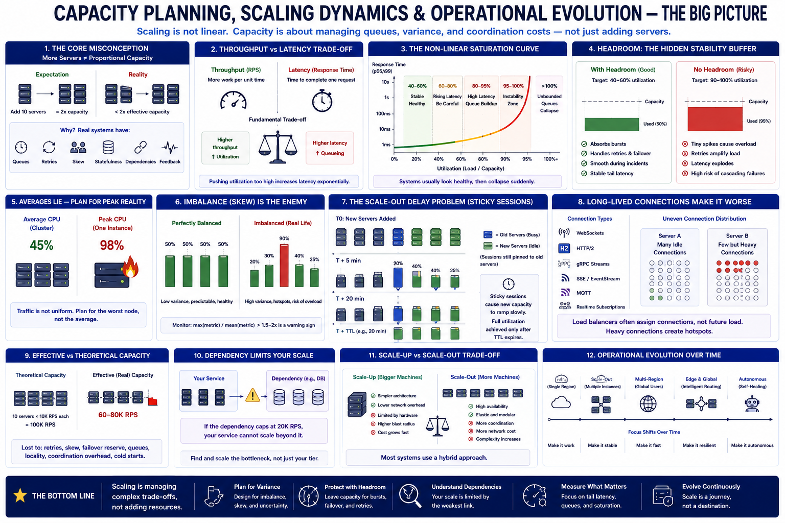

# SECTION 9 — CAPACITY PLANNING, SCALING DYNAMICS, AND OPERATIONAL EVOLUTION

---

# Why This Section Exists

Previous sections established:

* balancing algorithms,
* affinity,
* retries,
* overload propagation,
* connection lifecycle,
* global routing,
* and distributed instability.

But production systems eventually confront another unavoidable reality:

> scaling behavior is rarely linear.

Adding:

* more servers,
* more regions,
* more proxies,
* or more bandwidth
  does NOT automatically produce:
* proportional capacity increase.

Why?

Because real systems contain:

* queues,
* locality,
* retries,
* cold starts,
* skew,
* replication lag,
* shared dependencies,
* and delayed feedback loops.

This section studies:

> how distributed systems actually behave operationally under growth and scale.

And why:

* theoretical capacity differs from effective capacity,
* averages become dangerous,
* headroom matters more than peak throughput,
* and most scaling failures emerge from hidden coordination costs rather than raw compute shortages.

This section transitions from:

> “how systems route traffic”
> to:
> “how systems survive long-term operational growth.”

---

# The Fundamental Misconception

One of the biggest beginner assumptions:

> doubling servers doubles capacity.

This is rarely true in production.

Real scaling behavior is distorted by:

* uneven traffic,
* retries,
* statefulness,
* long-lived connections,
* queue contention,
* dependency bottlenecks,
* replication costs,
* and operational delays.

This creates one of the deepest systems lessons:

> effective capacity is always lower than theoretical capacity.

Understanding WHY is one of the central goals of this section.

---

# The Deep Hidden Narrative

This section revolves around a foundational systems principle:

> scaling is fundamentally coordination management.

Small systems scale mostly through:

* raw hardware.

Large systems increasingly scale through:

* reducing coordination overhead,
* isolating bottlenecks,
* controlling amplification,
* and stabilizing feedback loops.

The biggest challenge eventually becomes:

* distributed coordination cost,
  not:
* CPU.

---

# Throughput vs Latency — The Foundational Trade-Off

Before discussing capacity planning,
we must establish a critical distinction.

---

# Throughput

Amount of work completed per unit time.

Examples:

* requests/sec,
* MB/sec,
* messages/sec.

---

# Latency

Time required to complete one operation.

Examples:

* p50 response time,
* p99 request latency.

---

# Why This Matters

Systems often increase:

* throughput,
  while simultaneously worsening:
* latency.

Example:
queueing more work increases utilization,
but waiting time explodes near saturation.

---

# Deep Queueing Insight

A system at:

* 50% utilization
  may behave extremely well.

At:

* 95% utilization,
  small bursts create:
* massive queue growth,
* tail-latency explosions,
* instability.

This is why production systems rarely target:

* 100% utilization.

---

# The Non-Linear Saturation Curve

One of the most important operational realities.

As utilization rises:

| Utilization | Behavior              |
| ----------- | --------------------- |
| 40–60%      | Stable                |
| 70–80%      | Elevated tail latency |
| 85–95%      | Queue buildup risk    |
| 95–100%     | Instability zone      |
| >100%       | Unbounded queues      |

This explains why:
systems often appear healthy,
then collapse suddenly.

---

# Headroom — The Hidden Stability Buffer

Modern infrastructure intentionally leaves:

> unused capacity.

This is called:

* headroom.

Example:
target:

* 40–60% CPU,
  NOT:
* 95%.

---

# Why Headroom Exists

Headroom absorbs:

* bursts,
* retries,
* failover traffic,
* hotspotting,
* GC pauses,
* noisy neighbors,
* deployment imbalance.

Without headroom:
small disturbances create:

* instability cascades.

---

# Deep Systems Insight

Unused capacity is NOT waste.

It is:

> stability reserve.

This is one of the most important production lessons.

---

# The Difference Between Average and Peak Reality

Averages hide operational danger.

Example:

Average cluster CPU:

* 45%

Peak instance CPU:

* 98%

System appears:

* healthy.

Reality:

* hotspot collapse imminent.

---

# Why This Happens

Traffic is NOT uniform.

Different users generate:

* radically different load.

Examples:

* power users,
* hot tenants,
* viral content,
* uneven connection distribution,
* sticky sessions.

Thus:
capacity planning must account for:

> skew,
> not merely:
> averages.

---

# Imbalance Ratios

Production systems often monitor:

max(metric) / mean(metric)

Examples:

* CPU imbalance,
* RPS imbalance,
* queue imbalance.

Ratios:

> 1.5–2×
> often indicate:

* dangerous skew,
* hotspotting,
* poor balancing.

---

# Effective Capacity vs Theoretical Capacity

Suppose:
10 servers
×
10K RPS each
============

100K theoretical RPS.

Reality may only sustain:

* 60–80K safely.

Why?

Because:

* imbalance,
* retries,
* failover reserve,
* queue variance,
* coordination overhead,
* and cold-start behavior
  reduce usable capacity.

---

# Deep Insight

Capacity planning is fundamentally:

> planning for imperfection.

---

# Sticky Sessions and Capacity Distortion

Section 3 introduced:

* affinity,
* locality,
* sticky sessions.

Now we examine operational consequences.

---

# The Scale-Out Delay Problem

Suppose:
session TTL:
20 minutes.

Add new servers.

Existing sessions remain pinned.

New instances initially receive:

* only new sessions.

Thus:
cluster capacity ramps slowly over:

* the TTL duration. 

This creates:

> delayed effective scaling.

---

# Long-Lived Connections Make This Worse

WebSockets,
HTTP/2,
gRPC streams
persist for:

* minutes,
* hours.

Scaling out:

* does NOT rebalance old connections.

This creates:

* hot old nodes,
* cold new nodes,
* severe utilization skew.

---

# The Deep Systems Lesson

Historical routing decisions continue affecting future load distribution.

This means:
distributed systems possess:

> operational memory.

And systems with memory are harder to stabilize.

---

# Autoscaling — The Illusion of Infinite Elasticity

Cloud platforms create a dangerous beginner illusion:

> “systems scale automatically.”

Real autoscaling is extremely hard.

Why?

Because autoscaling itself is:

> a distributed feedback-control system.

---

# Typical Autoscaling Inputs

Examples:

* CPU,
* queue depth,
* request rate,
* latency,
* concurrency.

---

# Hidden Problem — Delayed Signals

Metrics arrive:

* late.

Scaling actions take:

* time.

New instances require:

* startup,
* warmup,
* connection establishment,
* cache filling.

Thus:
autoscaling reacts to:

> old information.

---

# Positive Feedback Failure Example

Traffic spike
→ queues grow
→ latency rises
→ retries amplify traffic
→ autoscaler adds cold nodes
→ cache misses spike
→ latency worsens further

This creates:

> autoscaling-induced instability.

---

# Cold Start Penalties

New servers initially lack:

* warm caches,
* JIT optimization,
* open connections,
* trained adaptive behavior.

Cold instances often perform:

* substantially worse initially.

Thus:
adding capacity may temporarily worsen latency.

---

# Slow Start Mechanisms

Production systems gradually ramp:

* traffic to new instances.

Benefits:

* controlled cache warmup,
* smoother scaling,
* reduced retry amplification.

Another example of:

> stability over aggressive responsiveness.

---

# Queue-Based Autoscaling

Modern systems increasingly scale using:

* queue depth,
  not merely:
* CPU.

Why?

Queues reveal:

* pending work,
* saturation risk,
* latency pressure,
  earlier than CPU averages.

This reflects a deeper shift toward:

> workload-aware scaling.

---

# Resource Bottleneck Migration

A critical scaling insight:

> scaling one bottleneck exposes another.

Example progression:

Phase 1:
CPU bottleneck.

Scale app servers.

Phase 2:
DB bottleneck emerges.

Scale DB replicas.

Phase 3:
network bottleneck emerges.

Phase 4:
cache bottleneck emerges.

Phase 5:
coordination bottleneck emerges.

This progression is almost universal.

---

# Deep Systems Insight

Scaling is largely:

> bottleneck migration engineering.

---

# Shared Dependency Collapse

Distributed systems frequently share:

* DBs,
* caches,
* queues,
* auth services.

One overloaded shared dependency:
→ many services fail simultaneously.

This creates:

> correlated failure domains.

---

# Fanout Amplification

Microservices often multiply work.

One frontend request:
→ 20 downstream calls.

Traffic spike:
100K frontend RPS
→ 2M backend operations.

This creates:

> multiplicative infrastructure pressure.

---

# Capacity Planning for Failures

Healthy systems must survive:

* node failures,
* AZ failures,
* regional failures.

Meaning:
systems intentionally provision:

* spare failover capacity.

---

# N+1 Redundancy

Example:
need:
10 servers.

Actually deploy:
11+ servers.

Purpose:
maintain safe load after failure.

---

# Deep Systems Insight

Reliable systems intentionally operate below maximum efficiency.

Efficiency and resilience fundamentally conflict.

---

# Regional Failover Capacity

Global systems often reserve:

* regional spare capacity.

Otherwise:
one-region outage
→ global overload cascade.

But spare capacity is expensive.

Thus:
capacity planning becomes:

> economic optimization under uncertainty.

---

# Brownout Engineering

Under overload:
systems increasingly degrade:

* non-essential functionality.

Examples:
disable:

* recommendations,
* analytics,
* expensive ML inference.

Preserve:

* login,
* checkout,
* critical APIs.

This maintains:

> graceful degradation.

---

# Operational Cost of Tail Latency

Tail latency creates hidden infrastructure cost.

Suppose:
p99 spikes.

To preserve SLOs:
operators often:

* massively overprovision infrastructure.

This means:
small tail improvements can save:

* enormous infrastructure cost.

---

# Capacity Is Multidimensional

Another critical production insight.

Systems rarely bottleneck on:
only CPU.

Possible bottlenecks:

* CPU,
* RAM,
* disk IOPS,
* NIC bandwidth,
* packet rate,
* file descriptors,
* DB pools,
* locks,
* queue depth,
* threadpools,
* network RTT.

Thus:
capacity planning is:

> multidimensional resource management.

---

# Observability Distortion During Scaling

Scaling systems distort telemetry.

Examples:

* retries inflate RPS,
* caching hides backend load,
* pooled connections hide concurrency,
* averages hide hotspots,
* autoscaling lags actual pressure.

This makes:
capacity forecasting extremely difficult.

---

# Forecasting — The Hard Reality

Capacity planning involves:

* uncertainty,
* seasonality,
* flash crowds,
* viral spikes,
* regional anomalies,
* marketing events.

Meaning:
precise forecasting is impossible.

Modern systems instead optimize for:

> adaptability under uncertainty.

---

# Flash Crowds and Burstiness

Traffic is highly bursty.

Examples:

* product launches,
* sports events,
* Black Friday,
* breaking news,
* celebrity traffic.

Burstiness often matters more than:

* average traffic.

---

# Deep Insight

Infrastructure must survive:

> transient extremes,
> not merely:
> average behavior.

---

# The Cost of Coordination

As systems scale:
coordination increasingly dominates.

Examples:

* distributed locks,
* cache invalidation,
* consensus,
* replication,
* metadata propagation,
* health synchronization.

Eventually:
coordination overhead itself becomes:

* the bottleneck.

---

# Horizontal Scaling Eventually Stops Being Linear

This is one of the deepest scaling lessons.

Initially:
adding servers helps enormously.

Later:
coordination cost grows.

Eventually:
additional servers produce:

* diminishing returns.

This is why:
large systems increasingly partition:

* services,
* data,
* tenants,
* regions.

---

# Sharding — Scaling Through Partitioning

At very large scale:
systems stop:

* “sharing everything.”

Instead:

* partition ownership.

Examples:

* user shards,
* tenant shards,
* regional isolation.

This reduces:

* coordination overhead.

---

# Deep Systems Insight

Scalability increasingly comes from:

> reducing coordination scope.

NOT merely:

> adding hardware.

---

# The Hidden Evolution Narrative

Operational scaling evolves through clear phases.

---

# Phase 1 — Vertical Scaling

Simple hardware growth.

Problem:
physical limits.

---

# Phase 2 — Horizontal Scaling

More servers.

Problem:
traffic coordination.

---

# Phase 3 — Dynamic Balancing

Adaptive routing.

Problem:
feedback instability.

---

# Phase 4 — Elastic Infrastructure

Autoscaling,
cloud elasticity.

Problem:
cold starts and delayed feedback.

---

# Phase 5 — Planetary Coordination

Global balancing,
regional failover,
distributed state.

Problem:
physics and coordination cost.

---

# Phase 6 — Partitioned Systems

Shard ownership,
tenant isolation,
regional autonomy.

Goal:
reduce coordination complexity itself.

This evolution is fundamentally driven by:

> coordination cost becoming the dominant scaling bottleneck.

---

# The Deepest Systems Lesson

Perhaps the single most important insight of this section:

> large-scale distributed systems are constrained less by raw compute and more by coordination, imbalance, and stability dynamics.

Most production scaling problems are NOT:

* “need more CPU.”

They are:

* hotspotting,
* retries,
* queue amplification,
* cold starts,
* delayed feedback,
* failover skew,
* and coordination overhead.

Understanding this is the transition from:

* beginner scaling intuition
  to:
* real production systems thinking.

---

# Connection to Final Section

This section focused on:

* operational scaling,
* capacity dynamics,
* autoscaling,
* bottleneck migration,
* and distributed coordination cost.

The final section now synthesizes EVERYTHING together:

* requests,
* connections,
* retries,
* locality,
* global routing,
* health detection,
* scaling behavior,
* and distributed instability.

We will trace:

> the complete lifecycle of a request through a modern distributed system.

And connect all prior sections into:

> one unified systems-engineering narrative.

---
# Diagram 

# Quick Summary

* Real-world scaling behavior is non-linear due to coordination cost and instability dynamics.
* Effective capacity is always lower than theoretical capacity.
* Queue growth and tail latency explode near saturation.
* Headroom is a deliberate stability reserve, not wasted infrastructure.
* Sticky sessions and long-lived connections create scaling inertia and imbalance.
* Autoscaling is itself a delayed feedback-control system.
* Cold starts and cache warmup distort scaling behavior.
* Bottlenecks migrate as systems evolve.
* Shared dependencies create correlated failure domains.
* Capacity planning must account for failures, retries, skew, and burstiness.
* Scalability increasingly depends on reducing coordination overhead rather than adding hardware.
* Large-scale distributed systems are fundamentally coordination-management systems operating under uncertainty.
