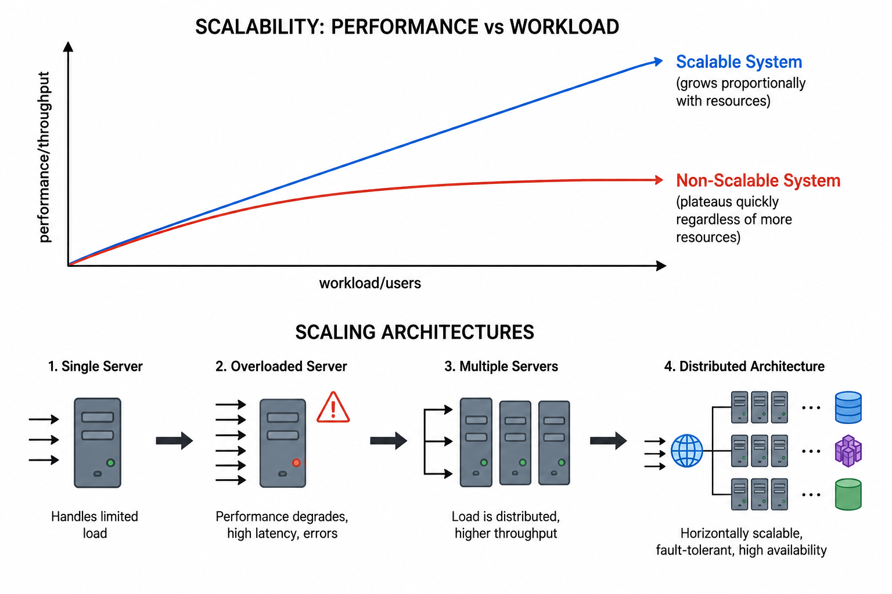
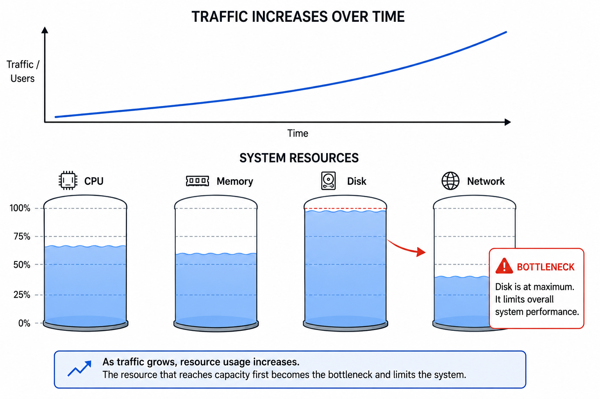
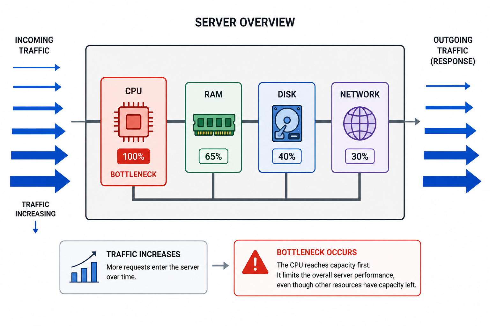

# PART 1 - FOUNDATIONS OF SCALABILITY

# Understanding WHY Systems Need to Scale

# SECTION 0 - ORIENTATION

# What is this topic about?

This part teaches the foundational thinking behind scalability.

Before learning:

* load balancers,
* caching,
* databases,
* CDNs,
* queues,

we must first understand:
WHY systems fail as they grow.

Scalability is fundamentally about:
how systems behave when workload increases.

And more importantly:
how engineers redesign systems when existing designs stop working.

---

# Why does this matter?

Every successful software system eventually faces growth.

Growth creates pressure on:

* CPU,
* memory,
* storage,
* network,
* databases,
* latency,
* reliability.

Without scalability:

* systems become slow,
* users experience failures,
* downtime increases,
* costs explode,
* architectures collapse under traffic.

Scalability is what separates:

* hobby projects
  from
* internet-scale systems.

---

# Where does this fit in the bigger picture?

This part is the conceptual foundation for all future system design topics.

Everything later like :

* load balancing,
* distributed systems,
* replication,
* caching,
* queues,
* microservices,

exists because of scalability pressures.

This section builds the mental model needed to understand why those systems exist.

---

# What will we fully understand by the end?

By the end of this part, we will understand:

* what scalability actually means,
* why it is difficult,
* why scalability is not “just adding servers,”
* why systems hit bottlenecks,
* how bottlenecks evolve,
* why distributed systems emerge,
* why scalability must be designed early,
* the physical realities behind system growth.

---

# Prerequisite Check

Required:

* Basic understanding of websites/apps
* Basic idea of servers and databases

No distributed systems knowledge required.

---

# The Landscape - Key Topics Covered

This part covers:

1. What scalability actually means
2. Throughput vs latency
3. Scaling dimensions
4. Resource bottlenecks
5. Why scalability is hard
6. Redundancy and reliability scaling
7. Heterogeneity in distributed systems
8. Scalability as architectural philosophy
9. Bottleneck migration
10. Resource-level systems thinking

---

# 1. WHAT IS SCALABILITY?

─────────────────────────────────────────────

# The One-Line Definition

Scalability is the ability of a system to handle increasing workload efficiently by adding resources.

---

# Intuition First

[Analogy]

Imagine a small restaurant.

Initially:

* 1 chef,
* 5 customers.

Everything works perfectly.

Now imagine:

* 500 customers arrive.

Problems immediately appear:

* waiting time increases,
* kitchen becomes overloaded,
* tables become full,
* service slows down.

The restaurant now has two choices:

* buy better kitchen equipment,
* hire more chefs/open more branches.

Scalability is about whether the restaurant can continue serving customers efficiently as demand grows.

Exactly the same thing happens in software systems.

---

# The Problem It Solves

Initially, almost every application works fine.

Why?

Because:

* low traffic,
* small datasets,
* few concurrent users.

But growth changes everything.

As systems grow:

* requests increase,
* data grows,
* users become concurrent,
* operations become expensive.

Eventually:
one or more resources become overloaded.

That overload creates:

* slow responses,
* failures,
* downtime,
* crashes.

Scalability exists because successful systems grow beyond the limits of their original architecture.

---

# The Core Idea

A system is scalable if:

Adding resources leads to proportional performance improvement.

Examples:

* doubling servers roughly doubles throughput,
* adding replicas improves read capacity,
* adding cache reduces database load.

Scalability is NOT:
“system survives.”

Scalability IS:
“system continues operating efficiently as workload grows.”

---

# Important Clarification — Performance vs Scalability

A fast system is not necessarily scalable.

Example:

A single extremely powerful machine may:

* handle 50,000 requests/sec today.

But:
if traffic doubles tomorrow,
the system may completely collapse.

Meanwhile:
a distributed system handling only 10,000 requests/sec today may scale to millions later.

Meaning:
performance today ≠ scalability tomorrow.

---

# How It Works — Step by Step

1. System receives workload
2. Workload increases
3. Resource bottleneck appears
4. Engineers identify bottleneck
5. Additional resources added
6. Architecture redesigned if needed
7. Throughput improves
8. New bottleneck eventually appears

This last step is critical.

Scalability is never “finished.”

Bottlenecks continuously move.

---

# Worked Example

Suppose:

* one web server handles 1,000 requests/sec.

Traffic grows to:

* 5,000 requests/sec.

Possible scaling responses:

* more CPU,
* more RAM,
* SSD upgrade,
* additional servers,
* caching,
* replication,
* queues.

If architecture scales well:
the system survives growth.

If not:
latency spikes,
timeouts occur,
server crashes.

---

#  Diagram

---

# Key Properties and Characteristics

* Resource proportionality
* Growth tolerance
* Bottleneck sensitivity
* Elasticity potential
* Throughput-oriented
* Often distributed
* Operationally complex

---

# Trade-offs

| Advantage               | Cost / Limitation            |
| ----------------------- | ---------------------------- |
| Supports growth         | Increased complexity         |
| Better availability     | Operational burden           |
| Better resilience       | Coordination overhead        |
| Handles large workloads | Distributed systems problems |

---

# Failure Modes

* CPU exhaustion
* Memory pressure
* Disk bottlenecks
* Network saturation
* Connection exhaustion
* Cascading failures
* Database overload

---

# When to Use This

Scalability matters when:

* traffic can grow,
* workloads are unpredictable,
* uptime matters,
* systems are user-facing.

---

# When NOT to Overengineer

Not every system needs internet-scale architecture.

Overengineering early can:

* slow development,
* increase complexity,
* increase operational cost.

A small internal tool may not need:

* distributed cache,
* replication,
* autoscaling.

---

# Common Mistakes and Misconceptions

## Mistake 1 — “Scalability means adding servers”

False.

Sometimes:

* database schema,
* network latency,
* lock contention,
* bad algorithms

prevent scaling regardless of hardware.

---

## Mistake 2 — “Scalability can be added later”

One of the biggest misconceptions.

Werner Vogels strongly emphasizes:
scalability cannot be an afterthought.

Why?

Because architecture decisions create long-term constraints.

Bad assumptions early become:

* migration pain,
* operational debt,
* rigid systems.

---

## Mistake 3 — “More hardware solves everything”

Eventually:

* coordination,
* consistency,
* network latency,
* software architecture

become bigger problems than raw hardware.

---

# Connection to Other Concepts

This concept leads directly into:

* vertical scaling,
* horizontal scaling,
* distributed systems,
* caching,
* load balancing,
* replication.

---

# Quick Summary

* Scalability = efficient growth handling
* Adding resources should improve performance proportionally
* Scalability is different from raw performance
* Bottlenecks continuously move
* Scalability must be designed early

---

Bridge:
Now that we understand what scalability means, we need to understand WHAT exactly grows inside a system and WHY systems become overloaded.

# 2. UNDERSTANDING WORKLOAD & SYSTEM GROWTH

# The One-Line Definition

Scalability problems occur because workload grows faster than system resources can handle.

---

# Intuition First

Imagine a highway.

Initially:

* few cars,
* traffic moves smoothly.

As more cars arrive:

* congestion increases,
* movement slows,
* eventually traffic jams completely.

Servers behave similarly.

As workload increases:
resources become congested.

---

# The Problem It Solves

Many beginners think:
“More users” is the problem.

But systems do not directly experience:
“users.”

Systems experience:

* CPU work,
* memory usage,
* disk operations,
* network packets,
* database queries,
* concurrent connections.

Understanding scalability means understanding:
which resources are under pressure.

---

# The Core Idea 

Workload growth appears in several dimensions:

| Growth Type               | Example                    |
| ------------------------- | -------------------------- |
| Traffic Growth            | More requests/sec          |
| Data Growth               | More stored records        |
| Concurrency Growth        | More simultaneous users    |
| Geographic Growth         | Global users               |
| Computational Growth      | Heavier operations         |
| Availability Requirements | Higher uptime expectations |

Different systems fail differently depending on which dimension grows first.

---

# Throughput vs Latency

These two concepts are fundamental.

## Throughput

How much work the system completes.

Examples:

* requests/sec,
* transactions/sec,
* MB/sec processed.

## Latency

How long one request takes.

Example:

* 20ms response time.

Important:

A system may have:

* high throughput,
* terrible latency.

or:

* low latency,
* poor throughput.

Real systems constantly balance both.

---

# How It Works

Example:
Instagram traffic grows.

Consequences:

1. More HTTP requests
2. More DB reads
3. More image delivery
4. More memory usage
5. More concurrent connections
6. More cache pressure
7. More network bandwidth usage

Eventually:
some resource saturates first.

That becomes the bottleneck.

---

# Worked Example

Suppose:
one server handles:

* 1,000 users,
* 2 GB RAM usage,
* 30% CPU.

Traffic grows 10x.

Now:

* CPU → 100%
* memory exhausted
* DB overloaded
* requests queue up
* latency spikes

Even though:
“nothing changed in code.”

Growth alone creates failure.

---

# Diagram

---

# Key Properties and Characteristics

* Growth creates pressure
* Different resources saturate differently
* Bottlenecks vary by workload type
* Scaling depends on bottleneck identification

---

# Trade-offs

| Optimization     | Possible Side Effect |
| ---------------- | -------------------- |
| More caching     | More memory usage    |
| More replicas    | Replication lag      |
| More concurrency | Lock contention      |
| Bigger servers   | Higher cost          |

---

# Failure Modes

* Queue buildup
* Connection exhaustion
* Memory swapping
* Disk I/O saturation
* Thread exhaustion
* Network congestion

---

# Common Mistakes

## Mistake — Looking only at CPU

Many systems fail while CPU is low.

Example:

* database connection pool exhausted,
* disk IOPS saturated,
* network bottleneck.

Real scalability requires:
full resource visibility.

---

# Connection to Other Concepts

This section leads into:

* bottlenecks,
* vertical scaling,
* hardware scaling,
* distributed scaling.

---

# Quick Summary

* Systems scale along multiple dimensions
* Growth stresses physical resources
* Bottlenecks depend on workload type
* Throughput and latency are different
* Resource saturation causes failures
---

> **Bridge:**
Now we can understand one of the deepest ideas in scalability:
every scalability problem is fundamentally a resource problem.

---

# 3. RESOURCE-LEVEL THINKING

# The One-Line Definition

Scalability problems are ultimately caused by physical resource limits.

---

# Intuition First

Software feels abstract.

But eventually:
all software runs on physical hardware.

Meaning:
every scalability issue eventually becomes:

* CPU,
* RAM,
* disk,
* network,
  or coordination pressure.

---

# The Problem It Solves

Many beginners think scalability is:
“architecture diagrams.”

But real production bottlenecks are physical.

Examples:

* CPU cannot execute more instructions,
* RAM becomes full,
* disks cannot seek fast enough,
* network RTT becomes dominant.

Real systems engineering requires:
thinking at the resource level.

---

# CPU Bottlenecks

CPU handles:

* request processing,
* encryption,
* compression,
* serialization,
* business logic.

When CPU saturates:

* queues build,
* latency spikes,
* throughput collapses.

---

# Memory Bottlenecks

RAM stores:

* application state,
* cache,
* queues,
* buffers,
* active requests.

When RAM fills:
operating systems begin swapping to disk.

This is catastrophic for latency.

---

# Disk Bottlenecks

Databases heavily depend on disk.

Mechanical disks require:
physical head movement.

This creates:
seek latency.

Important concepts from source material:

| Storage Type | Characteristics                 |
| ------------ | ------------------------------- |
| SATA HDD     | Cheap, slower                   |
| SAS HDD      | Faster enterprise disks         |
| SSD          | No moving parts, extremely fast |

---

# SSD vs HDD Intuition

HDD:
like finding a book by physically walking through a warehouse.

SSD:
like instantly opening the exact page electronically.

That is why SSDs dramatically improve database performance.

---

# Disk IOPS

IOPS:
Input/Output Operations Per Second.

Databases often fail because:
disk cannot perform enough reads/writes fast enough.

Not because CPU is slow.

This is a critical production insight.

---

# Network Bottlenecks

Distributed systems introduce:
network communication.

Network calls are expensive because:

* packets travel physically,
* routers process traffic,
* RTT accumulates.

Important:
cross-machine communication is always slower than in-process communication.

This is one reason distributed systems become hard.

---

# Concurrency Bottlenecks

Servers also fail because of:

* thread exhaustion,
* connection pool exhaustion,
* lock contention.

Example:
DB allows only 500 connections.

501st request:
must wait.

Even if CPU is mostly idle.

---

# Worked Example

A database server:

* CPU = 20%
* memory = 40%

Yet queries are extremely slow.

Why?

Disk:

* 100% IOPS utilization.

Meaning:
storage became bottleneck.

Not compute.

---

# Diagram

---

# Key Properties and Characteristics

* Every resource has limits
* Different workloads stress different resources
* Distributed systems add network overhead
* Physical reality constrains software systems

---

# Trade-offs

| Optimization   | Tradeoff                   |
| -------------- | -------------------------- |
| More RAM cache | Higher cost                |
| SSDs           | Smaller capacity           |
| More threads   | Context switching overhead |
| More replicas  | Network replication cost   |

---

# Failure Modes

* CPU starvation
* Memory exhaustion
* Disk thrashing
* Network congestion
* Queue amplification

---

# Common Mistakes

## Mistake — Ignoring physical reality

A system design that ignores:

* RTT,
* IOPS,
* memory pressure,
* connection limits

will eventually fail in production.

---

# Connection to Other Concepts

This section is foundational for:

* caching,
* databases,
* queues,
* distributed systems,
* load balancing.

---

# Quick Summary

* Scalability is constrained by physical resources
* CPU is not the only bottleneck
* Disk and network are often dominant
* SSDs massively improve performance
* Distributed systems introduce network costs

---

# END OF PART 1 — FOUNDATIONAL UNDERSTANDING

# What We Should Understand Now

We should now understand:

* what scalability actually means,
* why systems fail as they grow,
* how workloads stress resources,
* why bottlenecks emerge,
* why scalability is fundamentally physical,
* why scalability cannot be added casually later.

Most importantly:

> We should now think about systems as:
resource-constrained evolving architectures,
NOT just “applications.”