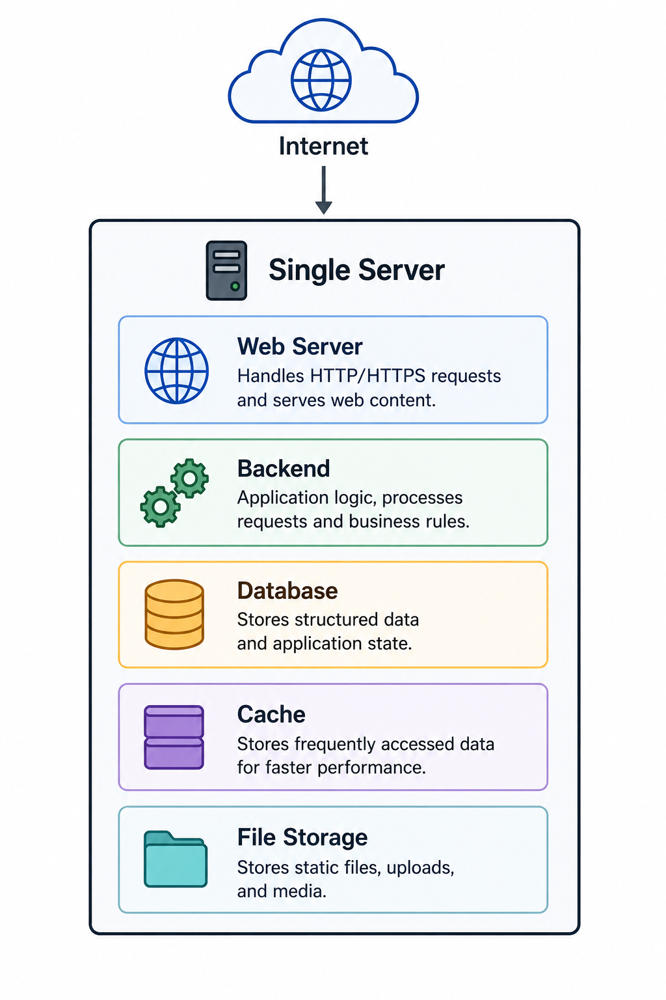
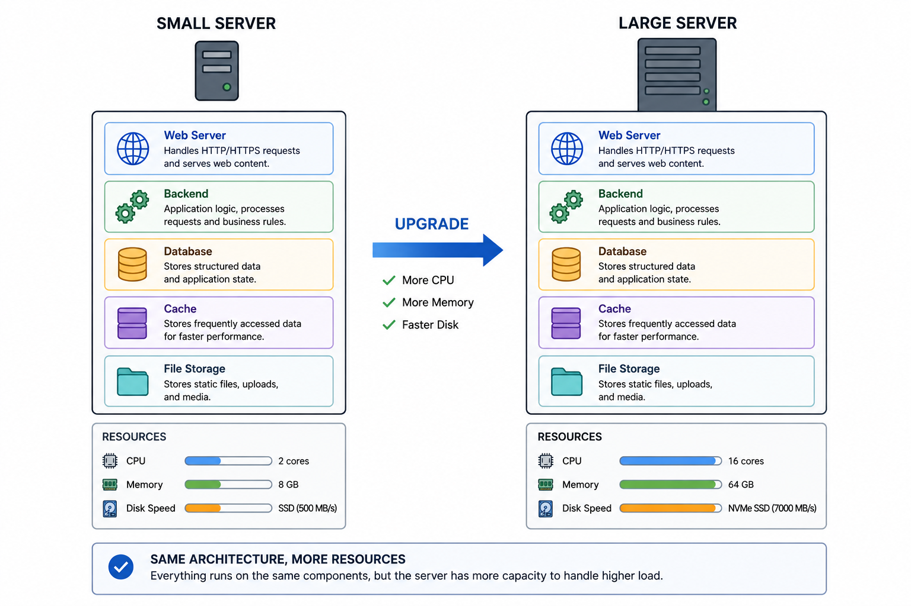
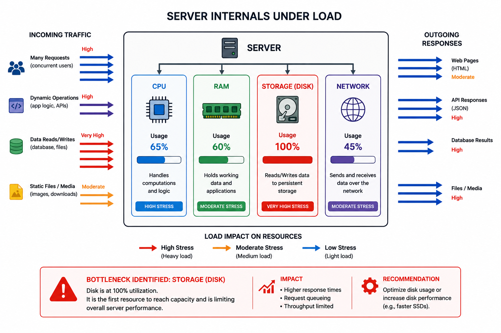
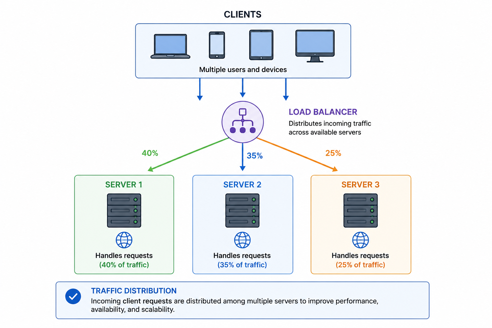

# PART 2: FROM SINGLE SERVER TO HORIZONTAL SYSTEMS

# How Real Systems Begin to Scale

---

# SECTION 0 — ORIENTATION

# What is this part about?

This part teaches how real systems evolve when one machine becomes insufficient.

This is one of the most important transitions in all of system design.

Initially, everything runs on one machine.

Eventually, traffic, data, and concurrent users grow beyond what one server can handle.

At that moment: distributed systems begin.

This section explains why that transition happens.

---

# Why does this matter?

Almost every internet-scale system:

* Netflix,
* Instagram,
* Amazon,
* WhatsApp,
* YouTube

started as:
very small systems.

The challenge is not:
“building a huge system immediately.”

The challenge is:
evolving architecture correctly as bottlenecks appear.

Understanding this evolution teaches:

* architectural thinking,
* scaling reasoning,
* bottleneck analysis,
* production realism.

---

# Where does this fit in the bigger picture?

Part 1 taught:
why scalability matters.

This part teaches:
how scaling evolution actually begins.

This becomes the foundation for:

* load balancers,
* stateless services,
* replication,
* caching,
* distributed systems.

---

# What will we understand by the end?

By the end of this part, we will understand:

* how single-server systems work,
* why they fail,
* vertical scaling,
* hardware bottlenecks,
* VPS/cloud concepts,
* horizontal scaling,
* why distributed architectures emerge,
* why multi-server systems are fundamentally different.

---

# Prerequisite Check

Required:

* Part 1 understanding
* Basic idea of server/client communication

---

# Landscape — Key Topics

1. Single server architecture
2. Request lifecycle
3. Web hosting & VPS
4. Vertical scaling
5. Hardware evolution
6. CPU cores & concurrency
7. Storage systems (HDD/SAS/SSD)
8. Hardware ceilings
9. Horizontal scaling introduction
10. Distributed architecture emergence

---

# 1. THE SINGLE SERVER WORLD

# The One-Line Definition

A single-server architecture runs the entire application stack on one machine.

---

# Intuition First

Imagine a tiny shop.

Inside one building:

* cashier,
* storage,
* manager,
* kitchen,
* accounting,
* inventory.

Everything happens in one place.

That is exactly how most applications begin.

One server handles:

* frontend,
* backend,
* database,
* caching,
* files.

---

# The Problem It Solves

Initially:
small systems do not need complexity.

A single server is:

* easy to build,
* easy to deploy,
* cheap,
* operationally simple.

For early-stage products:
this is ideal.

---

# The Core Idea

Single-server architecture means:
all application components live on one machine.

Typical components:

* web server,
* backend logic,
* database,
* cache,
* storage,
* sessions.

Example stack:

* Nginx
* Node.js
* PostgreSQL
* Redis

all on:
one Linux machine.

---

# How It Works — Step by Step

## Request Lifecycle

1. User enters URL
2. DNS resolves domain
3. Browser gets server IP
4. HTTP request sent
5. Web server receives request
6. Backend processes logic
7. Database queried
8. Response returned

Everything happens on one machine.

---

# Worked Example

Suppose:
you build a small notes app.

One EC2 instance runs:

* React frontend
* Express backend
* PostgreSQL
* Redis

Traffic:
100 users/day.

Everything works perfectly.

Why?

Because:
resource demand is tiny.

---

# Diagram

---

# Key Properties and Characteristics

* Simple
* Cheap
* Fast local communication
* Easy debugging
* Easy deployment

---

# Trade-offs

| Advantage              | Cost / Limitation       |
| ---------------------- | ----------------------- |
| Simplicity             | Single point of failure |
| Easy maintenance       | Limited scalability     |
| Low latency internally | Resource contention     |
| Cheap                  | No redundancy           |

---

# Failure Modes

* CPU overload
* Memory exhaustion
* DB bottleneck
* Full disk
* Server crash = total outage

---

# When to Use This

Good for:

* MVPs
* startups
* prototypes
* internal tools
* low traffic systems

---

# When NOT to Use This

Bad for:

* high availability systems,
* global traffic,
* large concurrent workloads.

---

# Common Mistakes

## Mistake — Starting distributed too early

Many beginners prematurely build:

* microservices,
* distributed queues,
* multiple databases.

This often creates unnecessary complexity.

Single-server systems are often enough initially.

---
# Quick Summary

* Most systems start with one server
* Simple architectures are valuable early
* Everything initially shares one machine
* Single servers are easy but limited
* Growth eventually breaks this model

---

# Bridge

Now we understand how simple systems begin.
The next question becomes:
what happens when this single machine becomes overloaded?

# 2. VERTICAL SCALING — SCALING UP

# The One-Line Definition

Vertical scaling means increasing the power of a single machine.

---

# Intuition First

Your restaurant becomes crowded.

Instead of opening more restaurants:
you buy:

* bigger kitchen,
* faster ovens,
* more tables.

Same building.
Better hardware.

That is vertical scaling.

---

# The Problem It Solves

As traffic grows:
one machine becomes overloaded.

Common symptoms:

* slow responses,
* high CPU,
* memory exhaustion,
* disk bottlenecks.

Vertical scaling attempts to solve this by:
making the machine stronger.

---

# The Core Idea

Increase machine resources:

* CPU
* RAM
* SSD speed
* network bandwidth

without increasing server count.

This is also called:
“scaling up.”

---

# How It Works — Step by Step

1. Monitor bottleneck
2. Identify overloaded resource
3. Upgrade hardware
4. Redeploy application
5. Throughput improves

---

# Worked Example

Initial server:

* 4 CPU cores
* 8 GB RAM
* SATA HDD

Upgrade:

* 32 cores
* 128 GB RAM
* NVMe SSD

Result:
system handles significantly more traffic.

---

# Diagram

---

# Key Properties and Characteristics

* Simple scaling model
* Minimal architecture changes
* Easier consistency
* Easier debugging

---

# Trade-offs

| Advantage                    | Cost / Limitation       |
| ---------------------------- | ----------------------- |
| Simple                       | Hardware ceiling        |
| Lower operational complexity | Expensive               |
| Easier consistency           | Single point of failure |
| Faster local communication   | Limited scalability     |

---

# Failure Modes

* Hardware ceiling reached
* Machine crash causes outage
* Expensive enterprise hardware
* Thermal/power limitations

---

# Important Hidden Insight

Vertical scaling delays distributed systems complexity.

That is extremely valuable.

Distributed systems are hard.

So good engineers avoid them until necessary.

This is one reason startups often vertically scale first.

---

# Common Mistakes

## Mistake — Assuming vertical scaling is infinite

Every machine eventually hits:

* physical limits,
* economic limits,
* thermal limits.

At some point:
one machine is no longer enough.

---

# Quick Summary

* Vertical scaling = stronger machine
* Simple but limited
* Easier operationally
* Eventually hits hard limits
* Delays distributed systems complexity

---

# Bridge

To understand why vertical scaling eventually fails,
we need to understand the actual hardware limits underneath modern systems.

---

# 3. HARDWARE EVOLUTION & RESOURCE LIMITS

# The One-Line Definition

Modern scalability is deeply influenced by physical hardware constraints.

---

# Intuition First

Software engineers often think:
“just add more power.”

But computers are physical machines.

Meaning:

* CPUs have limits,
* disks have limits,
* memory has limits,
* networks have limits.

Scalability eventually collides with physics.

---

# CPU Evolution — Cores & Parallelism

Older computers:

* single CPU,
* single core.

Modern systems:

* multiple CPUs,
* multiple cores per CPU.

Example:

* 32-core server.

Meaning:
many operations can happen simultaneously.

---

# Important Insight — Concurrency vs Parallelism

## Concurrency

Many tasks make progress over time.

## Parallelism

Many tasks literally execute simultaneously.

The key difference is that concurrency is about dealing with many things at once, while parallelism is about doing many things at once

Modern multi-core servers enable:
true parallelism.

This is critical for:
handling many requests simultaneously.

---

# Why Multi-Core Changed Scalability

Before multi-core:
servers handled requests mostly serially.

Now:
multiple requests can execute simultaneously.

This massively improved:
web server scalability.

---

# Storage Evolution

| Storage Type | Characteristics              |
| ------------ | ---------------------------- |
| SATA HDD     | Standard consumer disks      |
| SAS HDD      | Faster enterprise disks      |
| SSD          | Solid-state, no moving parts |

---

# HDD vs SSD

## HDD

Mechanical:

* spinning platters,
* physical seek movement.

Performance bottleneck:
seek latency.

---

## SSD

No moving parts.

Advantages:

* much lower latency,
* massively higher IOPS,
* better database performance.

---

# Why Databases Care About SSDs

Databases constantly:

* read pages,
* write WAL logs,
* update indexes.

Disk latency heavily affects:
query speed.

This is why SSD adoption dramatically improved:
database scalability.

---

# SAS (Serial Attached SCSI) vs SATA (Serial Advanced Technology Attachment)

SAS drives:

* enterprise-grade,
* faster RPM,
* higher reliability,
* better throughput.

Used heavily in:
servers/databases.

---

# Resource-Level Production Insight

A surprising number of production outages are:
NOT caused by bad code.

They are caused by:

* disk saturation,
* IOPS exhaustion,
* memory pressure,
* connection exhaustion.

This is one of the deepest lessons in scalability.

---

# Worked Example

Suppose:
DB server CPU = 20%.

Yet queries are slow.

Reason:
disk IOPS fully saturated.

Meaning:
storage became bottleneck.

Not compute.

---

# Diagram

---

# Key Properties and Characteristics

* Hardware constrains scalability
* Different workloads stress different resources
* SSDs dramatically reduce latency
* CPU is not always bottleneck

---

# Trade-offs

| Resource Upgrade | Tradeoff         |
| ---------------- | ---------------- |
| More RAM         | Higher cost      |
| SSDs             | Smaller capacity |
| More CPU cores   | More power usage |
| Enterprise disks | Higher expense   |

---

# Common Mistakes

## Mistake — Looking only at CPU

Many real bottlenecks occur in:

* storage,
* network,
* memory,
* connection pools.

---

# Quick Summary

* Scalability is constrained by hardware
* Multi-core CPUs improved concurrency
* SSDs transformed DB performance
* Disk bottlenecks are common
* Real systems are limited by physical resources

---

# Bridge

Eventually even powerful hardware becomes insufficient.
That is when systems begin the most important architectural transition:
horizontal scaling.

---

# 4. HORIZONTAL SCALING — SCALING OUT

# The One-Line Definition

Horizontal scaling means increasing capacity by adding more machines.

---

# Intuition First

Instead of one giant restaurant:
open many smaller restaurants.

Distribute customers among them.

That is horizontal scaling.

---

# The Problem It Solves

Vertical scaling eventually fails because:

* hardware has limits,
* costs explode,
* one machine remains fragile.

Horizontal scaling removes dependency on one server.

---

# The Core Idea (Precise)

Instead of:
1 huge machine,

use:
many machines cooperating together.

Requests distributed across:
multiple servers.

This is also called:
“scale out.”

---

# Why Horizontal Scaling Is Powerful

With enough coordination:
systems can theoretically scale almost indefinitely.

Add:

* more servers,
* more storage nodes,
* more replicas.

Capacity grows incrementally.

---

# How It Works — Step by Step

1. Traffic grows
2. One server overloaded
3. Additional servers added
4. Requests distributed
5. Workload shared
6. Throughput improves

---

# Worked Example

One server:
1,000 req/sec.

10 servers:
~10,000 req/sec possible.

assuming:

* proper load balancing,
* stateless architecture,
* no DB bottleneck.

---

# Diagram

---

# Key Properties and Characteristics

* Better scalability
* Better fault tolerance
* Better availability
* Incremental growth
* Cloud-friendly

---

# Trade-offs

| Advantage                       | Cost / Limitation      |
| ------------------------------- | ---------------------- |
| Near-infinite scaling potential | Distributed complexity |
| Better redundancy               | Network overhead       |
| Fault tolerance                 | Consistency challenges |
| Easier incremental growth       | Operational burden     |

---

# Important Production Insight

Horizontal scaling changes the nature of the problem.

You no longer manage:
one machine.

You now manage:
a distributed system.

That introduces:

* coordination,
* state synchronization,
* network communication,
* distributed failures.

This is a HUGE transition.

---

# Failure Modes

* Uneven traffic distribution
* State inconsistency
* Replication lag
* Network failures
* Distributed coordination problems

---

# Common Mistakes

## Mistake — Assuming more servers automatically fixes scaling

Sometimes:
adding servers increases complexity faster than performance.

Poorly designed distributed systems can scale worse than single servers.

---

# Connection to Other Concepts

Horizontal scaling directly leads into:

* load balancers,
* stateless architecture,
* replication,
* distributed systems.

---

# Quick Summary

* Horizontal scaling = adding more servers
* Removes single-machine dependency
* Enables internet-scale systems
* Introduces distributed systems complexity
* Changes architecture fundamentally

---

# END OF PART 2 — EVOLUTION INTO DISTRIBUTED SYSTEMS

# What we should understand now

We should now understand:

* how real systems begin,
* why one machine eventually fails,
* vertical scaling mechanics,
* hardware limitations,
* storage realities,
* why distributed systems emerge,
* the fundamental difference between scale-up vs scale-out.

Most importantly:

We should now understand that:
horizontal scaling is NOT “just more servers.”

It is the beginning of distributed systems engineering.
