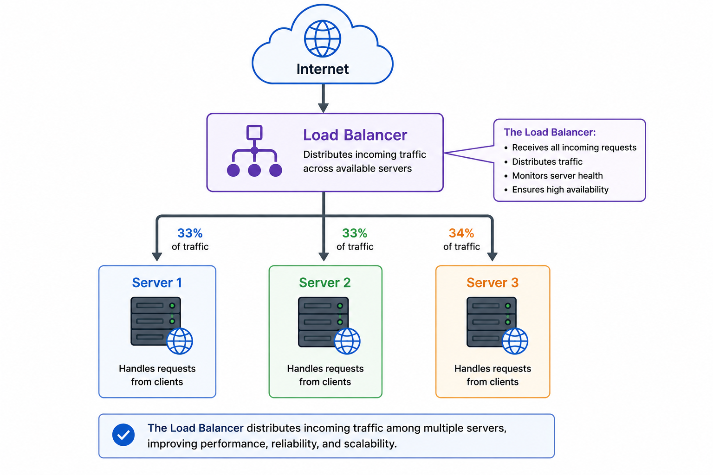
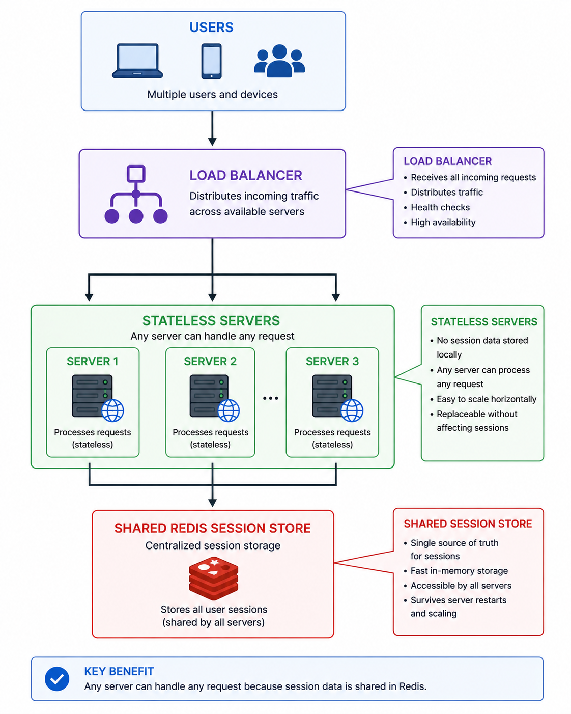
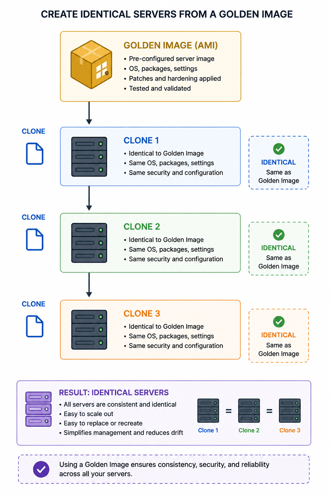

# PART 3 - LOAD BALANCING & STATELESS ARCHITECTURE

# How Multiple Servers Cooperate

# SECTION 0 - ORIENTATION

# What is this part about?

In Part 2, we learned:
one machine eventually becomes insufficient.

So we added:
multiple servers.

But that immediately creates a new problem:

“How do users interact with many servers correctly?”

This part teaches:

* how requests are distributed,
* how servers cooperate,
* why state becomes dangerous,
* why stateless architecture is foundational,
* how scalable systems make servers interchangeable.

This is one of the most important transitions in system design.

Because:
THIS is where systems stop being “single applications”
and start becoming:
distributed systems.

---

# Why does this matter?

Without proper traffic distribution:

* some servers overload,
* others remain idle,
* failures crash the entire system.

Without stateless design:

* scaling breaks,
* sessions disappear,
* users get inconsistent behavior.

Modern cloud infrastructure fundamentally depends on:

* stateless services,
* interchangeable servers,
* externalized state.

---

# Where does this fit in the bigger picture?

This part is the bridge between:
“multiple machines”
and
“real distributed systems.”

This becomes the foundation for:

* autoscaling,
* Kubernetes,
* cloud-native systems,
* microservices,
* distributed deployments.

---

# What will we understand by the end?

By the end of this part, we will understand:

* how load balancers work,
* DNS vs real load balancing,
* traffic distribution strategies,
* why sessions break scaling,
* sticky sessions,
* stateless architecture,
* shared session stores,
* Redis session management,
* deployment consistency,
* immutable infrastructure foundations,
* why scalable servers must become interchangeable.

---

# Mental Prerequisite Check

Required:

* Part 1 & 2 understanding
* Horizontal scaling concepts
* Basic HTTP request flow

---

# Landscape — Key Topics

1. Why traffic distribution is required
2. DNS round robin
3. Load balancers
4. Request routing
5. Health checks
6. Public vs private networking
7. Session problems
8. Sticky sessions
9. Stateless architecture
10. Shared session stores
11. Redis session management
12. Deployment consistency
13. Immutable infrastructure
14. AMIs & server cloning

---

# 1. WHY MULTIPLE SERVERS CREATE NEW PROBLEMS

# The One-Line Definition

Adding more servers solves capacity problems but creates coordination problems.

---

# Intuition First

Imagine:
we expanded from:
1 restaurant
to
10 restaurants.

Now new questions appear:

* Which restaurant should customers go to?
* What if one restaurant is full?
* What if one closes?
* How do all branches stay consistent?

Scaling infrastructure creates coordination challenges.

The same thing happens in software systems.

---

# The Problem It Solves

Initially:
one server handled everything.

Now:
multiple servers exist.

Without coordination:

* users randomly overload servers,
* traffic becomes uneven,
* failures become chaotic,
* user sessions break.

This is the beginning of distributed systems complexity.

---

# The Core Idea

Horizontal scaling introduces:

* traffic distribution problems,
* shared state problems,
* synchronization problems,
* deployment consistency problems.

The architecture must now:
coordinate multiple independent machines.

---

# Worked Example

Suppose:
we add 10 web servers.

Question:
How do users know which server to connect to?

Without coordination:

* some servers overload,
* others idle,
* failover impossible.

A coordination layer becomes necessary.

---

# Key Insight

Scaling introduces:
NEW classes of problems.

This is one of the deepest truths in system design.

Every scalability solution creates:
new bottlenecks,
new coordination costs,
new operational complexity.

---

# Quick Summary

* More servers solve capacity problems
* More servers create coordination problems
* Distributed systems require traffic management
* Scaling always introduces new complexity

---

# Bridge

The first coordination problem is:
“How do incoming requests get distributed?”

---

# 2. DNS ROUND ROBIN — THE SIMPLEST LOAD DISTRIBUTION

# The One-Line Definition

DNS round robin distributes traffic by rotating returned IP addresses.

---

# Intuition First

Imagine:
a receptionist alternates customers between:

* Counter A,
* Counter B,
* Counter C.

Each new customer gets a different counter.

DNS round robin works similarly.

---

# The Problem It Solves

When multiple servers exist:
users need a way to connect to different machines.

DNS can help distribute users across servers.

---

# The Core Idea

Normally:
DNS maps:
domain → one IP address.

With round robin:
DNS rotates among multiple IPs.

Example:

google.com may return:

* IP1
* IP2
* IP3

Different users may receive different IPs.

---

# How It Works — Step by Step

1. User requests domain
2. DNS server receives query
3. DNS rotates through server IPs
4. User connects to returned IP

Traffic distribution achieved.

---

# Worked Example

DNS records:

* Server A → 10.0.0.1
* Server B → 10.0.0.2
* Server C → 10.0.0.3

Users receive alternating IPs.

---

# Why DNS Round Robin Is Limited

This is VERY important.

DNS does NOT know:

* server health,
* server load,
* active connections,
* CPU usage.

It blindly rotates IPs.

This creates imbalance.

---

# Hidden Production Problem — DNS Caching

Browsers and ISPs cache DNS responses.

Meaning:
many users may continue hitting:
the same server.

This breaks:
true load balancing.

---

# Failure Example

Suppose:
Server B crashes.

DNS may still return:
Server B’s IP
because of caching.

Users now fail requests.

This is one reason:
modern systems rarely rely purely on DNS balancing.

---

# Key Properties and Characteristics

* Extremely simple
* Cheap
* Easy setup
* No true load awareness

---

# Trade-offs

| Advantage               | Limitation              |
| ----------------------- | ----------------------- |
| Simple                  | Poor balancing accuracy |
| Cheap                   | No health awareness     |
| No extra infrastructure | DNS caching issues      |

---

# Connection to Other Concepts

This naturally leads into:
real load balancers.

---

# Quick Summary

* DNS round robin distributes IPs
* Very simple load distribution
* No awareness of server health/load
* DNS caching causes imbalance
* Limited for large-scale systems

---

# Bridge

DNS balancing is primitive.
Real scalable systems need smarter traffic routing.
That leads to load balancers.

---

# 3. LOAD BALANCERS — THE TRAFFIC CONTROLLER

# The One-Line Definition

A load balancer intelligently distributes incoming traffic across multiple backend servers.

---

# Intuition First

Imagine an airport traffic controller.

Planes do not randomly choose runways.

A controller decides:

* which runway is free,
* which is overloaded,
* which is unavailable.

Load balancers do the same for requests.

---

# The Problem It Solves

Without load balancing:

* some servers overload,
* failures affect users directly,
* no intelligent routing exists.

Load balancers centralize traffic control.

---

# The Core Idea

Clients connect to:
one public endpoint.

Load balancer:

* receives traffic,
* selects healthy backend server,
* forwards request.

Backend servers often use:
private IPs.

Users never directly access them.

---

# Diagram

---

# How It Works

1. User resolves domain
2. DNS returns LB IP
3. User sends request to LB
4. LB selects backend
5. Backend processes request
6. Response returns through LB

---

# Important Production Insight

The load balancer becomes:
the “front door” of the system.

Meaning:

* backend servers can change,
* scale dynamically,
* fail independently.

Users remain unaware.

This abstraction is extremely powerful.

---

# Public vs Private IPs

Important architecture pattern:

## Public IP

Accessible from internet.

## Private IP

Internal-only communication.

Modern architectures:

* expose only LB publicly,
* keep backend servers private.

Benefits:

* security,
* isolation,
* reduced attack surface.

---

# Health Checks

Load balancers constantly check:
whether servers are healthy.

Example:
LB periodically sends:
`/health`

If server fails:
traffic stops routing there.

This enables:
automatic failover.

---

# Routing Strategies

## Round Robin

Rotate requests evenly.

## Least Connections

Choose least busy server.

## Weighted Routing

Powerful servers receive more traffic.

## Geographic Routing

Closest region receives request.

---

# Worked Example

3 servers:

* S1 healthy
* S2 overloaded
* S3 healthy

LB routes fewer requests to:
S2.

Traffic dynamically adapts.

---

# Failure Modes

* LB becomes bottleneck
* Misconfigured health checks
* Uneven traffic distribution
* Retry storms during failures

---

# Important Hidden Insight

Load balancers decouple:
clients
from
infrastructure topology.

This is foundational for:

* autoscaling,
* deployments,
* failover,
* cloud-native systems.

---

# Trade-offs

| Advantage           | Cost                   |
| ------------------- | ---------------------- |
| Better availability | Extra infrastructure   |
| Intelligent routing | Additional latency hop |
| Failover support    | Operational complexity |

---

# Common Mistakes

## Mistake — Treating LB as “just traffic forwarding”

Real load balancers:

* terminate TLS,
* buffer requests,
* perform retries,
* detect failures,
* enforce rate limits,
* manage connection pools.

They are major infrastructure components.

---

# Quick Summary

* LB intelligently distributes traffic
* Backend servers stay private
* Health checks enable failover
* LB abstracts infrastructure changes
* Foundational for scalable systems

---

# Bridge

Now traffic distribution works.
But another massive problem appears:
user state.

# 4. THE SESSION PROBLEM — WHY STATE BREAKS SCALING

# The One-Line Definition

Stateful servers break horizontal scalability because requests may hit different machines.

---

# Intuition First

Suppose:
a customer visits Restaurant Branch A.

Their order details exist only there.

Next visit:
they accidentally go to Branch B.

Branch B knows nothing about them.

Result:
confusion.

This is exactly what happens with local server sessions.

---

# The Problem It Solves

Users make multiple requests:

* login,
* cart,
* profile,
* settings.

If session data exists only in one server:
requests routed elsewhere fail.

---

# The Core Idea 

In load-balanced systems:
requests from same user may hit:
different servers.

If servers store sessions locally:
user state becomes fragmented.

Example failures:

* user logged out randomly,
* cart disappears,
* inconsistent profile behavior.

---

# Worked Example

Request flow:

Request 1:
User → Server A
Session created locally.

Request 2:
User → Server B

Problem:
Server B lacks session.

User appears logged out.

---

# Sticky Sessions

One temporary solution:
force same user to always hit same server.

This is called:
sticky sessions.

---

# Why Sticky Sessions Are Dangerous

Sticky sessions reduce:
true elasticity.

Problems:

* uneven traffic,
* hard failover,
* poor autoscaling,
* server dependency.

If user’s server crashes:
session lost.

Modern scalable systems try to avoid this.

---

# Key Insight

Statefulness destroys interchangeability.

This is one of the deepest cloud architecture lessons.

---

# Quick Summary

* Stateful servers break horizontal scaling
* Users may hit different servers
* Sticky sessions are imperfect
* Shared state becomes necessary

---

# Bridge:
To solve the session problem,
modern systems evolved toward stateless architecture.

# 5. STATELESS ARCHITECTURE — THE FOUNDATION OF CLOUD SYSTEMS

# The One-Line Definition

Stateless servers do not store user-specific persistent state locally.

---

# Intuition First

Imagine every cashier in a supermarket can serve us because:
all customer information exists centrally.

Any cashier can continue our transaction.

That is stateless architecture.

---

# The Problem It Solves

We need:

* interchangeable servers,
* autoscaling,
* failover,
* elasticity.

Local state prevents all of these.

---

# The Core Idea

Application servers should contain:
ONLY:

* code,
* temporary execution state.

NOT:

* persistent sessions,
* uploaded files,
* user-specific state.

All persistent state should be externalized:

* Redis,
* DB,
* object storage.

---

# Diagram 

---

# How It Works — Step by Step

1. User request arrives
2. Any server receives request
3. Server fetches session from shared store
4. Request processed
5. Response returned

Server interchangeability achieved.

---

# Why This Is Powerful

Now:

* servers can fail safely,
* autoscaling becomes possible,
* deployments become easier,
* replacement becomes trivial.

Servers become:
fungible.

Meaning:
replaceable identical units.

This is foundational cloud philosophy.

---

# Redis as Session Store

Redis commonly stores:

* sessions,
* authentication state,
* temporary user data.

Why Redis?

* RAM-fast,
* centralized,
* shared across servers.

---

# Important Hidden Insight

Stateless architecture transforms servers into:
disposable infrastructure.

This is one of the biggest revolutions in modern cloud systems.

---

# Failure Modes

* Redis outage affects sessions
* Shared state bottleneck
* Session invalidation issues

---

# Trade-offs

| Advantage          | Cost                     |
| ------------------ | ------------------------ |
| Elastic scaling    | Extra network hop        |
| Easy failover      | Shared dependency        |
| Easier deployments | Session store complexity |

---

# Common Mistakes

## Mistake — Mixing local and shared state

Partial state externalization causes:
extremely difficult debugging.
Keeping related data partly in component state and partly in global/shared state. This creates multiple sources of truth, causing state inconsistency, synchronization issues, and difficult debugging. Prefer a single source of truth for any piece of data.
---

# Quick Summary

* Stateless servers externalize persistent state
* Any server can handle any request
* Redis commonly stores sessions
* Statelessness enables elasticity
* Foundation of modern cloud systems

---

# Bridge:

Now servers are interchangeable.
But scalable systems still need one more capability:
rapid reproducible infrastructure deployment.

# 6. DEPLOYMENT CONSISTENCY & IMMUTABLE INFRASTRUCTURE

# The One-Line Definition

Scalable infrastructure requires servers to be reproducible and identical.

---

# Intuition First

Imagine:
10 restaurant branches.

One branch:
* new menu,
* different prices,
* outdated recipes.

Customers now get inconsistent experience.

Distributed systems face identical problems.

---

# The Problem It Solves

In multi-server systems:
all servers must run:

* same code,
* same dependencies,
* same configuration.

Otherwise:
behavior becomes inconsistent.

---

# Deployment Drift

Different servers may accidentally run:

* different versions,
* different configs,
* missing dependencies.

This is called:
configuration drift.

Very common production problem.

---

# The Core Idea

Modern scalable systems use:
identical server templates.

Servers become:
clones.

This guarantees:
consistent behavior.

---

# Capistrano (Capistrano is an open-source automation tool designed for deploying web applications to remote servers via SSH) Insight

Deployment synchronization across servers.

Hidden lesson:
deployment itself becomes distributed systems engineering.

At scale:
updating infrastructure safely becomes difficult.

---

# AWS AMIs - Immutable Infrastructure

Amazon Machine Images (AMIs).

Important hidden concept:

Instead of manually configuring every server:
create reusable machine images.

New servers boot from:
preconfigured templates.

---

# Why This Is Powerful

Benefits:

* fast autoscaling,
* reproducibility,
* consistency,
* easier recovery,
* simpler deployments.

This becomes:
immutable infrastructure.

Servers are not manually modified.

Instead:
replace old servers with new cloned versions.

---

# Diagram

---

# Important Production Insight

Horizontal scaling becomes operationally practical ONLY when:
servers become reproducible.

Otherwise:
infrastructure management becomes chaos.

---

# Trade-offs

| Advantage              | Cost                       |
| ---------------------- | -------------------------- |
| Consistent deployments | Build pipeline complexity  |
| Easier autoscaling     | Immutable workflow changes |
| Easier recovery        | Larger deployment systems  |

---

# Common Mistakes

## Mistake — Manual server modification

Manual patching creates:

* snowflake servers,
* inconsistent behavior,
* deployment nightmares.

Modern systems avoid this heavily.

---

# Quick Summary

* Multi-server systems require consistency
* Immutable infrastructure solves deployment drift
* AMIs create reproducible server templates
* Stateless + immutable servers enable cloud scaling

---

# END OF PART 3 - LOAD BALANCING & STATELESS SYSTEMS

# What We Should Understand Now

We should now understand:

* why traffic distribution exists,
* DNS balancing limitations,
* how load balancers work,
* why state breaks scaling,
* why stateless architecture is foundational,
* how Redis sessions work,
* why immutable infrastructure matters,
* how scalable servers become interchangeable.

Most importantly:

We should now understand that:
modern cloud systems are fundamentally built around:

* disposable stateless servers,
* centralized shared state,
* intelligent traffic routing,
* reproducible infrastructure.
