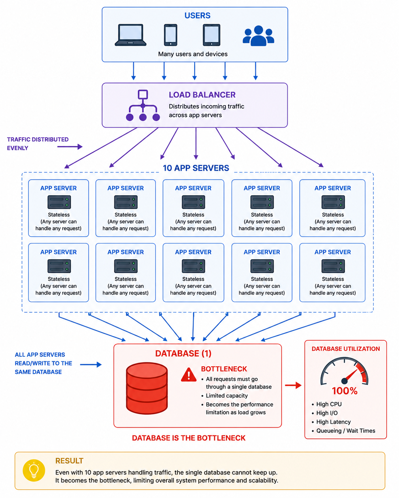
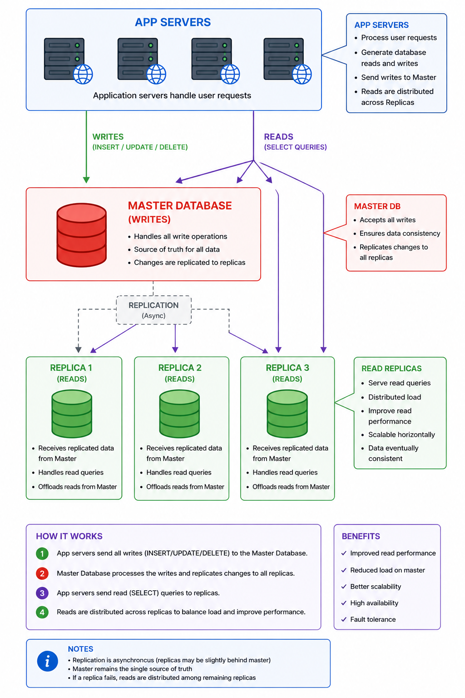

# PART 4 — DATABASE SCALING & DATA ARCHITECTURE
---

# SECTION 0 — ORIENTATION

# What is this part about?

In Part 3:
we successfully scaled web servers.

Traffic can now distribute across:

* multiple app servers,
* load balancers,
* stateless infrastructure.

Everything looks scalable.

Then suddenly:
the system slows down again.

Why?

The database.

This happens in almost every real system.

Databases eventually become:
the central bottleneck.

This part teaches:

* why databases become overloaded,
* why scaling databases is difficult,
* how replication works,
* SQL vs NoSQL tradeoffs,
* denormalization,
* joins at scale,
* how data architecture evolves under growth.

---

# Why does this matter?

Scaling application servers is relatively easy.

Scaling databases is hard.

Why?

Because databases manage:

* persistence,
* consistency,
* transactions,
* shared state.

Unlike stateless web servers:
databases contain critical system truth.

That makes scaling much more difficult.

---

# Where does this fit in the bigger picture?

This part transitions from:
“compute scaling”
to
“data scaling.”

This is a massive conceptual jump.

Most large-scale systems are ultimately constrained by:

* data access,
* consistency,
* storage architecture,
* replication behavior.

---

# What will we understand by the end?

By the end of this part, we will understand:

* why databases become bottlenecks,
* read vs write scaling,
* replication,
* master-slave architecture,
* failover,
* replication lag,
* SQL vs NoSQL scaling tradeoffs,
* denormalization,
* why joins become problematic,
* early sharding intuition,
* consistency realities at scale.

---

# Mental Prerequisite Check

Required:

* Parts 1–3 understanding
* Basic database knowledge
* Basic SQL familiarity

---

# Landscape — Key Topics

1. Why databases bottleneck
2. Read-heavy workloads
3. Replication
4. Master-slave architecture
5. Failover
6. Replication lag
7. SQL vs NoSQL
8. Denormalization
9. Joins at scale
10. Application-side joins
11. Data distribution intuition
12. Consistency tradeoffs

---

# 1. WHY DATABASES BECOME BOTTLENECKS

# The One-Line Definition

As systems grow, databases often become the hardest component to scale.

---

# Intuition First

Imagine:
a restaurant expanded successfully.

Now:
all restaurants depend on one central warehouse.

Even if:

* kitchens scale,
* staff scales,
* branches scale,

the warehouse becomes overloaded.

That warehouse is the database.

---

# The Problem It Solves

Initially:
databases easily handle small workloads.

But growth creates:

* more reads,
* more writes,
* more concurrent queries,
* larger datasets,
* more indexes,
* more locks.

Eventually:
database performance degrades.

This is one of the most common scaling bottlenecks.

---

# The Core Idea

Databases are difficult to scale because they manage:

* persistence,
* transactions,
* consistency,
* shared state.

Unlike stateless servers:
databases cannot simply become “disposable clones.”

---

# Why Databases Are Special

Web servers:

* mostly compute requests.

Databases:

* store long-term system truth.

Meaning:
incorrect scaling decisions can:

* corrupt data,
* lose consistency,
* create stale state.

This makes database scaling fundamentally harder.

---

# Worked Example

Suppose:
10 web servers.

Every request still queries:
1 database.

Now:
DB receives traffic from ALL servers.

Result:
DB overloads before web tier.

---

# Visual / Diagram Description

---

# Key Properties and Characteristics

* Centralized state
* Shared resource
* Persistence-heavy
* Concurrency-sensitive
* I/O-intensive

---

# Trade-offs

| Advantage          | Limitation            |
| ------------------ | --------------------- |
| Strong consistency | Harder scaling        |
| Centralized truth  | Bottleneck risk       |
| Transactions       | Coordination overhead |

---

# Failure Modes

* Slow queries
* Lock contention
* Disk IOPS saturation
* Connection exhaustion
* Replication lag
* Full-table scans

---

# Common Mistakes

## Mistake — Scaling only app servers

Many systems:
add more web servers,
while DB remains unchanged.

Eventually:
web tier scales,
DB collapses.

---

# Quick Summary

* Databases commonly become bottlenecks
* DBs manage shared persistent state
* Scaling DBs is harder than scaling app servers
* Reads and writes grow with traffic
* Centralized DBs eventually overload

---

# Bridge:

To scale databases properly,
we first need to understand one critical workload reality:
most systems are read-heavy.

# 2. READS VS WRITES — THE FUNDAMENTAL ASYMMETRY

# The One-Line Definition

Most applications perform far more reads than writes.

---

# Intuition First

Imagine Instagram.

Users constantly:

* scroll feeds,
* view profiles,
* watch reels.

But comparatively:
few actions actually modify data.

This imbalance matters enormously.

---

# The Problem It Solves

If reads dominate:
we can optimize architecture differently.

Understanding workload distribution is foundational for:
database scaling strategies.

---

# The Core Idea

Typical large systems:

* 80–99% reads
* small percentage writes

Examples of reads:

* viewing posts
* loading profiles
* searching products

Examples of writes:

* posting content
* updating settings
* purchases

This asymmetry enables:
read scaling architectures.

---

# Why Reads Are Easier to Scale

Reads:
can often be duplicated safely.

Writes:
must maintain consistency.

This distinction becomes foundational for replication.

---

# Worked Example

Traffic:

* 1 million requests/minute

Breakdown:

* 950k reads
* 50k writes

If reads can distribute:
DB scaling improves dramatically.

---

# Important Hidden Insight

Most internet systems are optimized around:
read amplification.

Because:
reads dominate workload.

This heavily influences:

* caching,
* replicas,
* CDN design,
* feed precomputation.

---

# Quick Summary

* Most systems are read-heavy
* Reads scale more easily than writes
* Workload asymmetry shapes architecture
* Replication mainly optimizes reads

---

# Bridge:

If reads dominate,
one obvious idea emerges:
“Why not create multiple copies of the database?”
That leads to replication.

# 3. DATABASE REPLICATION

# The One-Line Definition

Replication copies database data across multiple database servers.

---

# Intuition First

Instead of:
one library handling all readers,

create:
multiple copies of books across libraries.

Readers distribute across them.

---

# The Problem It Solves

Single DB server problems:

* overloaded reads,
* poor availability,
* single point of failure.

Replication addresses these issues.

---

# The Core Idea

Database replication creates:
multiple synchronized copies of data.

Typical architecture:

* 1 master
* multiple replicas/slaves

---

# Master-Slave Architecture

## Master

Handles:

* writes,
* updates,
* deletes.

## Replicas/Slaves

Handle:

* reads only.

Data copied from master → replicas.

---

# Diagram

---

# How It Works — Step by Step

1. Write sent to master
2. Master commits write
3. Replication log generated
4. Replicas receive updates
5. Replicas apply changes
6. Reads distributed across replicas

---

# Why Replication Is Powerful

Benefits:

* improved read scalability,
* better availability,
* redundancy,
* fault tolerance.

Reads now distribute across:
many DB servers.

---

# Worked Example

Without replication:
1 DB handles:

* all reads
* all writes

With replication:

* master handles writes
* 5 replicas handle reads

Read load massively reduced.

---

# Important Production Insight

Replication is fundamentally:
a consistency tradeoff.

Because replicas may lag behind master.

This is extremely important.

---

# Replication Lag

Replication is rarely instant.

Reasons:

* network latency,
* disk flush delays,
* overloaded replicas.

Result:
replicas may contain stale data temporarily.

---

# Real Production Example

User updates profile photo.

Immediately refreshes page.

Request hits replica:
old image still appears.

Why?
Replication lag.

---

# Why Writes Are Harder

Writes require:

* synchronization,
* durability,
* ordering,
* consistency guarantees.

This makes write scaling fundamentally harder than read scaling.

---

# Trade-offs

| Advantage           | Cost                   |
| ------------------- | ---------------------- |
| Read scalability    | Replication lag        |
| Better availability | More infrastructure    |
| Redundancy          | Consistency complexity |

---

# Failure Modes

* Replica lag
* Stale reads
* Split brain
* Replication backlog
* Network partition issues

---

# Common Mistakes

## Mistake — Assuming replicas are perfectly current

Replication delay always exists.

Even tiny lag matters for:
financial systems,
real-time systems,
strong consistency workloads.

---

# Quick Summary

* Replication creates DB copies
* Reads scale through replicas
* Writes centralized to master
* Replication introduces lag
* Consistency becomes harder

---

# Bridge:
Replication improves scaling and availability.
But now another difficult problem appears:
“What happens if the master dies?”

# 4. FAILOVER & HIGH AVAILABILITY

# The One-Line Definition

Failover promotes backup infrastructure when primary systems fail.

---

# Intuition First

Suppose:
main power station fails.

Backup generators activate automatically.

That is failover.

---

# The Problem It Solves

Without failover:
master DB crash
↓
system outage.

Large-scale systems cannot tolerate:
single-machine dependency.

---

# The Core Idea

When master fails:
one replica becomes new master.

Traffic rerouted automatically.

This improves:
availability and resilience.

---

# How It Works — Step by Step

1. Master DB crashes
2. Failure detected
3. Replica selected
4. Replica promoted
5. Traffic rerouted
6. New replica created

---

# Important Production Reality

This process is MUCH harder than diagrams suggest.

Why?

Replicas may:

* lag,
* miss writes,
* contain inconsistent state.

Promoting replicas safely is complex.

---

# Hidden Distributed Systems Problem

Suppose:
network partition occurs.

Two DBs both believe:
they are master.

This is called:
split brain.

Very dangerous.

Can create:
conflicting writes,
data corruption.

---

# Worked Example

Master crashes during:
payment transaction.

Replica promoted:
but missing latest transactions.

Potential inconsistency created.

---

# Key Insight

High availability often conflicts with:
perfect consistency.

This becomes one of the deepest distributed systems tradeoffs.

---

# Trade-offs

| Advantage           | Cost                    |
| ------------------- | ----------------------- |
| Better availability | Complex recovery        |
| Redundancy          | Risk of stale data      |
| Faster recovery     | Coordination complexity |

---

# Failure Modes

* Split brain
* Lost writes
* Inconsistent replicas
* Delayed failover
* Corrupted recovery

---

# Common Mistakes

## Mistake — Thinking failover is instant and perfect

Real failover systems are:
messy,
distributed,
coordination-heavy.

---

# Quick Summary

* Failover improves availability
* Replicas can become masters
* Recovery is operationally complex
* Split brain is dangerous
* Availability vs consistency tradeoffs emerge

---

# Bridge:

Replication solves some scaling problems.
But eventually:
even replicated SQL systems begin struggling at scale.
That leads to NoSQL and denormalization.

---

# 5. SQL VS NOSQL — SCALING PHILOSOPHIES

# The One-Line Definition

SQL and NoSQL databases optimize for different scalability tradeoffs.

---

# Intuition First

SQL databases optimize:
correctness and relationships.

NoSQL databases optimize:
distribution and scalability.

---

# The Problem It Solves

Traditional relational DBs:
work extremely well initially.

But massive scale introduces problems:

* expensive joins,
* large relational graphs,
* distributed coordination costs.

Some systems choose NoSQL architectures instead.

---

# SQL Databases

Examples:

* PostgreSQL
* MySQL
* Oracle

Characteristics:

* tables,
* schemas,
* joins,
* transactions,
* ACID guarantees.

---

# Why SQL Is Powerful

Excellent for:

* strong consistency,
* relational queries,
* transactions,
* structured data.

---

# Why SQL Becomes Difficult at Scale

Large joins become expensive because:
data may span:

* huge tables,
* many indexes,
* distributed nodes.

As systems scale:
coordination cost rises.

---

# NoSQL Databases

Examples:

* MongoDB
* Cassandra
* DynamoDB
* CouchDB

Characteristics:

* distributed-friendly,
* schema flexibility,
* denormalized storage,
* easier partitioning.

---

# Important Hidden Insight

NoSQL is not:
“better SQL.”

It is:
a different optimization philosophy.

Usually prioritizing:

* scalability,
* availability,
* distribution,

over:

* relational complexity,
* strict consistency.

---

# Trade-offs

| SQL                             | NoSQL                       |
| ------------------------------- | --------------------------- |
| Strong consistency              | Easier distribution         |
| Rich joins                      | Flexible schema             |
| Transactions                    | Horizontal scalability      |
| Harder large-scale distribution | Eventual consistency common |

---

# Common Mistakes

## Mistake — Thinking NoSQL removes complexity

NoSQL often moves complexity:
from DB
to
application logic.

---

# Quick Summary

* SQL prioritizes relational correctness
* NoSQL prioritizes scalability/distribution
* Joins become expensive at scale
* NoSQL trades consistency for scalability flexibility

---

# Bridge:

One of the biggest architectural changes at scale is:
denormalization.

---

# 6. DENORMALIZATION & APPLICATION-SIDE JOINS

# The One-Line Definition

Denormalization duplicates data to reduce expensive joins.

---

# Intuition First

Instead of:
walking through multiple warehouses to assemble one product package,
pre-package everything together.

Faster access.
More duplication.

---

# The Problem It Solves

Joins become expensive at scale because:
multiple datasets must coordinate during queries.

Large distributed joins are especially painful.

---

# The Core Idea

Traditional normalization:
reduces redundancy.

Denormalization:
intentionally duplicates data for faster reads.

---

# Example

Normalized:

Users table
Posts table

Query joins:
users + posts.

---

# Denormalized Version

Post document directly stores:

* username,
* profile image,
* metadata.

Reads become faster.

---

# Application-Side Joins

Instead of:
DB performing joins,

application assembles relationships itself.

Meaning:
logic shifts from:
database
→ application layer.

---

# Why This Helps Scaling

Distributed joins across massive datasets are expensive.

Denormalization:
reduces coordination cost.

This is extremely common in:

* social feeds,
* analytics,
* NoSQL systems.

---

# Important Production Insight

Denormalization improves:
read performance.

But introduces:
consistency complexity.

Now duplicated data must remain synchronized.

---

# Worked Example

User changes username.

Now:
millions of posts containing duplicated username
may require updates.

This is denormalization cost.

---

# Trade-offs

| Advantage           | Cost                   |
| ------------------- | ---------------------- |
| Faster reads        | Data duplication       |
| Easier distribution | Update complexity      |
| Better scalability  | Consistency challenges |

---

# Failure Modes

* Stale duplicated data
* Inconsistent updates
* Synchronization complexity

---

# Common Mistakes

## Mistake — Over-normalizing internet-scale systems

Perfect relational purity often scales poorly.

Real production systems frequently:
trade normalization for scalability.

---

# Quick Summary

* Denormalization duplicates data intentionally
* Reduces expensive joins
* Common in scalable architectures
* Moves complexity into updates/consistency
* Application-side joins often replace DB joins

---

# 7. EARLY SHARDING INTUITION

# The One-Line Definition

Sharding splits data across multiple database machines.

---

# Intuition First

Suppose:
one warehouse becomes too large.

Instead of:
one giant warehouse,

create:
many smaller warehouses,
each storing different inventory.

That is sharding.

---

# Why This Emerges

Eventually:
even replication is insufficient.

Because:
one master still handles all writes.

Sharding distributes:
both reads AND writes.

---

# Important Note

This source only hinted at sharding.

But it is important to introduce the intuition here.

Deep sharding mechanics belong later in distributed systems topics.

---

# Quick Summary

* Replication scales reads
* Sharding scales storage/writes
* Data distributed across machines
* Much more operationally complex

---

# END OF PART 4 — DATABASE SCALING & DATA ARCHITECTURE

# What We Should Understand Now

We should now understand:

* why DBs become bottlenecks,
* why reads dominate workloads,
* replication architecture,
* master-slave systems,
* replication lag,
* failover complexity,
* SQL vs NoSQL scaling philosophy,
* denormalization,
* application-side joins,
* why data scaling is fundamentally difficult.

Most importantly:

We should now understand that:
scaling databases is NOT merely a hardware problem.

It is fundamentally:
a consistency,
coordination,
and distributed systems problem.
