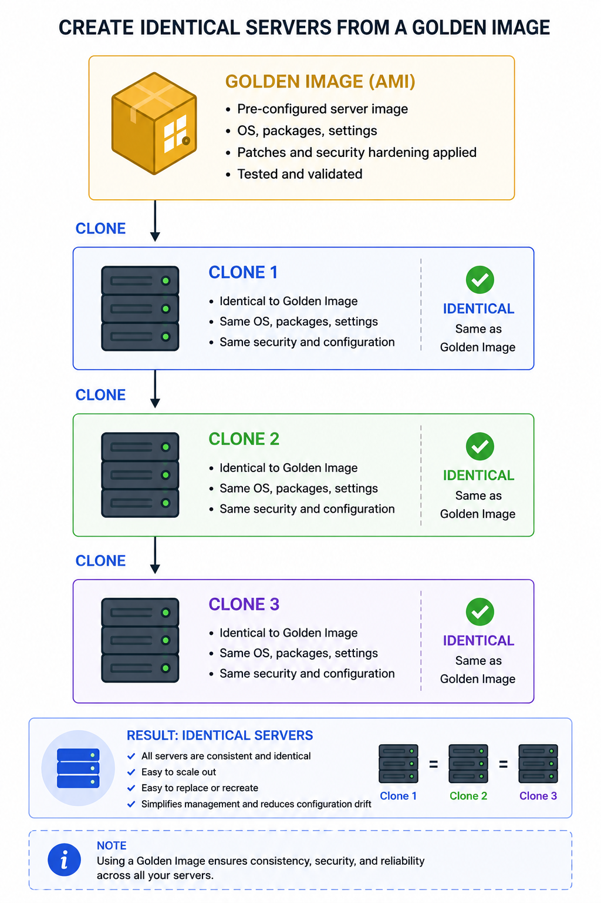
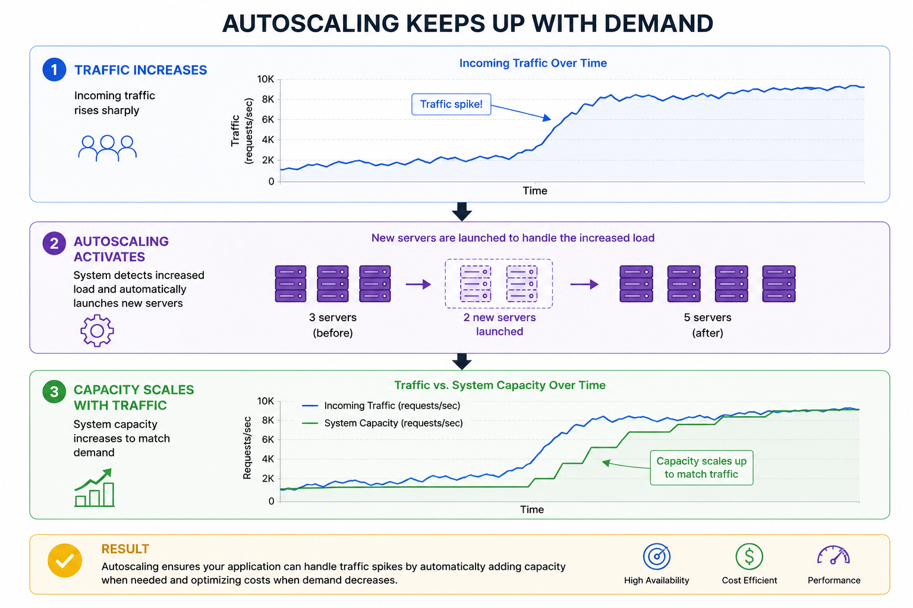

# PART 5 — INFRASTRUCTURE, DEPLOYMENTS & ELASTICITY

# How Scalable Systems Become Operationally Manageable

---

# SECTION 0 — ORIENTATION

# What is this part about?

In previous parts:
we learned how systems:

* scale horizontally,
* distribute traffic,
* externalize state,
* replicate databases.

At this point:
the architecture itself can scale.

But another massive problem now appears:

“How do we OPERATE all this infrastructure reliably?”

This is where scalability becomes:
an operational engineering problem.

This part teaches:

* infrastructure reproducibility,
* deployment consistency,
* autoscaling,
* immutable infrastructure,
* server cloning,
* elasticity,
* operational scalability realities.

This is one of the biggest transitions from:
“system design learner”
to
“real production engineer.”

---

# Why does this matter?

A system may be:
architecturally scalable,

but operationally unmanageable.

That system will still fail in production.

At scale:
engineers do not manage:
1 server.

They may manage:

* hundreds,
* thousands,
* tens of thousands of machines.

Without reproducibility and automation:
this becomes impossible.

---

# The Hidden Truth About Scalability

Most beginners think:
scaling means:
“adding more servers.”

Real engineers know:
the HARD part is:
operating those servers safely and consistently.

That is what this part teaches.

---

# Where does this fit in the bigger picture?

This part connects:
architecture
with
operations.

This becomes the foundation for:

* cloud-native systems,
* Kubernetes,
* autoscaling,
* infrastructure-as-code,
* immutable deployments,
* DevOps philosophy.

---

# What will we understand by the end?

By the end of this part, we will understand:

* why deployment consistency matters,
* configuration drift,
* immutable infrastructure,
* server cloning,
* AMIs,
* autoscaling,
* elasticity,
* provisioning,
* infrastructure reproducibility,
* deployment safety,
* operational scaling realities.

---

# Mental Prerequisite Check

Required:

* Parts 1–4 understanding
* Horizontal scaling understanding
* Stateless architecture understanding

---

# Landscape — Key Topics

1. Why operational scaling becomes difficult
2. Deployment consistency
3. Configuration drift
4. Immutable infrastructure
5. AMIs & machine images
6. Server cloning
7. Autoscaling
8. Elasticity
9. Provisioning
10. Fleet management
11. Infrastructure reproducibility
12. Operational failure modes

---

# 1. THE OPERATIONS PROBLEM

# The One-Line Definition

As systems scale, infrastructure management itself becomes a scalability problem.

---

# Intuition First

[Analogy]

Managing:
1 restaurant manually is easy.

Managing:
5,000 restaurants manually is impossible.

We now need:

* standardization,
* automation,
* reproducibility,
* centralized coordination.

Exactly the same thing happens in large-scale infrastructure.

---

# The Problem It Solves

Initially:
one server can be manually configured.

At scale:
manual management becomes catastrophic.

Examples:

* inconsistent software versions,
* missing dependencies,
* broken deployments,
* security mismatches,
* unpredictable behavior.

Infrastructure itself becomes difficult to scale operationally.

---

# The Core Idea 

Large-scale systems require:

* reproducible infrastructure,
* automated provisioning,
* identical deployments,
* infrastructure consistency.

Without these:
distributed systems become operational chaos.

---

# Worked Example

Suppose:
100 backend servers.

One server accidentally:

* missing dependency,
* older environment variable,
* outdated runtime version.

Now:
only some requests fail.

These become extremely difficult production bugs.

---

# Hidden Production Insight

Many major outages are caused NOT by:
bad architecture,

but by:
operational inconsistency.

This is a huge real-world lesson.

---

# Key Properties and Characteristics

* Operational complexity grows with scale
* Manual infrastructure does not scale
* Reproducibility becomes mandatory
* Consistency matters more than individual machines

---

# Trade-offs

| Advantage       | Cost                    |
| --------------- | ----------------------- |
| Automation      | Tooling complexity      |
| Reproducibility | More deployment systems |
| Standardization | Less manual flexibility |

---

# Failure Modes

* Configuration drift
* Partial deployments
* Version mismatches
* Environment inconsistencies

---

# Common Mistakes

## Mistake — Treating servers as “special snowflakes”

Manual per-server customization:
becomes impossible at scale.

Modern infrastructure avoids this heavily.

---

# Quick Summary

* Infrastructure management becomes difficult at scale
* Manual operations fail under growth
* Reproducibility becomes critical
* Operational consistency is foundational

---

# Bridge

The first major operational problem at scale is:
deployment inconsistency.

---

# 2. DEPLOYMENT CONSISTENCY & CONFIGURATION DRIFT

# The One-Line Definition

Distributed systems require all servers to behave consistently.

---

# Intuition First

Suppose:
10 restaurant branches exist.

Some branches:

* use old recipes,
* different ingredients,
* outdated menus.

Customers now receive inconsistent experiences.

That is deployment inconsistency.

---

# The Problem It Solves

In multi-server systems:
all servers must run:

* same code,
* same dependencies,
* same configurations.

Otherwise:
behavior diverges unpredictably.

---

# Configuration Drift

This is one of the most important operational concepts.

Definition:

Over time:
servers slowly become different from each other.

Examples:

* different package versions,
* different configs,
* manual patches,
* environment mismatch.

This is called:
configuration drift.

---

# Why Drift Is Dangerous

Suppose:
only 3 of 100 servers fail requests.

Why?

Different:

* dependency versions,
* runtime configs,
* missing patches.

These issues become:
nightmarish to debug.

---

# The Core Idea

Scalable systems require:
identical infrastructure behavior.

Meaning:
servers must become reproducible.

---

# Capistrano Insight

There is deployment synchronization tools like Capistrano.

Hidden lesson:
deployment itself becomes distributed systems coordination.

Rolling out code safely across fleets is difficult.

---

# Worked Example

Deployment:
Version 2.0 pushed.

Problem:

* 40 servers updated,
* 60 still on old version.

Now:
APIs incompatible.

Distributed outage occurs.

---

# Key Production Insight

Deployment systems themselves are:
critical infrastructure.

Modern systems heavily invest in:

* CI/CD,
* deployment orchestration,
* rollback systems.

---

# Trade-offs

| Advantage           | Cost                                 |
| ------------------- | ------------------------------------ |
| Consistent behavior | More automation tooling              |
| Easier debugging    | Deployment infrastructure complexity |

---

# Failure Modes

* Partial rollout failures
* Version incompatibility
* Dependency mismatch
* Environment skew

---

# Common Mistakes

## Mistake — Manual server patching

Manual infrastructure modification creates:
unpredictable fleets.

This is heavily avoided in modern systems.

---

# Quick Summary

* Distributed systems require deployment consistency
* Configuration drift is extremely dangerous
* Identical environments are critical
* Deployment systems become core infrastructure

---

# Bridge

To eliminate configuration drift,
modern systems evolved toward immutable infrastructure.

---

# 3. IMMUTABLE INFRASTRUCTURE

# The One-Line Definition

Immutable infrastructure means servers are replaced instead of manually modified.

---

# Intuition First

Instead of:
repairing old factory machines manually,

simply:
replace them with standardized factory-built machines.

That is immutable infrastructure.

---

# The Problem It Solves

Mutable servers create:

* drift,
* inconsistency,
* unpredictable state,
* debugging nightmares.

Manual modifications accumulate over time.

Eventually:
servers become unique snowflakes.

---

# The Core Idea 

Servers should never be manually changed after deployment.

Instead:

* build standardized server images,
* launch new servers from templates,
* replace old servers entirely.

This guarantees reproducibility.

---

# Why This Is Powerful

Benefits:

* predictable infrastructure,
* safer deployments,
* easier rollback,
* reproducibility,
* simpler scaling.

---

# Visual / Diagram Description

---

# Important Hidden Insight

Immutable infrastructure transforms servers into:
disposable compute units.

This is one of the deepest cloud architecture shifts.

Servers stop being:
“pets.”

They become:
“replaceable cattle.”

---

# Worked Example

Bug discovered in production.

Instead of:
manually patching 1,000 servers,

engineers:

1. build new image,
2. deploy replacement fleet,
3. terminate old servers.

Much safer and more reproducible.

---

# Why This Enables Scaling

Without immutable infrastructure:
large-scale autoscaling becomes operationally impossible.

Because:
new machines would require:
manual setup.

---

# Trade-offs

| Advantage                  | Cost                          |
| -------------------------- | ----------------------------- |
| Predictable infrastructure | Stronger CI/CD requirements   |
| Easier rollback            | Image-building complexity     |
| Safer deployments          | Immutable workflow discipline |

---

# Failure Modes

* Broken image propagation
* Fleet-wide bad deployments
* Rollback coordination issues

---

# Common Mistakes

## Mistake — SSH-ing into production servers manually

Manual fixes:
destroy reproducibility.

Modern systems strongly discourage this.

---

# Quick Summary

* Immutable infrastructure avoids configuration drift
* Servers become reproducible templates
* Replace servers instead of modifying them
* Critical for large-scale operations

---

# Bridge

Immutable infrastructure requires one critical capability:
reproducible machine templates.
That leads to machine images.

---

# 4. MACHINE IMAGES & AWS AMIs

# The One-Line Definition

Machine images are reusable templates used to create identical servers.

---

# Intuition First

Imagine:
a perfectly configured restaurant blueprint.

Instead of:
building every branch manually,

clone the same blueprint repeatedly.

That is a machine image.

---

# The Problem It Solves

Provisioning servers manually:

* slow,
* inconsistent,
* error-prone.

Large-scale systems require:
instant reproducible infrastructure.

---

# AWS AMIs

Amazon Machine Images (AMIs).

AMIs store:

* OS,
* dependencies,
* runtime,
* configurations,
* startup scripts,
* deployment logic.

New EC2 instances boot from AMIs.

---

# The Core Idea

A machine image acts as:
a “golden template.”

New servers become:
identical clones.

---

# How It Works — Step by Step

1. Configure base server
2. Install dependencies
3. Configure runtime
4. Create AMI/image
5. Launch new instances from image

Now:
infrastructure becomes reproducible.

---

# Why This Is Foundational

AMIs enable:

* rapid scaling,
* autoscaling,
* disaster recovery,
* reproducible environments,
* immutable deployments.

This is foundational cloud architecture.

---

# Hidden Production Insight

Horizontal scaling only becomes practical when:
servers can be created automatically and reliably.

---

# Worked Example

Traffic spike occurs.

Autoscaling group launches:
50 new instances.

Without AMIs:
manual setup required.

Impossible.

With AMIs:
new servers ready in minutes.

---

# Trade-offs

| Advantage           | Cost                        |
| ------------------- | --------------------------- |
| Fast provisioning   | Image management overhead   |
| Reproducibility     | Larger deployment pipelines |
| Autoscaling support | Build/version complexity    |

---

# Failure Modes

* Outdated AMIs
* Vulnerable images
* Misconfigured templates
* Fleet-wide bad image rollout

---

# Common Mistakes

## Mistake — Building servers manually repeatedly

Manual provisioning:
does not scale operationally.

---

# Quick Summary

* AMIs are reusable server templates
* Enable reproducible infrastructure
* Critical for autoscaling
* Foundation of immutable deployments

---

# Bridge

Now infrastructure is reproducible.
The next step is:
automatic scaling itself.

# 5. AUTOSCALING & ELASTICITY

# The One-Line Definition

Autoscaling automatically adjusts infrastructure capacity based on workload.

---

# Intuition First

Suppose:
a restaurant automatically:

* hires staff during rush hours,
* reduces staff during quiet hours.

That is elasticity.

---

# The Problem It Solves

Traffic is unpredictable.

Examples:

* viral posts,
* Black Friday,
* breaking news,
* live sports events.

Static infrastructure wastes money or crashes under spikes.

---

# The Core Idea

Autoscaling systems:

* monitor infrastructure metrics,
* automatically add/remove servers.

Scaling triggers:

* CPU usage,
* request rate,
* memory pressure,
* queue depth.

---

# Elasticity

Elasticity means:
infrastructure dynamically expands/contracts with demand.

Cloud computing made this revolutionary.

---

# How It Works — Step by Step

1. Monitoring detects rising load
2. Scaling policy triggered
3. New instances launched
4. LB routes traffic to new servers
5. Traffic stabilizes
6. Extra servers removed later

---

# Diagram 

---

# Important Hidden Insight

Elasticity only works because:

* servers are stateless,
* infrastructure is reproducible,
* load balancers exist.

All previous scalability concepts connect here.

---

# Worked Example

Traffic:
10k req/sec → 100k req/sec.

Autoscaling group:
launches 20 additional instances automatically.

Without elasticity:
system crashes.

---

# Production Realities — Autoscaling Is Hard

Autoscaling sounds easy.

In reality:
many problems appear.

---

# Cold Starts

New servers require:

* boot time,
* deployment,
* warm-up,
* cache loading.

Scaling is not instant.

---

# Scaling Lag

Traffic may rise faster than:
infrastructure provisioning.

Temporary overload still occurs.

---

# Oscillation Problem

Poor scaling rules can cause:
continuous scale up/down loops.

This destabilizes systems.

---

# Hidden Distributed Systems Insight

Autoscaling itself becomes:
a feedback-control systems problem.

This is much deeper than beginners realize.

---

# Trade-offs

| Advantage         | Cost                   |
| ----------------- | ---------------------- |
| Dynamic scaling   | Operational complexity |
| Cost efficiency   | Scaling instability    |
| Better resilience | Cold-start delays      |

---

# Failure Modes

* Scaling lag
* Oscillation
* Failed provisioning
* Runaway scaling costs
* Delayed health checks

---

# Common Mistakes

## Mistake — Assuming autoscaling is instant

Infrastructure provisioning:
takes time.

This matters enormously during sudden spikes.

---

# Quick Summary

* Autoscaling dynamically adjusts infrastructure
* Elasticity is foundational cloud capability
* Stateless reproducible servers enable autoscaling
* Scaling reactions themselves introduce complexity

---

# Bridge

At this point,
we now understand how scalable systems become operationally manageable.
But another major challenge remains:
surviving failure itself.

---

# END OF PART 5 — INFRASTRUCTURE, DEPLOYMENTS & ELASTICITY

# What We Should Understand Now

We should now understand:

* why operational scaling becomes difficult,
* deployment consistency,
* configuration drift,
* immutable infrastructure,
* AMIs,
* autoscaling,
* elasticity,
* reproducible infrastructure,
* fleet management realities,
* why scalable systems require operational automation.

Most importantly:

We should now understand that:
real scalability is NOT just:
“handling more traffic.”

It is:
being able to operate,
deploy,
replace,
recover,
and scale infrastructure safely under continuous change.